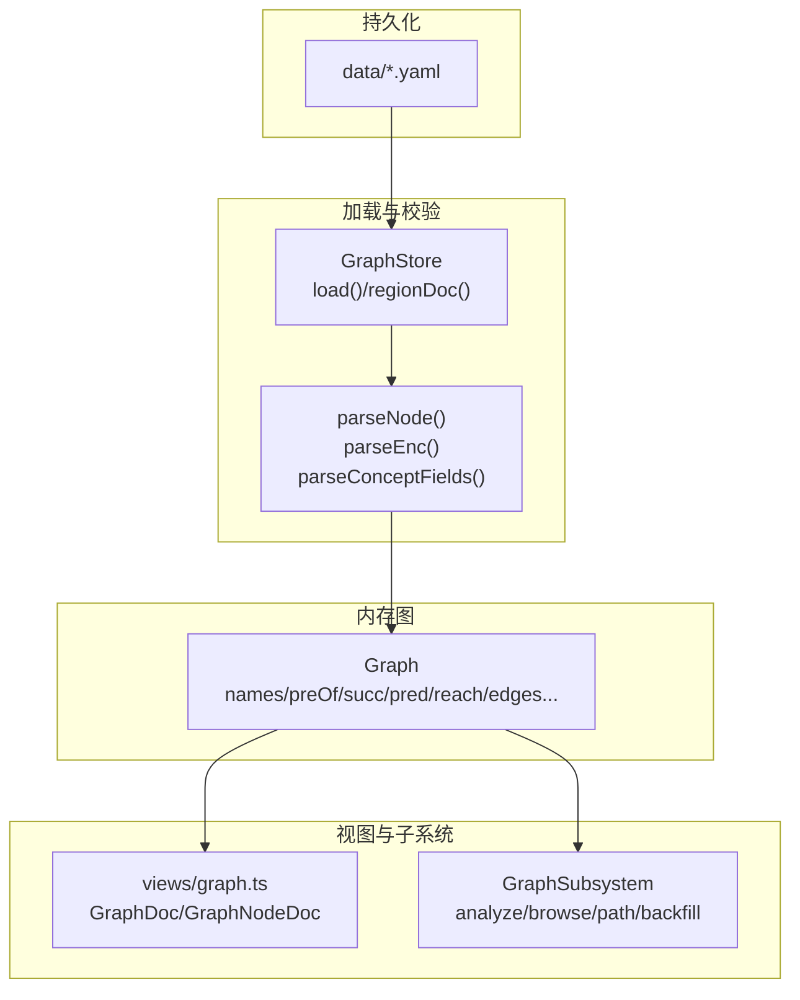
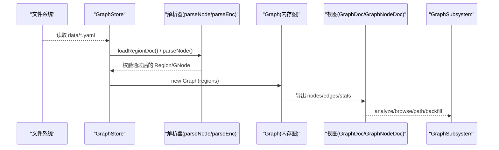
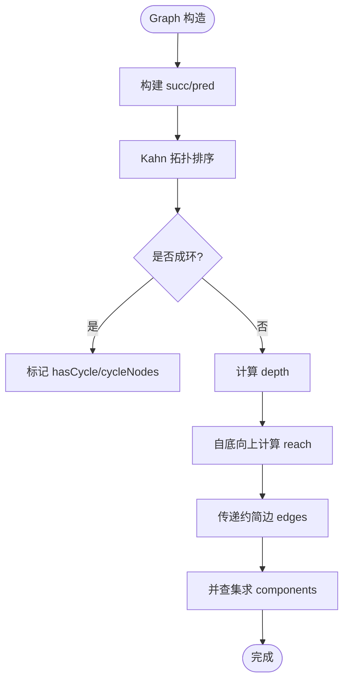
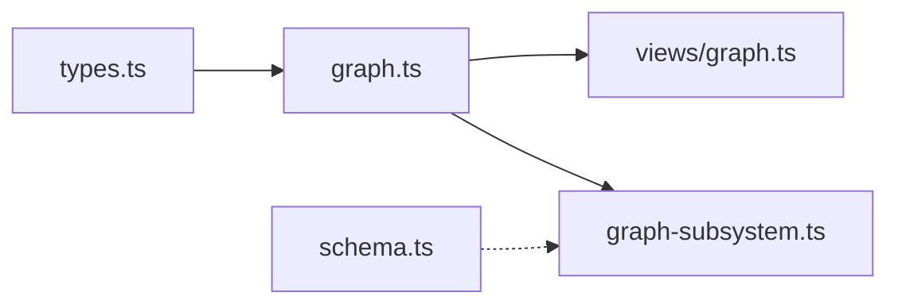
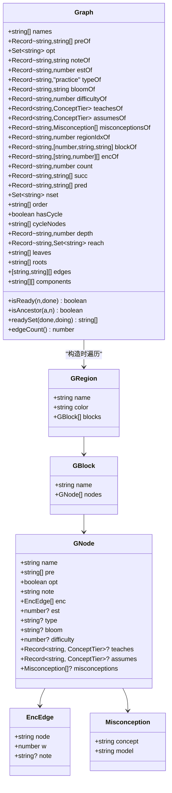
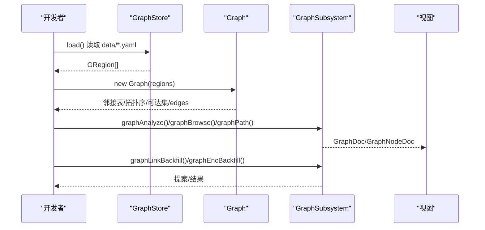

# 图谱数据模型

<cite>
**本文引用的文件**
- [src/engine/graph.ts](file://src/engine/graph.ts)
- [src/engine/types.ts](file://src/engine/types.ts)
- [src/engine/views/graph.ts](file://src/engine/views/graph.ts)
- [src/engine/schema.ts](file://src/engine/schema.ts)
- [src/engine/graph-subsystem.ts](file://src/engine/graph-subsystem.ts)
</cite>

## 目录
1. [简介](#简介)
2. [项目结构](#项目结构)
3. [核心组件](#核心组件)
4. [架构总览](#架构总览)
5. [详细组件分析](#详细组件分析)
6. [依赖关系分析](#依赖关系分析)
7. [性能考虑](#性能考虑)
8. [故障排查指南](#故障排查指南)
9. [结论](#结论)
10. [附录：数据结构与示例](#附录：数据结构与示例)

## 简介
本文件面向“图谱数据模型”，系统性说明课程知识图谱的核心数据结构（Graph、GNode、GRegion、GBlock）、节点属性语义、概念字段组（teaches/assumes/misconceptions）的作用机制、边关系表示（前置依赖 pre 与 enc 技能边）的区别，以及图谱的分层组织方式（区 region → 块 block → 节点 node）。同时给出数据验证规则、约束条件、常见错误处理策略，并提供可操作的创建与使用流程指引。

## 项目结构
- 数据事实源：data/*.yaml 描述图结构（区/块/节点），由 GraphStore 加载并校验。
- 类型定义：types.ts 集中声明 GNode/GBlock/GRegion、EncEdge、BloomLevel、ConceptTier 等。
- 图构建与分析：graph.ts 提供解析、校验、派生邻接表、拓扑序、可达集、传递约简边、连通分量、就绪判定等。
- 视图与门面：views/graph.ts 定义对外视图类型；graph-subsystem.ts 暴露子系统能力（分析、浏览、路径查询、提案与回填等）。
- 版本门：schema.ts 负责引擎启动时的 schema 版本硬门。

图表来源
- [src/engine/graph.ts:175-276](file://src/engine/graph.ts#L175-L276)
- [src/engine/graph.ts:278-443](file://src/engine/graph.ts#L278-L443)
- [src/engine/views/graph.ts:77-202](file://src/engine/views/graph.ts#L77-L202)
- [src/engine/graph-subsystem.ts:88-117](file://src/engine/graph-subsystem.ts#L88-L117)

章节来源
- [src/engine/graph.ts:175-276](file://src/engine/graph.ts#L175-L276)
- [src/engine/graph.ts:278-443](file://src/engine/graph.ts#L278-L443)
- [src/engine/views/graph.ts:77-202](file://src/engine/views/graph.ts#L77-L202)
- [src/engine/graph-subsystem.ts:88-117](file://src/engine/graph-subsystem.ts#L88-L117)

## 核心组件
- GRegion（区）：包含 name、color、blocks[]，对应 data/*.yaml 单文件。
- GBlock（块）：包含 name、nodes[]，用于将节点按教学单元分组。
- GNode（节点）：核心学习单元，包含 name、pre、opt、note、enc、est、type、bloom、difficulty，以及概念字段组 teaches/assumes/misconceptions。
- EncEdge（enc 边）：{node, w, note?}，表示“成分技能”或“反哺/链接先验”的有向边。
- Graph（内存图）：从 regions 派生的邻接表、拓扑序、深度、可达集、传递约简边、连通分量、就绪集合等。

章节来源
- [src/engine/types.ts:63-107](file://src/engine/types.ts#L63-L107)
- [src/engine/graph.ts:131-173](file://src/engine/graph.ts#L131-L173)
- [src/engine/graph.ts:175-196](file://src/engine/graph.ts#L175-L196)
- [src/engine/graph.ts:278-443](file://src/engine/graph.ts#L278-L443)

## 架构总览
下图展示从 YAML 到内存图再到视图/子系统的完整链路，以及关键校验点。

图表来源
- [src/engine/graph.ts:175-276](file://src/engine/graph.ts#L175-L276)
- [src/engine/graph.ts:278-443](file://src/engine/graph.ts#L278-L443)
- [src/engine/views/graph.ts:77-202](file://src/engine/views/graph.ts#L77-L202)
- [src/engine/graph-subsystem.ts:88-117](file://src/engine/graph-subsystem.ts#L88-L117)

## 详细组件分析

### 节点属性与概念字段组
- name：节点唯一标识（同区内需唯一，跨图重名会被结构检查拒绝）。
- pre：前置依赖列表，表示“必须先学”的概念/节点。
- opt：可选节点，参与就绪判定时可跳过。
- note：节点备注（人读友好）。
- enc：成分技能边列表，表示“掌握该节点需要哪些技能/知识点”。
- est：标称学习时长（分钟），用于内容定价与调度提示。
- type：节点类型，当前仅允许 practice（交互实践节点）。
- bloom：Bloom 认知层级（记忆/理解/应用/分析/评价/创造），用于生成与未来调度消费。
- difficulty：难度 1–5，用于认知跨步检测与可视化。
- teaches：本节点教到的概念→教学档位（知道/会用/能教），限制 1–8 条，过窄（1–2）会 WARN，过多（>8）ERROR。
- assumes：本节点假设学习者已具备的概念→所需档位，缺席合法，在场 1–2 条 WARN，>10 ERROR。
- misconceptions：误解先验列表 {concept, model}，每概念全课程封顶 3 条，越界 ERROR。

章节来源
- [src/engine/types.ts:63-107](file://src/engine/types.ts#L63-L107)
- [src/engine/graph.ts:18-27](file://src/engine/graph.ts#L18-L27)
- [src/engine/graph.ts:35-79](file://src/engine/graph.ts#L35-L79)
- [src/engine/graph.ts:81-127](file://src/engine/graph.ts#L81-L127)
- [src/engine/graph.ts:131-173](file://src/engine/graph.ts#L131-L173)

### 边关系的表示与区别
- 前置依赖边（pre）：表达“学习顺序/先决条件”，用于就绪判定、拓扑排序、可达性计算。
- enc 边：表达“成分技能/反哺/链接先验”，权重 w∈[0,1]，可选 note 记录来源。常用于题目 invokes 投影、Vault 链接先验回填等场景。
- 两者在结构检查中均要求目标节点存在（断边报错），但语义不同：pre 是“必须先学”，enc 是“掌握该节点所需的技能/知识”。

章节来源
- [src/engine/graph.ts:131-173](file://src/engine/graph.ts#L131-L173)
- [src/engine/graph.ts:445-468](file://src/engine/graph.ts#L445-L468)
- [src/engine/graph-subsystem.ts:198-265](file://src/engine/graph-subsystem.ts#L198-L265)

### 图谱分层结构：区 → 块 → 节点
- 区（region）：data/*.yaml 顶层对象，name/color/blocks。
- 块（block）：教学单元分组，name/nodes。
- 节点（node）：最小学习单元，承载属性与概念字段组。
- GraphStore 负责按文件名顺序加载全部 .yaml 为 Region 列表；Graph 构造时遍历所有 region/block/node 建立索引与邻接表。

章节来源
- [src/engine/graph.ts:175-196](file://src/engine/graph.ts#L175-L196)
- [src/engine/graph.ts:203-239](file://src/engine/graph.ts#L203-L239)
- [src/engine/graph.ts:278-341](file://src/engine/graph.ts#L278-L341)

### 内存图 Graph 的关键派生
- 邻接表：succ/pred 基于 pre 构建。
- 拓扑序与环检测：Kahn 算法，若 order.length < names.length 则 hasCycle=true，cycleNodes 列出环内节点。
- 深度 depth：无环时按 pred 最大深度 +1。
- 可达集 reach：自底向上合并后继可达集。
- 传递约简边 edges：去除冗余边（若 u→v 且 v 可由另一后继 w 到达，则 u→v 为冗余）。
- 连通分量 components：并查集划分。
- 就绪判定 isReady：所有前置已完成或为可选即就绪。

图表来源
- [src/engine/graph.ts:317-422](file://src/engine/graph.ts#L317-L422)

章节来源
- [src/engine/graph.ts:317-422](file://src/engine/graph.ts#L317-L422)

### 数据验证规则与约束
- 节点字段白名单：仅允许 name/pre/opt/note/enc/est/type/bloom/difficulty/teaches/assumes/misconceptions。
- enc 条目：字符串=权重 1；映射必须含 node，w∈[0,1]，可选 note，不允许未知字段。
- 概念字段组：
  - teaches：键为非空概念名，值为 CONCEPT_TIERS 之一；数量 1–8 条（1–2 条 WARN，>8 ERROR）。
  - assumes：同构映射；数量 1–2 条 WARN，>10 ERROR，缺席合法。
  - misconceptions：{concept, model} 列表；每概念全课程封顶 3 条，越界 ERROR。
- 其他字段：
  - est：正数（分钟），取整。
  - type：仅允许 practice。
  - bloom：必须在 BLOOM_LEVELS 枚举中。
  - difficulty：1–5 整数。
- 结构检查：
  - 重名节点：拒绝。
  - 断边：pre/enc 指向未定义节点：拒绝。
  - 引入环：拒绝并报告涉及节点。
  - 误解封顶：同一概念全课程 >3 条：拒绝。

章节来源
- [src/engine/graph.ts:18-27](file://src/engine/graph.ts#L18-L27)
- [src/engine/graph.ts:35-79](file://src/engine/graph.ts#L35-L79)
- [src/engine/graph.ts:81-127](file://src/engine/graph.ts#L81-L127)
- [src/engine/graph.ts:131-173](file://src/engine/graph.ts#L131-L173)
- [src/engine/graph.ts:445-481](file://src/engine/graph.ts#L445-L481)

### 常见错误与处理
- SchemaError：YAML 解析失败、字段非法、未知字段、enc 权重非法、概念档位非法等直接拒收。
- 结构错误：重名、断边、环、误解封顶越界，统一返回错误列表供调用方提示。
- 启动硬门：schema 版本不匹配直接抛错并指引迁移脚本。

章节来源
- [src/engine/graph.ts:29-33](file://src/engine/graph.ts#L29-L33)
- [src/engine/graph.ts:445-481](file://src/engine/graph.ts#L445-L481)
- [src/engine/schema.ts:59-79](file://src/engine/schema.ts#L59-L79)

## 依赖关系分析
- graph.ts 依赖 types.ts（GNode/GBlock/GRegion/EncEdge/BloomLevel/ConceptTier 等）。
- graph-subsystem.ts 依赖 views/graph.ts（对外视图类型）与 graph.ts（declaredEncOf 等工具）。
- views/graph.ts 仅依赖 types.ts 与 proposals 视图类型，保持叶子模块低耦合。
- schema.ts 独立于图谱域，作为启动硬门被上层入口调用。

图表来源
- [src/engine/types.ts:63-107](file://src/engine/types.ts#L63-L107)
- [src/engine/graph.ts:131-173](file://src/engine/graph.ts#L131-L173)
- [src/engine/views/graph.ts:77-202](file://src/engine/views/graph.ts#L77-L202)
- [src/engine/graph-subsystem.ts:88-117](file://src/engine/graph-subsystem.ts#L88-L117)
- [src/engine/schema.ts:59-79](file://src/engine/schema.ts#L59-L79)

章节来源
- [src/engine/types.ts:63-107](file://src/engine/types.ts#L63-L107)
- [src/engine/graph.ts:131-173](file://src/engine/graph.ts#L131-L173)
- [src/engine/views/graph.ts:77-202](file://src/engine/views/graph.ts#L77-L202)
- [src/engine/graph-subsystem.ts:88-117](file://src/engine/graph-subsystem.ts#L88-L117)
- [src/engine/schema.ts:59-79](file://src/engine/schema.ts#L59-L79)

## 性能考虑
- 邻接表与可达集：O(V+E) 构建，reach 自底向上合并，避免重复扫描。
- 传递约简边：利用 reach 快速判断冗余边，减少渲染与推理开销。
- 拓扑序与就绪集合：Kahn 算法线性时间；readySet 过滤 done/doing 后排序，适合 UI 渲染。
- 结构检查：在合并新区域前一次性校验，避免多次无效写入。

[本节为通用性能讨论，无需具体文件引用]

## 故障排查指南
- 加载失败：
  - 数据目录不存在或为空：抛出 SchemaError，指引创建 data 目录与至少一个 .yaml 区文件。
- 解析失败：
  - 节点字段非法/未知字段：根据 fail 文案定位具体节点与字段。
  - enc 权重非法/未知字段：检查 enc 条目格式。
  - 概念字段组越界：teaches>8、assumes>10、misconceptions 同概念>3 条。
- 结构问题：
  - 重名/断边/环：structureCheck 返回错误列表，修正后再 apply。
- 启动问题：
  - schema 版本不匹配：运行迁移脚本升级至当前主版本。

章节来源
- [src/engine/graph.ts:203-218](file://src/engine/graph.ts#L203-L218)
- [src/engine/graph.ts:131-173](file://src/engine/graph.ts#L131-L173)
- [src/engine/graph.ts:445-481](file://src/engine/graph.ts#L445-L481)
- [src/engine/schema.ts:59-79](file://src/engine/schema.ts#L59-L79)

## 结论
本图谱数据模型以 YAML 为事实源，通过严格的 schema 校验与结构检查保证图的合法性；内存图 Graph 提供丰富的派生结构以支撑调度、分析与可视化。enc 与 pre 分工明确：前者表达技能/反哺关系，后者表达学习顺序。概念字段组将教学意图与误解先验显式建模，便于生成与教练侧消费。整体设计兼顾可读性、可审计性与可扩展性。

[本节为总结性内容，无需具体文件引用]

## 附录：数据结构与示例

### 数据结构总览（类图）

图表来源
- [src/engine/types.ts:63-107](file://src/engine/types.ts#L63-L107)
- [src/engine/graph.ts:278-443](file://src/engine/graph.ts#L278-L443)

### 典型工作流（序列图）

图表来源
- [src/engine/graph.ts:203-239](file://src/engine/graph.ts#L203-L239)
- [src/engine/graph.ts:278-443](file://src/engine/graph.ts#L278-L443)
- [src/engine/graph-subsystem.ts:88-117](file://src/engine/graph-subsystem.ts#L88-L117)
- [src/engine/graph-subsystem.ts:198-265](file://src/engine/graph-subsystem.ts#L198-L265)

### 创建与操作要点
- 创建区与块：在 data 目录下新增 .yaml，定义 region/name/color/blocks/nodes。
- 添加节点：在某个块的 nodes 中添加 GNode，填写必要字段（name、pre 等）。
- 设置 enc 边：为节点配置 enc 列表，指定技能节点与权重。
- 概念字段组：按需填写 teaches/assumes/misconceptions，遵守数量与枚举约束。
- 校验与生效：通过 structureCheck 检查重名/断边/环；通过 propose/apply 流程落盘。
- 查询与分析：使用 graphAnalyze/graphBrowse/graphPath 获取视图数据。

章节来源
- [src/engine/graph.ts:175-276](file://src/engine/graph.ts#L175-L276)
- [src/engine/graph.ts:445-481](file://src/engine/graph.ts#L445-L481)
- [src/engine/graph-subsystem.ts:88-117](file://src/engine/graph-subsystem.ts#L88-L117)
- [src/engine/graph-subsystem.ts:198-265](file://src/engine/graph-subsystem.ts#L198-L265)