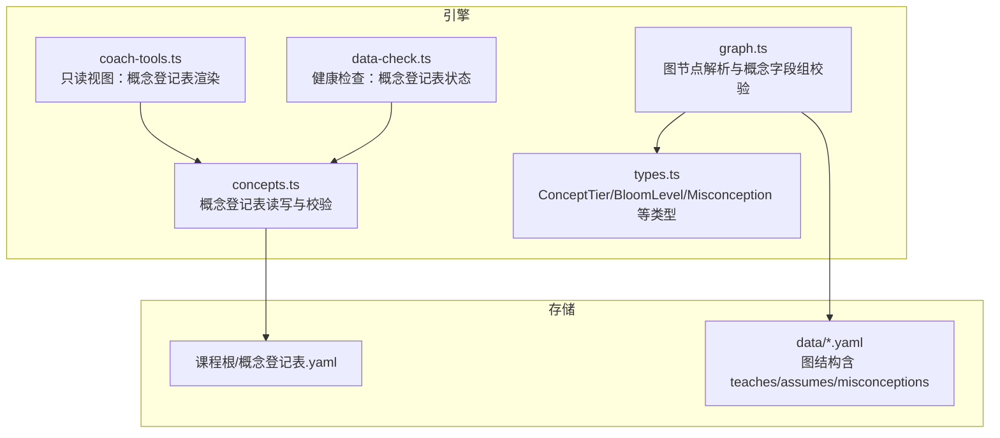
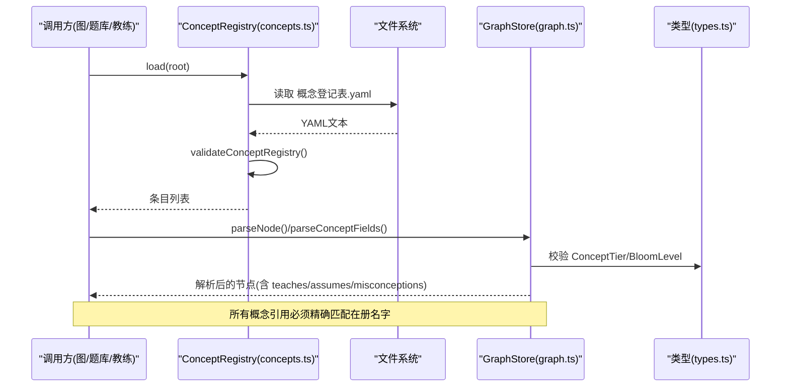
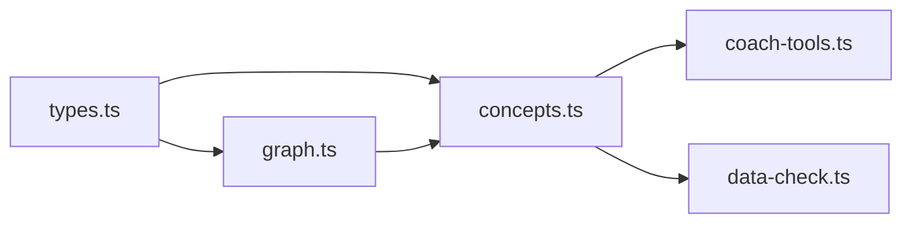

# 概念注册表

<cite>
**本文引用的文件**
- [concepts.ts](file://src/engine/concepts.ts)
- [types.ts](file://src/engine/types.ts)
- [graph.ts](file://src/engine/graph.ts)
- [coach-tools.ts](file://src/engine/coach-tools.ts)
- [data-check.ts](file://src/engine/data-check.ts)
- [concept-registry.test.ts](file://tests/concept-registry.test.ts)
</cite>

## 目录
1. [简介](#简介)
2. [项目结构](#项目结构)
3. [核心组件](#核心组件)
4. [架构总览](#架构总览)
5. [详细组件分析](#详细组件分析)
6. [依赖关系分析](#依赖关系分析)
7. [性能与可扩展性](#性能与可扩展性)
8. [故障排查指南](#故障排查指南)
9. [结论](#结论)
10. [附录：API 参考与使用示例](#附录api-参考与使用示例)

## 简介
本文件系统化说明“概念注册表”的数据模型、设计原则与实现要点，覆盖概念定义、分类与层级（ConceptTier）、元数据管理、生命周期（注册/更新/删除/合并）、引用与冲突检测、质量评估与审核流程、版本控制与历史追踪，以及与知识图谱的集成方式。

## 项目结构
概念注册表的核心位于引擎层，围绕课程根目录下的“概念登记表.yaml”进行受控词表管理；图节点通过 teaches/assumes/misconceptions 字段引用登记的概念名，形成“概念—节点”的双向约束。

图表来源
- [concepts.ts:284-334](file://src/engine/concepts.ts#L284-L334)
- [graph.ts:63-127](file://src/engine/graph.ts#L63-L127)
- [types.ts:70-100](file://src/engine/types.ts#L70-L100)
- [coach-tools.ts:124-140](file://src/engine/coach-tools.ts#L124-L140)
- [data-check.ts:553-565](file://src/engine/data-check.ts#L553-L565)

章节来源
- [concepts.ts:1-335](file://src/engine/concepts.ts#L1-L335)
- [graph.ts:1-200](file://src/engine/graph.ts#L1-L200)
- [types.ts:70-100](file://src/engine/types.ts#L70-L100)
- [coach-tools.ts:124-140](file://src/engine/coach-tools.ts#L124-L140)
- [data-check.ts:553-565](file://src/engine/data-check.ts#L553-L565)

## 核心组件
- 概念条目 ConceptEntry：canonical（主名）、aliases（别名列表）、definition（可选定义）、confusable（可选易混对）。
- 概念注册表 ConceptRegistry：提供 load/save/merge 等持久化操作，负责 YAML 读取、契约校验与原子写入。
- 概念档位 ConceptTier：固定枚举 ['知道','会用','能教']，用于 teaches/assumes 的教学深度标注。
- 误解 Misconception：{concept, model} 描述典型错误模型，限制每概念全课程最多若干条。
- 受理门与冲突检测：在提案受理阶段校验概念引用是否在册、铸名是否冲突、误解数量是否越界。

章节来源
- [concepts.ts:19-28](file://src/engine/concepts.ts#L19-L28)
- [concepts.ts:284-334](file://src/engine/concepts.ts#L284-L334)
- [types.ts:70-100](file://src/engine/types.ts#L70-L100)
- [graph.ts:63-127](file://src/engine/graph.ts#L63-L127)

## 架构总览
概念注册表作为“受控词表”，为图节点、题库出题、教练工具等子系统提供权威名称解析与引用一致性保障。其关键交互如下：

图表来源
- [concepts.ts:294-315](file://src/engine/concepts.ts#L294-L315)
- [graph.ts:63-127](file://src/engine/graph.ts#L63-L127)
- [types.ts:70-100](file://src/engine/types.ts#L70-L100)

## 详细组件分析

### 数据结构与设计原理
- 概念条目 ConceptEntry
  - canonical：唯一主名，身份标识。
  - aliases：历史地址集合，支持旧引用续解析。
  - definition：可选定义，用于同形异义与螺旋升档判断。
  - confusable：可选易混对，辅助跨概念对比题生成。
- 联合唯一性：canonical 与全部别名在全表内严格唯一，违约即 Broken。
- 身份=条目、名字=地址：解析时精确匹配 canonical 或别名，永不模糊匹配。
- 条目禁删只并入：通过 merge 将 from 并入 into，from 的 canonical 降级为别名，旧地址继续解析。

章节来源
- [concepts.ts:19-28](file://src/engine/concepts.ts#L19-L28)
- [concepts.ts:112-138](file://src/engine/concepts.ts#L112-L138)
- [concepts.ts:247-280](file://src/engine/concepts.ts#L247-L280)

### 概念档位 ConceptTier
- 定义：['知道','会用','能教']，中文锁定，用于 teaches/assumes 的教学深度标注。
- 用途：不进入调度门禁，仅作为概念级生成注入与教练视角的感知面。
- 校验：teaches/assumes 映射中的值必须属于该枚举，否则拒收。

章节来源
- [types.ts:70-75](file://src/engine/types.ts#L70-L75)
- [graph.ts:63-79](file://src/engine/graph.ts#L63-L79)

### 元数据管理
- 名称与别名：canonical + aliases 构成可解析的地址空间。
- 定义：definition 用于语义消歧与教学策略提示。
- 易混对：confusable 经精确解析归一后，按 scope 过滤生成对比题候选对。
- 引用校验：teaches/assumes/misconceptions/invokes 均需在概念登记表在册或在同一批提案中铸名。

章节来源
- [concepts.ts:92-110](file://src/engine/concepts.ts#L92-L110)
- [concepts.ts:140-178](file://src/engine/concepts.ts#L140-L178)
- [graph.ts:81-127](file://src/engine/graph.ts#L81-L127)

### 生命周期管理
- 注册（铸名）：edit 提案 concepts 块随 apply 事务落盘到概念登记表；被拒则不落盘。
- 更新：通过 merge 将重复/分裂条目并入，保留旧地址别名；definition 缺省回退。
- 删除：禁止直接删除，采用并入策略保证历史地址可解析。
- 并发安全：apply 侧幂等处理，避免崩溃重放导致重复或冲突。

章节来源
- [concepts.ts:180-245](file://src/engine/concepts.ts#L180-L245)
- [concepts.ts:247-280](file://src/engine/concepts.ts#L247-L280)
- [concept-registry.test.ts:315-350](file://tests/concept-registry.test.ts#L315-L350)

### 依赖关系与冲突检测
- 概念引用门：teaches/assumes/misconceptions/invokes 必须精确匹配在册名字或同批铸名。
- 铸名冲突：提案内重复 canonical、撞既有登记表名字或别名均拒绝。
- 误解上限：每概念全课程封顶若干条，超限报错。
- 易混对提取：仅保留与当前 scope 相交的对，悬空/自指静默降级。

章节来源
- [concepts.ts:155-202](file://src/engine/concepts.ts#L155-L202)
- [graph.ts:81-127](file://src/engine/graph.ts#L81-L127)
- [concept-registry.test.ts:165-281](file://tests/concept-registry.test.ts#L165-L281)

### 与知识图谱的集成
- 图节点概念字段：teaches/assumes/misconceptions 通过 parseConceptFields 解析并校验。
- 概念到节点映射：概念名→节点 via pre/enc 边与 teaches/assumes 声明；invokes 标注题目与概念关联。
- 视图与工具：教练工具提供 concept_registry 只读视图，便于人审与导航。

章节来源
- [graph.ts:81-127](file://src/engine/graph.ts#L81-L127)
- [coach-tools.ts:124-140](file://src/engine/coach-tools.ts#L124-L140)
- [coach-tools.ts:222-283](file://src/engine/coach-tools.ts#L222-L283)

### 质量评估与审核流程
- 质量量规注册表：五类产物（大纲/节正文/题目/教练回合/种子·终点）的量规与判据，分层法庭（AI提议/人审终审/结果法院）。
- 评审器：离线批量抽样、两段式评分、证据定位核对、稳定性统计，报告输出至中心 state。
- 概念相关：题目出生打标（invokes）与覆盖率投影，结合概念登记表范围进行质量约束。

章节来源
- [types.ts:202-211](file://src/engine/types.ts#L202-L211)
- [tests/README.md:63-93](file://tests/README.md#L63-L93)

### 版本控制与历史追踪
- 提案-确认制：edit/seed/enrich/project_plan/project_milestone/experiment 等提案状态流转（pending/applied/rejected）。
- 日志与审计：数据健康检查 data-check 记录 concept_registry 缺失/损坏/契约违规；语料捕获与质量评审报告留存。
- 合并不可逆：通过 merge 保留历史地址，确保断裂存活。

章节来源
- [types.ts:202-211](file://src/engine/types.ts#L202-L211)
- [data-check.ts:553-565](file://src/engine/data-check.ts#L553-L565)
- [concepts.ts:247-280](file://src/engine/concepts.ts#L247-L280)

## 依赖关系分析
- 模块耦合
  - concepts.ts 提供纯函数与类，被 graph.ts、coach-tools.ts、data-check.ts 消费。
  - types.ts 集中类型定义，降低环依赖风险。
  - graph.ts 在节点解析阶段消费概念字段组与档位枚举。
- 外部依赖
  - 文件系统：YAML 读写、原子写。
  - 路径抽象：Paths 提供概念登记表路径。

图表来源
- [types.ts:70-100](file://src/engine/types.ts#L70-L100)
- [concepts.ts:284-334](file://src/engine/concepts.ts#L284-L334)
- [graph.ts:63-127](file://src/engine/graph.ts#L63-L127)
- [coach-tools.ts:124-140](file://src/engine/coach-tools.ts#L124-L140)
- [data-check.ts:553-565](file://src/engine/data-check.ts#L553-L565)

章节来源
- [concepts.ts:284-334](file://src/engine/concepts.ts#L284-L334)
- [graph.ts:63-127](file://src/engine/graph.ts#L63-L127)
- [types.ts:70-100](file://src/engine/types.ts#L70-L100)

## 性能与可扩展性
- 解析复杂度
  - 概念引用解析 O(n) 线性查找（entries 规模通常较小）。
  - 易混对提取 O(m) 遍历 confusable 列表，配合 Set 去重。
- 写入性能
  - 原子写保障一致性，避免部分写入导致的损坏。
- 扩展点
  - 新增概念字段需同步校验与视图渲染。
  - 新增档位需统一在 CONCEPT_TIERS 与解析逻辑中维护。

[本节为通用指导，无需具体文件引用]

## 故障排查指南
- 登记表 Missing：文件不存在视为合法空态，load 返回空表。
- 登记表 Broken：YAML 无法解析或契约校验失败会抛错，需修复后再加载。
- 联合唯一违约：canonical/别名重复会报 schema 错误，需合并或改名。
- 引用未在册：teaches/assumes/misconceptions/invokes 未命中在册名字会被拒收，需补充铸名或改用别名。
- 误解超上限：单概念误解条目过多需精简。

章节来源
- [concepts.ts:294-315](file://src/engine/concepts.ts#L294-L315)
- [concept-registry.test.ts:44-87](file://tests/concept-registry.test.ts#L44-L87)
- [graph.ts:81-127](file://src/engine/graph.ts#L81-L127)

## 结论
概念注册表以“受控词表+精确匹配”为核心，结合提案-确认制与合并策略，实现了概念生命周期的稳健治理。通过与图节点、题库、教练工具的深度集成，确保了概念引用的一致性与可追溯性，并为质量评估与历史追踪提供了坚实基础。

[本节为总结性内容，无需具体文件引用]

## 附录：API 参考与使用示例

### 数据类型
- ConceptEntry：canonical、aliases、definition、confusable。
- ConceptTier：['知道','会用','能教']。
- Misconception：{concept, model}。

章节来源
- [concepts.ts:19-28](file://src/engine/concepts.ts#L19-L28)
- [types.ts:70-100](file://src/engine/types.ts#L70-L100)

### 核心 API
- ConceptRegistry.load(root): 读取概念登记表，Missing 返回空表，Broken 抛错。
- ConceptRegistry.save(root, entries): 原子写入概念登记表。
- ConceptRegistry.merge(root, from, into): 合并条目，保留旧地址别名。
- validateConceptRegistry(raw): 校验登记表结构与联合唯一性。
- resolveConcept(entries, name): 精确匹配解析 canonical/别名。
- namesOf(entries): 获取在册名字全集。
- conceptReferenceErrors(refs, known): 生成未在册引用的可执行错误行。
- invokesUnregistered(q, known): 题目 invokes 在册校验。
- applyConceptMints(existing, mints): 应用铸名（幂等）。
- mergeConceptEntries(entries, from, into): 纯函数合并。

章节来源
- [concepts.ts:112-245](file://src/engine/concepts.ts#L112-L245)
- [concepts.ts:284-334](file://src/engine/concepts.ts#L284-L334)

### 使用示例（基于测试用例的行为）
- 登记表缺失：load 返回 []，不抛错。
- 联合唯一违约：validateConceptRegistry 报错并指出冲突位置。
- 别名解析：resolveConcept 可通过别名命中 canonical。
- 合并：merge 将 from 并入 into，from 的 canonical 降级为别名，旧地址继续解析。
- 铸名与引用同批：edit 提案 concepts 块与 ops 引用同批名字可受理。
- 铸名冲突：与既有登记表名字冲突将被拒收。
- 题目 invokes：未在册 invokes 被拒收，缺席合法。

章节来源
- [concept-registry.test.ts:44-87](file://tests/concept-registry.test.ts#L44-L87)
- [concept-registry.test.ts:102-111](file://tests/concept-registry.test.ts#L102-L111)
- [concept-registry.test.ts:115-161](file://tests/concept-registry.test.ts#L115-L161)
- [concept-registry.test.ts:165-281](file://tests/concept-registry.test.ts#L165-L281)
- [concept-registry.test.ts:315-350](file://tests/concept-registry.test.ts#L315-L350)
- [concept-registry.test.ts:369-411](file://tests/concept-registry.test.ts#L369-L411)