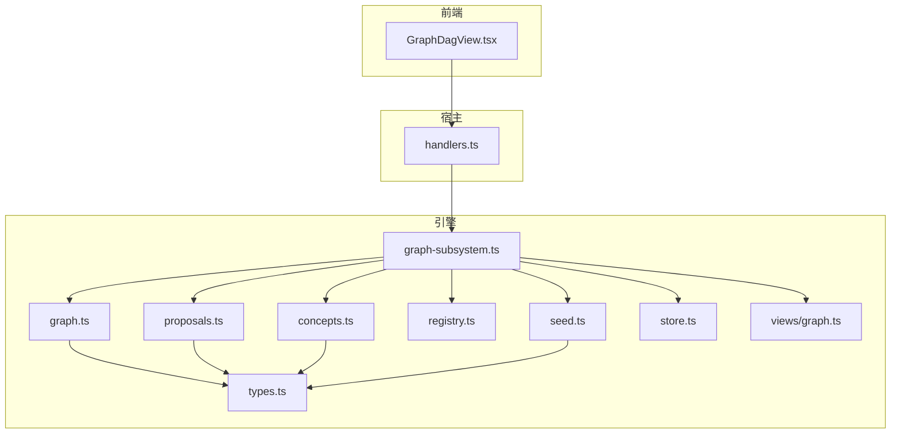
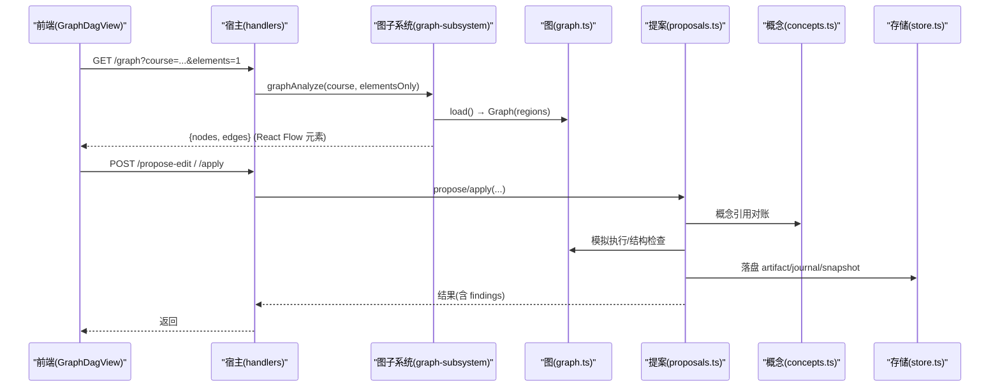
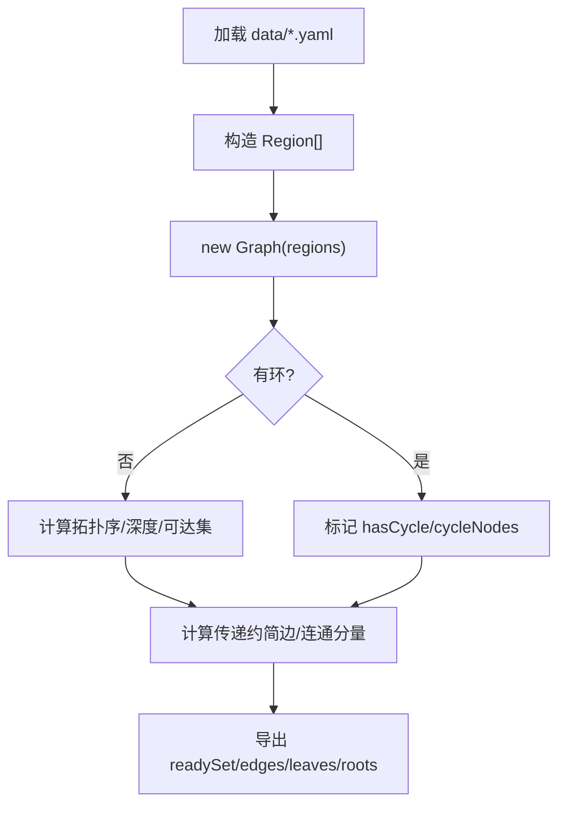
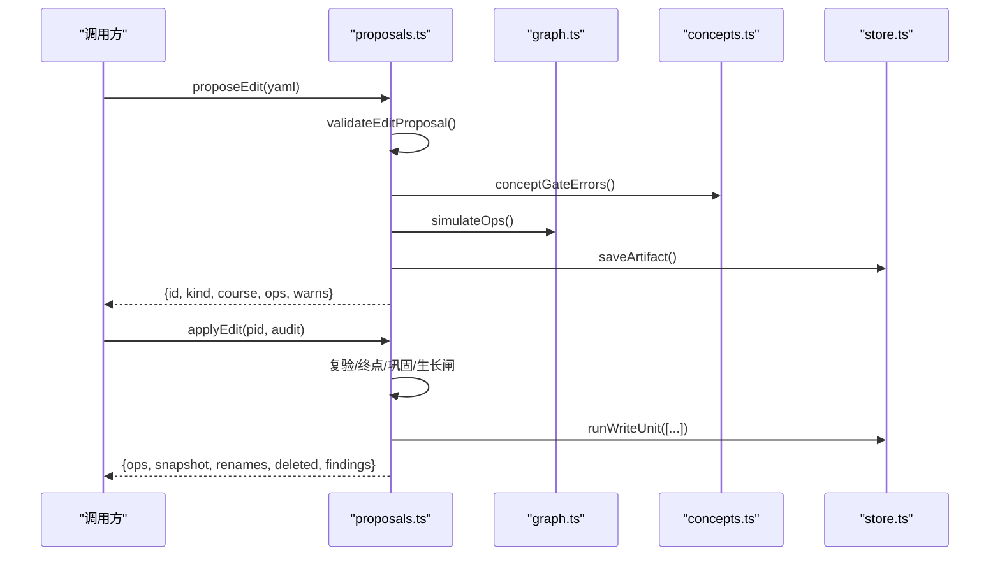
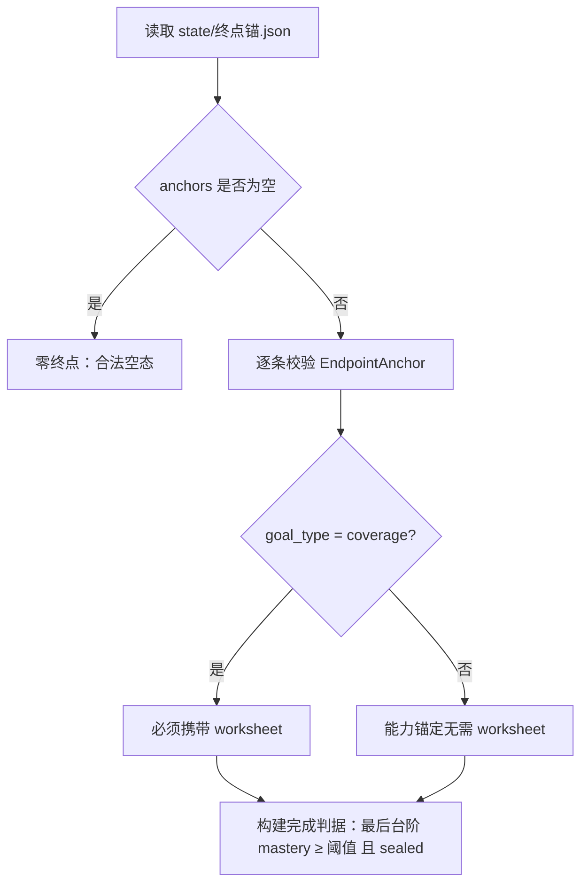
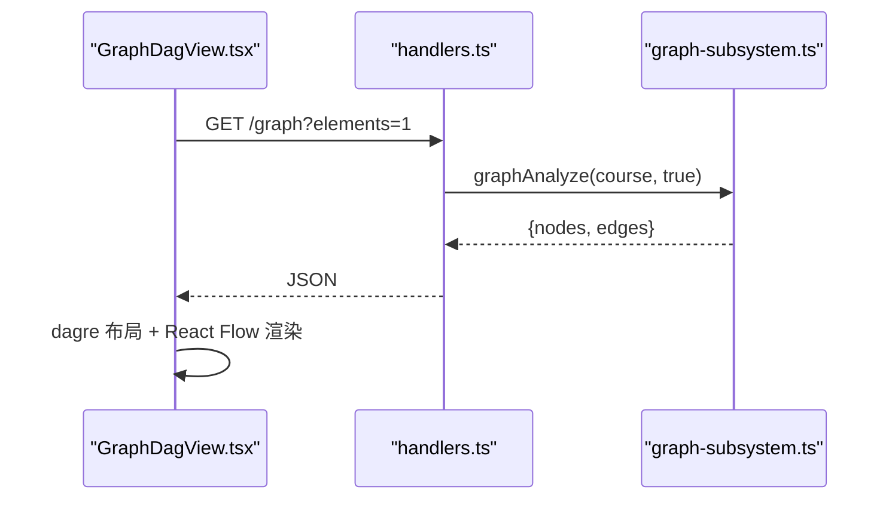
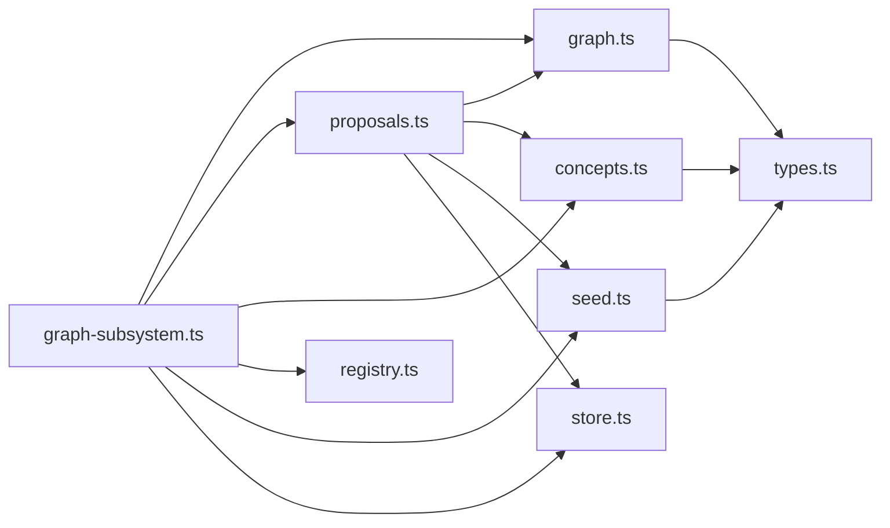

# 知识图谱系统

<cite>
**本文引用的文件**
- [graph.ts](file://src/engine/graph.ts)
- [registry.ts](file://src/engine/registry.ts)
- [proposals.ts](file://src/engine/proposals.ts)
- [concepts.ts](file://src/engine/concepts.ts)
- [graph-subsystem.ts](file://src/engine/graph-subsystem.ts)
- [types.ts](file://src/engine/types.ts)
- [views/graph.ts](file://src/engine/views/graph.ts)
- [seed.ts](file://src/engine/seed.ts)
- [store.ts](file://src/engine/store.ts)
- [handlers.ts](file://src/host/handlers.ts)
- [GraphDagView.tsx](file://ui/src/components/GraphDagView.tsx)
- [SKILL.md](file://skills/learnhub-graph-optimize/SKILL.md)
</cite>

## 目录
1. [简介](#简介)
2. [项目结构](#项目结构)
3. [核心组件](#核心组件)
4. [架构总览](#架构总览)
5. [详细组件分析](#详细组件分析)
6. [依赖关系分析](#依赖关系分析)
7. [性能与优化](#性能与优化)
8. [故障排查指南](#故障排查指南)
9. [结论](#结论)
10. [附录：API 使用示例与最佳实践](#附录api-使用示例与最佳实践)

## 简介
本系统提供课程级“知识图谱”的建模、变更、审核与应用能力。数据以 YAML 区文件为图结构的唯一事实源，通过提案机制实现安全可控的增删改；概念登记表维护受控词表与引用一致性；视图层输出 React Flow 可用的元素集合用于可视化渲染；存储层采用 JSONL 追加日志与原子写入保证持久化一致性与可审计性。

## 项目结构
- 引擎层（engine）
  - graph.ts：图模型、解析、校验、派生结构与快照
  - proposals.ts：提案受理、门禁、应用与落盘
  - concepts.ts：概念登记表读写、合并、引用对账
  - registry.ts：课程注册表读写与选择语义
  - seed.ts：种子与终点锚（多终点）契约与校验
  - store.ts：运行态存储（journal/practice/review-log/proposals/snapshots）
  - types.ts：共享类型定义
  - views/graph.ts：图视图类型（供 UI 消费）
  - graph-subsystem.ts：门面聚合（分析、链接先验、回填、提案入口等）
- 宿主层（host）
  - handlers.ts：HTTP 路由与 API 暴露（如 /graph）
- 前端（ui）
  - GraphDagView.tsx：基于 React Flow + dagre 的 DAG 可视化
- 技能文档（skills）
  - learnhub-graph-optimize/SKILL.md：图谱优化工作流指引



**图表来源**
- [graph-subsystem.ts:78-117](file://src/engine/graph-subsystem.ts#L78-L117)
- [handlers.ts:134-137](file://src/host/handlers.ts#L134-L137)
- [GraphDagView.tsx:1-25](file://ui/src/components/GraphDagView.tsx#L1-L25)

**章节来源**
- [graph.ts:1-20](file://src/engine/graph.ts#L1-L20)
- [graph-subsystem.ts:78-117](file://src/engine/graph-subsystem.ts#L78-L117)
- [handlers.ts:134-137](file://src/host/handlers.ts#L134-L137)

## 核心组件
- 图模型与持久化
  - 节点/边/区/块：GNode/GBlock/GRegion，字段含 pre/opt/note/enc/est/type/bloom/difficulty/teaches/assumes/misconceptions
  - GraphStore：读取 data/*.yaml → 构造 Region 列表；序列化/反序列化；原子写入
  - Graph：内存图，派生邻接表、拓扑序、深度、可达集、传递约简边、连通分量、就绪判定
- 概念登记与引用对账
  - ConceptRegistry：读/写概念登记表；合并条目；名称联合唯一；精确匹配解析
  - 引用对账：受理门与 apply 门均校验 teaches/assumes/误解中的概念名在册
- 提案系统
  - propose-edit/seed/enrich：schema 校验 → 结构检查 → 概念对表 → 终点保护/巩固门/生长闸门 → 落盘 pending
  - apply：审计门禁 → 复验 → 写入单元（铸名→图重写→锚维护→笔记联动→路线重写→边实验→快照→journal→applied）
- 课程注册表
  - Registry：课程清单与启用状态；按 name/id 查找；CLI 选择语义
- 种子与终点锚
  - 多终点锚容器 v2；起点/终点/粗占位边；完成判据折叠到终点最后台阶
- 存储与快照
  - Store：journal/practice/review-log 追加 JSONL；proposals 单文件；snapshots 整图文档序列；原子写入

**章节来源**
- [graph.ts:175-276](file://src/engine/graph.ts#L175-L276)
- [graph.ts:278-443](file://src/engine/graph.ts#L278-L443)
- [concepts.ts:282-335](file://src/engine/concepts.ts#L282-L335)
- [proposals.ts:495-510](file://src/engine/proposals.ts#L495-L510)
- [proposals.ts:686-764](file://src/engine/proposals.ts#L686-L764)
- [registry.ts:77-154](file://src/engine/registry.ts#L77-L154)
- [seed.ts:40-71](file://src/engine/seed.ts#L40-L71)
- [store.ts:1-10](file://src/engine/store.ts#L1-L10)

## 架构总览
知识图谱的数据流从 YAML 区文件加载为内存图，经分析视图输出给前端渲染；所有结构性变更必须走提案流程，经过多重门禁后统一应用并落盘，同时记录 journal 与快照。



**图表来源**
- [handlers.ts:134-137](file://src/host/handlers.ts#L134-L137)
- [graph-subsystem.ts:88-117](file://src/engine/graph-subsystem.ts#L88-L117)
- [graph.ts:203-219](file://src/engine/graph.ts#L203-L219)
- [proposals.ts:556-605](file://src/engine/proposals.ts#L556-L605)
- [proposals.ts:686-764](file://src/engine/proposals.ts#L686-L764)
- [store.ts:51-64](file://src/engine/store.ts#L51-L64)

## 详细组件分析

### 图数据结构与生命周期
- 数据结构
  - GNode：name/pre/opt/note/enc/est/type/bloom/difficulty/teaches/assumes/misconceptions
  - GBlock/GRegion：组织节点为区与块
  - Graph：names/preOf/opt/noteOf/estOf/typeOf/bloomOf/difficultyOf/teachesOf/assumesOf/misconceptionsOf/regionIdxOf/blockOf/encOf/count/succ/pred/nset/order/hasCycle/cycleNodes/depth/reach/leaves/roots/edges/components
- 生命周期
  - 加载：GraphStore.load() 读取 data/*.yaml → 构造 Region[]
  - 构建：new Graph(regions) 派生邻接表、拓扑序、深度、可达集、传递约简边、连通分量
  - 查询：readySet/isReady/isAncestor/edgeCount
  - 持久化：regionDoc()/writeRegionDoc() 原子写入；snapshotDoc() 生成整图快照



**图表来源**
- [graph.ts:203-219](file://src/engine/graph.ts#L203-L219)
- [graph.ts:317-422](file://src/engine/graph.ts#L317-L422)

**章节来源**
- [graph.ts:175-276](file://src/engine/graph.ts#L175-L276)
- [graph.ts:278-443](file://src/engine/graph.ts#L278-L443)

### 提案系统（edit/seed/enrich）
- edit 提案
  - 受理：validateEditProposal → 概念引用对表 → 结构检查 → 终点保护/巩固门/生长闸门 → 落盘 pending
  - 应用：audit 门禁 → 复验 → 写入单元（顺序严格：铸名→图重写→锚维护→笔记联动→路线重写→边实验→快照→journal→applied）
- seed 提案
  - 为已注册课程起草结构：1–3 起点 + 终点 + 粗占位边；一次人审即开工
- enrich 提案
  - 覆盖层通道：仅补 enc 字段；指纹锚定正典版本；可重入



**图表来源**
- [proposals.ts:125-341](file://src/engine/proposals.ts#L125-L341)
- [proposals.ts:556-605](file://src/engine/proposals.ts#L556-L605)
- [proposals.ts:686-764](file://src/engine/proposals.ts#L686-L764)
- [store.ts:51-64](file://src/engine/store.ts#L51-L64)

**章节来源**
- [proposals.ts:495-510](file://src/engine/proposals.ts#L495-L510)
- [proposals.ts:556-605](file://src/engine/proposals.ts#L556-L605)
- [proposals.ts:686-764](file://src/engine/proposals.ts#L686-L764)

### 概念注册表与依赖关系
- 概念登记表
  - 条目：canonical/aliases/definition/confusable；全部名字联合唯一
  - 解析：精确匹配 canonical 或别名；悬空引用在消费侧静默降级
  - 合并：from 并入 into，旧地址经别名续解析
- 依赖关系
  - 节点 teaches/assumes 映射概念名→档位；misconceptions 记录错误模型
  - 受理门/apply 门均校验概念引用在册；同一概念全课程误解封顶

```mermaid
classDiagram
class ConceptEntry {
+string canonical
+string[] aliases
+string definition
+string[] confusable
}
class ConceptRegistry {
+load(root) Promise~ConceptEntry[]~
+save(root, entries) Promise~void~
+merge(root, from, into) Promise~{into, names}~
}
ConceptRegistry --> ConceptEntry : "管理"
```

**图表来源**
- [concepts.ts:19-28](file://src/engine/concepts.ts#L19-L28)
- [concepts.ts:282-335](file://src/engine/concepts.ts#L282-L335)

**章节来源**
- [concepts.ts:112-163](file://src/engine/concepts.ts#L112-L163)
- [concepts.ts:204-280](file://src/engine/concepts.ts#L204-L280)
- [concepts.ts:282-335](file://src/engine/concepts.ts#L282-L335)

### 种子与终点锚（多终点）
- 锚容器 v2：version 2 + anchors 列表；零终点合法
- 单条锚：endpoint/goal_note/goal_type/declared/sealed/worksheet/origin_proposal/seed_nodes/start_basis
- 完成判据：按终点折叠，mastery 阈值 + sealed 收尾



**图表来源**
- [seed.ts:40-71](file://src/engine/seed.ts#L40-L71)
- [seed.ts:104-167](file://src/engine/seed.ts#L104-L167)
- [seed.ts:172-198](file://src/engine/seed.ts#L172-L198)

**章节来源**
- [seed.ts:40-71](file://src/engine/seed.ts#L40-L71)
- [seed.ts:104-167](file://src/engine/seed.ts#L104-L167)
- [seed.ts:172-198](file://src/engine/seed.ts#L172-L198)

### 序列化、反序列化与持久化策略
- 图区文件
  - 反序列化：loadRegionDoc() 解析 region/color/blocks/nodes
  - 序列化：regionDoc() 输出键顺序固定，省略空值；writeRegionDoc() 原子写入
- 快照
  - snapshotDoc()：将 regions 序列化为文档序列
- 存储层
  - journal/practice/review-log：JSONL 追加
  - proposals：单文件 JSON 清单，形状契约校验
  - snapshots：state/snapshots/<课程>-v<N>.json
  - 原子写入：atomicWrite 临时文件 + rename

**章节来源**
- [graph.ts:175-276](file://src/engine/graph.ts#L175-L276)
- [graph.ts:483-492](file://src/engine/graph.ts#L483-L492)
- [store.ts:1-10](file://src/engine/store.ts#L1-L10)
- [store.ts:168-200](file://src/engine/store.ts#L168-L200)

### 可视化技术方案与渲染接口
- 后端接口
  - GET /graph?course=...&elements=1：返回 GraphDoc 或 GraphElementsDoc（React Flow 元素）
- 前端渲染
  - GraphDagView.tsx：基于 @xyflow/react + dagre 分层布局；五态色板、掌握度底色插值、终点方向标记、推荐/锁定/练习角标
- 视图类型
  - GraphDoc/GraphElementsDoc：nodes/edges/stats/schema 等



**图表来源**
- [handlers.ts:134-137](file://src/host/handlers.ts#L134-L137)
- [graph-subsystem.ts:88-117](file://src/engine/graph-subsystem.ts#L88-L117)
- [GraphDagView.tsx:1-25](file://ui/src/components/GraphDagView.tsx#L1-L25)
- [views/graph.ts:77-143](file://src/engine/views/graph.ts#L77-L143)

**章节来源**
- [handlers.ts:134-137](file://src/host/handlers.ts#L134-L137)
- [graph-subsystem.ts:88-117](file://src/engine/graph-subsystem.ts#L88-L117)
- [GraphDagView.tsx:1-200](file://ui/src/components/GraphDagView.tsx#L1-L200)
- [views/graph.ts:77-143](file://src/engine/views/graph.ts#L77-L143)

## 依赖关系分析
- 模块耦合
  - graph-subsystem 聚合 graph/proposals/concepts/registry/seed/store，作为门面被宿主调用
  - proposals 强依赖 graph/concepts/seed/store，承担变更门禁与落盘
  - graph 被多处引用但保持纯函数与类职责清晰
- 外部依赖
  - YAML 解析/字符串化：yaml.ts
  - 文件系统抽象：VaultFs（io.ts）
  - 时间：clock.ts
  - 路径：paths.ts



**图表来源**
- [graph-subsystem.ts:14-77](file://src/engine/graph-subsystem.ts#L14-L77)
- [proposals.ts:8-38](file://src/engine/proposals.ts#L8-L38)
- [graph.ts:9-17](file://src/engine/graph.ts#L9-L17)

**章节来源**
- [graph-subsystem.ts:14-77](file://src/engine/graph-subsystem.ts#L14-L77)
- [proposals.ts:8-38](file://src/engine/proposals.ts#L8-L38)

## 性能与优化
- 索引机制
  - Graph 内部维护 succ/pred/depth/reach/encOf/teachesOf/assumesOf 等索引，支持 O(1)/O(n) 查询
  - 拓扑序与可达集预计算，避免重复 BFS/DFS
- 缓存策略
  - vault 链接先验缓存：readVaultLinksCache() 命中则直接映射到图节点，减少扫描
  - 建议项上限随图规模伸缩，避免大图中过多候选
- 查询优化
  - elementsOnly=true 时只返回 nodes/edges，降低传输与渲染开销
  - 分析阶段剔除终点影响（leaves/missing_pre），聚焦真实学习路径
- 写入优化
  - 原子写入避免中间态；JSONL 追加适合高吞吐流水

**章节来源**
- [graph.ts:317-422](file://src/engine/graph.ts#L317-L422)
- [graph-subsystem.ts:119-152](file://src/engine/graph-subsystem.ts#L119-L152)
- [analysis.ts:178-235](file://src/engine/analysis.ts#L178-L235)
- [store.ts:1-10](file://src/engine/store.ts#L1-L10)

## 故障排查指南
- 常见错误
  - 图结构错误：断边/环/重名 → structureCheck 返回错误行
  - 概念引用未在册 → conceptReferenceErrors 给出可执行修复指引
  - 终点保护：del/rename 锚定终点或被以终点为 pre → endpointGuardErrors
  - 巩固门：operator=巩固 的 add_node 只引已教概念
  - 生长闸门：插入积极性调速（三率超限/复诊通过率触底）拒绝受理
- 存储损坏
  - 注册表 Broken：YAML 无法解析或契约失败 → 抛错不静默降级
  - 概念登记表 Broken：同上
  - proposals 清单 Broken：非数组/形状违约/pair 悬空 → 抛错并提示修复位置

**章节来源**
- [graph.ts:445-481](file://src/engine/graph.ts#L445-L481)
- [proposals.ts:355-379](file://src/engine/proposals.ts#L355-L379)
- [proposals.ts:615-680](file://src/engine/proposals.ts#L615-L680)
- [registry.ts:77-154](file://src/engine/registry.ts#L77-L154)
- [concepts.ts:282-335](file://src/engine/concepts.ts#L282-L335)
- [store.ts:168-200](file://src/engine/store.ts#L168-L200)

## 结论
本系统以“数据即事实、变更即提案”为核心原则，通过严格的 schema 与结构校验、概念引用对账、终点保护与生长闸门，确保知识图谱的可演进性与一致性。视图层提供高效的 React Flow 元素输出，前端渲染直观呈现学习进度与方向标记。存储层采用原子写入与追加日志，兼顾可靠性与可审计性。

## 附录：API 使用示例与最佳实践
- 获取图元素（elementsOnly）
  - GET /graph?course=数学&elements=1
  - 返回 GraphElementsDoc，包含 nodes/edges，供前端渲染
- 提出编辑提案
  - 提交 EditProposal YAML（course/reason/ops），通过 propose-edit 受理
  - 人工审核后 apply-edit 生效，自动联动笔记与引用
- 提出富化提案
  - 提交 EnrichProposal YAML（course/reason/fields/fingerprints），仅补 enc 字段
- 提出种子提案
  - 为已注册课程起草结构（起点/终点/粗占位边），一次人审即开工
- 最佳实践
  - 始终通过提案修改图结构，禁止手工直改 data/*.yaml
  - 概念引用必须先在概念登记表在册或使用提案 concepts 块铸名
  - 主线批（前进/换向）含新节点时必须声明 target_endpoints 并完成接线覆盖
  - 利用 analyze 的建议（expand_blocks/missing_pre/unconverged/jump_candidates）指导优化

**章节来源**
- [handlers.ts:134-137](file://src/host/handlers.ts#L134-L137)
- [proposals.ts:125-341](file://src/engine/proposals.ts#L125-L341)
- [proposals.ts:404-483](file://src/engine/proposals.ts#L404-L483)
- [graph-subsystem.ts:445-524](file://src/engine/graph-subsystem.ts#L445-L524)
- [SKILL.md:1-26](file://skills/learnhub-graph-optimize/SKILL.md#L1-L26)