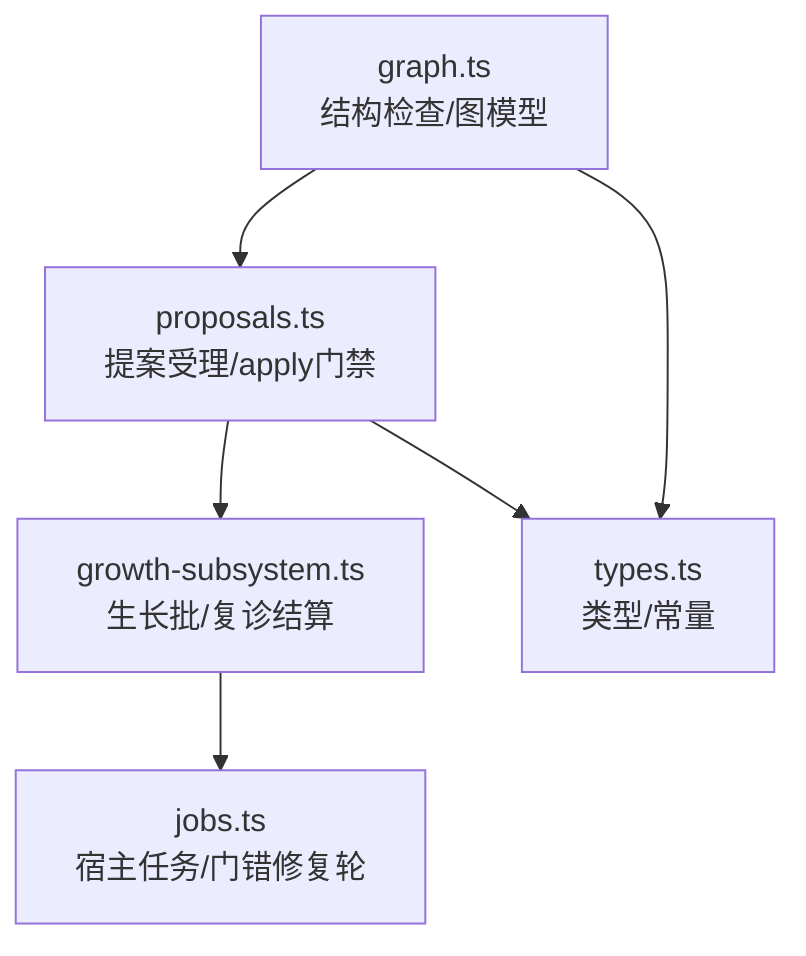
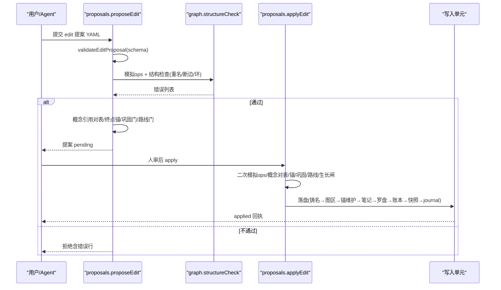
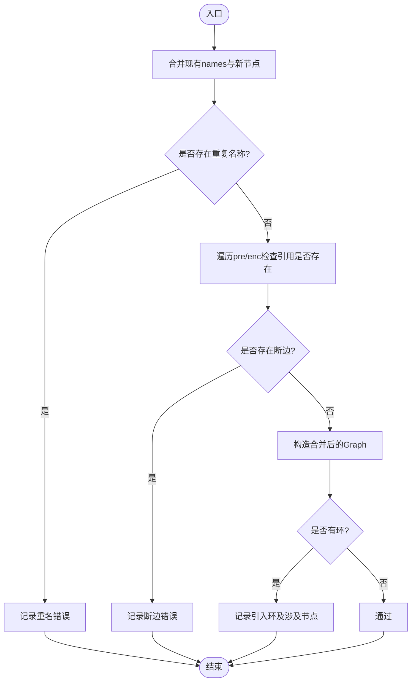
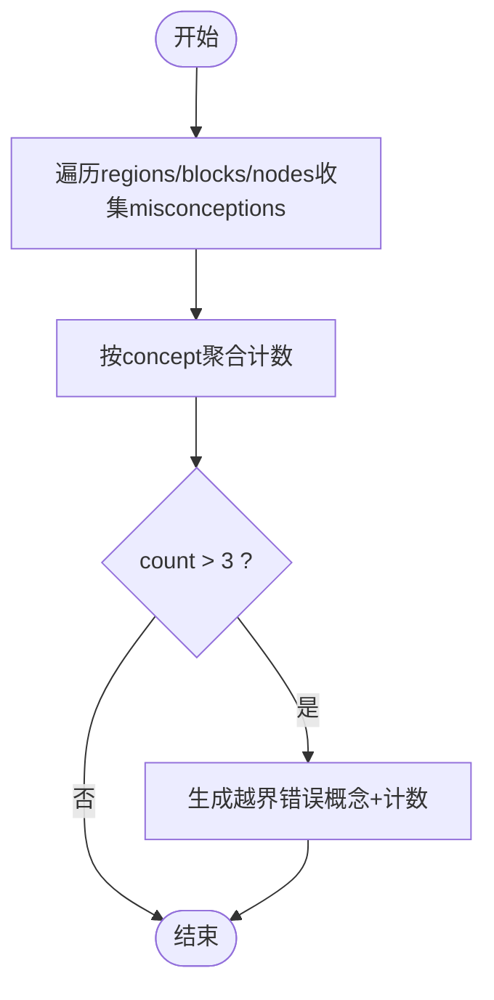
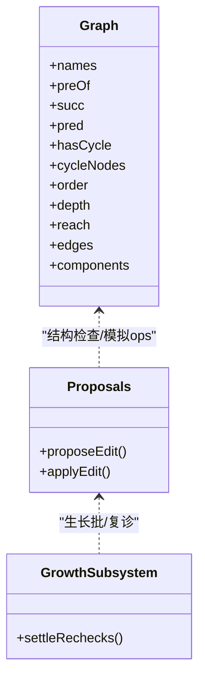
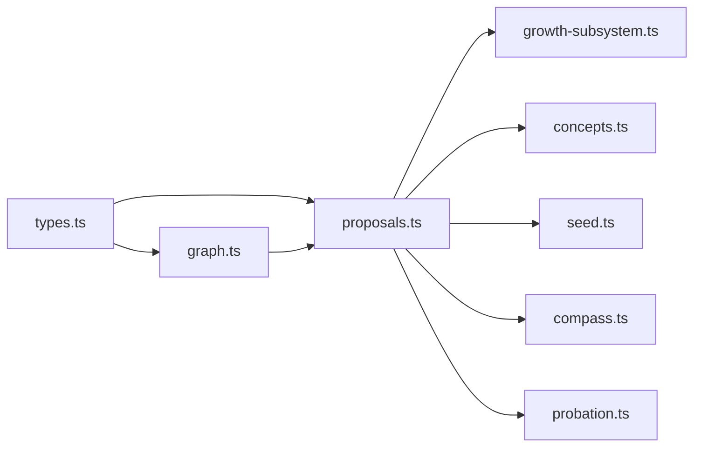

# 结构验证与检查

<cite>
**本文引用的文件**
- [graph.ts](file://src/engine/graph.ts)
- [proposals.ts](file://src/engine/proposals.ts)
- [growth-subsystem.ts](file://src/engine/growth-subsystem.ts)
- [jobs.ts](file://src/host/jobs.ts)
- [types.ts](file://src/engine/types.ts)
- [README.md（tests）](file://tests/README.md)
</cite>

## 目录
1. [简介](#简介)
2. [项目结构](#项目结构)
3. [核心组件](#核心组件)
4. [架构总览](#架构总览)
5. [详细组件分析](#详细组件分析)
6. [依赖关系分析](#依赖关系分析)
7. [性能考量](#性能考量)
8. [故障排查指南](#故障排查指南)
9. [结论](#结论)
10. [附录](#附录)

## 简介
本文件聚焦课程概念图的结构验证与检查机制，围绕以下目标展开：
- 解释 structureCheck 的实现逻辑：重名检测、断边检查、环检测。
- 说明 misconceptionCapErrors 的作用：误解封顶机制与跨节点计数规则。
- 描述 schema 验证流程与错误分类（SchemaError vs 语义错误）。
- 明确结构完整性检查的标准与规则。
- 提供验证结果的解释与处理建议。
- 列举常见结构问题案例与解决方案。
- 说明验证触发时机与执行策略。
- 描述与提案系统的集成方式，确保变更前的结构验证。

## 项目结构
结构验证相关代码集中在引擎层：
- 图模型与结构检查：src/engine/graph.ts
- 提案受理与 apply 门禁：src/engine/proposals.ts
- 生长批与复诊结算：src/engine/growth-subsystem.ts
- 宿主任务与门错修复轮：src/host/jobs.ts
- 类型与常量定义：src/engine/types.ts
- 测试与行为契约说明：tests/README.md

**图表来源**
- [graph.ts:1-514](file://src/engine/graph.ts#L1-L514)
- [proposals.ts:1-800](file://src/engine/proposals.ts#L1-L800)
- [growth-subsystem.ts:970-1046](file://src/engine/growth-subsystem.ts#L970-L1046)
- [jobs.ts:1016-1033](file://src/host/jobs.ts#L1016-L1033)
- [types.ts:276-312](file://src/engine/types.ts#L276-L312)

**章节来源**
- [graph.ts:1-514](file://src/engine/graph.ts#L1-L514)
- [proposals.ts:1-800](file://src/engine/proposals.ts#L1-L800)
- [growth-subsystem.ts:970-1046](file://src/engine/growth-subsystem.ts#L970-L1046)
- [jobs.ts:1016-1033](file://src/host/jobs.ts#L1016-L1033)
- [types.ts:276-312](file://src/engine/types.ts#L276-L312)
- [README.md（tests）:27-112](file://tests/README.md#L27-L112)

## 核心组件
- Graph 类：构建概念图的邻接表、拓扑序、可达集、传递约简边、连通分量等派生结构；构造时进行 Kahn 算法拓扑排序并检测环。
- structureCheck(existing, newRegions, label)：合并现有图与新区域，执行重名、断边、环三类结构检查，返回错误列表。
- misconceptionCapErrors(regions)：统计全课程同一概念的误解条目总数，超过封顶阈值则报错。
- parseNode / parseConceptFields / loadRegionDoc：节点与区文档的 schema 解析与校验，抛 SchemaError 中断。
- proposals.ts 中的 proposeEdit / applyEdit：在受理与 apply 阶段分别调用结构检查与概念引用对表、巩固门、终点锚保护等。
- growth-subsystem.ts 中的复诊结算：按学习日到期判定，自动剪除或恢复边实验。
- jobs.ts 的门错修复轮：当生成产物未过门时回灌一次修复轮（deep），仍失败则终止。

**章节来源**
- [graph.ts:278-493](file://src/engine/graph.ts#L278-L493)
- [proposals.ts:556-733](file://src/engine/proposals.ts#L556-L733)
- [growth-subsystem.ts:970-1046](file://src/engine/growth-subsystem.ts#L970-L1046)
- [jobs.ts:1016-1033](file://src/host/jobs.ts#L1016-L1033)

## 架构总览
结构验证贯穿“解析 → 受理 → apply → 运行”的全链路：
- 解析期：YAML/JSON 经 parseNode/loadRegionDoc 做 schema 校验，非法直接抛 SchemaError。
- 受理期（propose-edit）：模拟 ops 执行、概念引用对表、终点锚保护、巩固门、路线门预检、生长闸门。
- 应用期（apply-edit）：再次模拟 ops、概念对表、锚保护、巩固门、路线门、生长闸，通过后进入写入单元落盘。
- 运行期：生长批/复诊结算、健康分提示、快照记录。

**图表来源**
- [proposals.ts:556-733](file://src/engine/proposals.ts#L556-L733)
- [graph.ts:445-468](file://src/engine/graph.ts#L445-L468)

**章节来源**
- [proposals.ts:556-733](file://src/engine/proposals.ts#L556-L733)
- [graph.ts:445-468](file://src/engine/graph.ts#L445-L468)

## 详细组件分析

### structureCheck：重名检测、断边检查、环检测
- 重名检测：将现有图 names 与新区域 nodes 合并去重，若新节点名已存在则报“重名节点”。
- 断边检查：对新节点的 pre 与 enc 逐一校验是否指向已见节点集合，否则报“断边”。
- 环检测：若无断边/重名错误，则基于合并后的 regions 构造 Graph，利用 Kahn 拓扑序判断 hasCycle，并报告涉及的部分 cycleNodes。

**图表来源**
- [graph.ts:445-468](file://src/engine/graph.ts#L445-L468)

**章节来源**
- [graph.ts:445-468](file://src/engine/graph.ts#L445-L468)

### misconceptionCapErrors：误解封顶与跨节点计数
- 规则：同一概念在全课程（合并视图）内最多允许 3 条误解条目。
- 实现：遍历所有 region/block/node 的 misconceptions，按 concept 聚合计数；超过 3 条即返回错误信息，并按概念名排序输出。
- 语义：该检查在受理门以“模拟合并后的图”运行，存量越界也会阻止新增，便于执行性拒收提示（列出概念与现计数）。

**图表来源**
- [graph.ts:470-481](file://src/engine/graph.ts#L470-L481)

**章节来源**
- [graph.ts:470-481](file://src/engine/graph.ts#L470-L481)

### schema 验证流程与错误分类
- SchemaError：由 fail(path, msg) 抛出，用于形态/枚举/必填等硬性约束违规，立即中断流程。
- 语义错误：如重名、断边、环、误解封顶越界等，作为结构化检查的错误列表返回，供上层决策（拒绝/修复）。
- 关键入口：
  - parseNode / parseConceptFields：节点字段组（teaches/assumes/misconceptions）尺寸与枚举校验。
  - loadRegionDoc：区文档顶层形状校验。
  - validateEditProposal：edit 提案 note/ops/schema 严格校验，跨字段规则（如插入批必须带 recheck）在此处裁决。

**图表来源**
- [graph.ts:278-493](file://src/engine/graph.ts#L278-L493)
- [proposals.ts:556-733](file://src/engine/proposals.ts#L556-L733)
- [growth-subsystem.ts:970-1046](file://src/engine/growth-subsystem.ts#L970-L1046)

**章节来源**
- [graph.ts:1-173](file://src/engine/graph.ts#L1-L173)
- [proposals.ts:125-341](file://src/engine/proposals.ts#L125-L341)

### 结构完整性检查标准与规则
- 节点键白名单：name/pre/opt/note/enc/est/type/bloom/difficulty/teaches/assumes/misconceptions。
- 边轻纪律：origin/status/probation 不在图 YAML 存储，提案 op 同样不接受这些键。
- teaches/assumes：概念名→档位映射，尺寸上限（teaches≤8，assumes≤10），窄节点提示（1–2条为WARN）。
- misconceptions：每概念封顶3条；条目仅允许{concept,model}。
- enc：字符串=权重1，映射需node/w/note且w∈[0,1]。
- 结构检查：重名/断边/环均为ERROR；无错误才进行环检测。

**章节来源**
- [graph.ts:18-27](file://src/engine/graph.ts#L18-L27)
- [graph.ts:63-127](file://src/engine/graph.ts#L63-L127)
- [graph.ts:129-173](file://src/engine/graph.ts#L129-L173)
- [graph.ts:445-468](file://src/engine/graph.ts#L445-L468)
- [proposals.ts:87-118](file://src/engine/proposals.ts#L87-L118)

### 验证结果的解释与处理建议
- 重名节点：统一命名规范，避免跨区同名；必要时拆分或迁移到不同块。
- 断边：确保 pre/enc 引用的节点在当前合并图中存在；若为新增前置，需先创建对应节点。
- 引入环：调整依赖方向或拆分为多节点，避免循环依赖；可借助 Graph.order/depth 定位层级。
- 误解封顶越界：收敛既有误解条目文字或换节点承载；优先合并同概念多条误解。
- SchemaError：修正字段类型/枚举/必填项；参考错误消息中具体路径与位置。

**章节来源**
- [graph.ts:445-481](file://src/engine/graph.ts#L445-L481)
- [graph.ts:1-173](file://src/engine/graph.ts#L1-L173)

### 常见结构问题案例与解决方案
- 案例1：新增节点 pre 引用了尚未创建的节点 → 断边错误。解决：先创建前置节点或调整依赖顺序。
- 案例2：两个区块定义了相同 name 的节点 → 重名错误。解决：全局唯一命名或区分区块归属。
- 案例3：add_node 把终点设为 pre → 方向不变式违反。解决：不得长过目标，走重新种子提案或收尾接线批。
- 案例4：某概念误解条目累计超过3条 → 封顶越界。解决：合并既有条目或更换承载节点。
- 案例5：insert 批未携带 recheck → 跨字段规则拒绝。解决：补充 metric 与 days 预注册复诊。

**章节来源**
- [graph.ts:445-481](file://src/engine/graph.ts#L445-L481)
- [proposals.ts:615-680](file://src/engine/proposals.ts#L615-L680)
- [proposals.ts:317-329](file://src/engine/proposals.ts#L317-L329)

### 验证过程的触发时机与执行策略
- 解析期：YAML/JSON 解析时进行 schema 校验，非法直接抛 SchemaError。
- 受理期（propose-edit）：
  - 模拟 ops 执行，调用 structureCheck 进行重名/断边/环检查。
  - 概念引用对表、终点锚保护、巩固门、路线门预检、生长闸门。
- 应用期（apply-edit）：
  - 二次模拟 ops 与上述门复验，通过后进入写入单元落盘。
- 运行期：
  - 生长批/复诊结算：按学习日到期判定，自动剪除或恢复边实验。
  - 健康分提示：非种子阶段健康分低于基线给出建议。

**章节来源**
- [proposals.ts:556-733](file://src/engine/proposals.ts#L556-L733)
- [growth-subsystem.ts:970-1046](file://src/engine/growth-subsystem.ts#L970-L1046)

### 与提案系统的集成方式（确保变更前结构验证）
- proposeEdit：
  - validateEditProposal 严格 schema（note/ops/路由重写权限）。
  - simulateOps + structureCheck 确保结构安全。
  - 概念引用对表、终点锚保护、巩固门、路线门预检、生长闸门。
- applyEdit：
  - 二次校验（概念对表、模拟ops、锚保护、巩固门、路线门、生长闸）。
  - 写入单元顺序：铸名 → 图区重写 → 终点锚 sealed 维护 → 笔记联动 → 罗盘批内重写 → 边实验账本 → 快照 → journal(graph_edit) → 提案 applied。
- 门错修复轮：
  - 宿主 jobs.ts 在生成产物未过门时回灌一次 deep 修复轮；仍失败则终止，保留两轮死因。

**章节来源**
- [proposals.ts:556-800](file://src/engine/proposals.ts#L556-L800)
- [jobs.ts:1016-1033](file://src/host/jobs.ts#L1016-L1033)

## 依赖关系分析
- graph.ts 被 proposals.ts 导入用于结构检查与图建模。
- proposals.ts 依赖 concepts.ts（概念登记）、seed.ts（种子提案）、compass.ts（路线门）、probation.ts（复诊预注册）。
- growth-subsystem.ts 依赖 probation.ts（复诊结算）、store.ts（日志/快照）。
- types.ts 提供共享类型与常量（BLOOM_LEVELS、CONCEPT_TIERS、GROWTH_OPERATORS 等）。

**图表来源**
- [graph.ts:1-173](file://src/engine/graph.ts#L1-L173)
- [proposals.ts:1-800](file://src/engine/proposals.ts#L1-L800)
- [growth-subsystem.ts:970-1046](file://src/engine/growth-subsystem.ts#L970-L1046)
- [types.ts:276-312](file://src/engine/types.ts#L276-L312)

**章节来源**
- [graph.ts:1-173](file://src/engine/graph.ts#L1-L173)
- [proposals.ts:1-800](file://src/engine/proposals.ts#L1-L800)
- [growth-subsystem.ts:970-1046](file://src/engine/growth-subsystem.ts#L970-L1046)
- [types.ts:276-312](file://src/engine/types.ts#L276-L312)

## 性能考量
- 结构检查复杂度：
  - 重名检测：O(N) 使用 Set 去重。
  - 断边检查：O(E) 遍历 pre/enc 边。
  - 环检测：Kahn 拓扑排序 O(V+E)。
- 误解封顶计数：O(M) 遍历所有误解条目聚合计数。
- 建议：
  - 在大图上批量 apply 时，尽量合并变更以减少多次 Graph 构造。
  - 对频繁调用的结构检查，可缓存已有 Graph.names/succ/pred 以降低开销。

[本节为通用指导，无需特定文件来源]

## 故障排查指南
- SchemaError 快速定位：
  - 查看错误消息中的路径与字段，修正类型/枚举/必填项。
  - 参考 parseNode/parseConceptFields/loadRegionDoc 的校验点。
- 结构错误处理：
  - 重名：统一命名，避免跨区冲突。
  - 断边：确保 pre/enc 指向的节点存在。
  - 环：调整依赖方向或拆分节点。
  - 误解封顶：合并既有条目或更换承载节点。
- 门错修复轮：
  - 若生成产物未过门，系统会回灌一次 deep 修复轮；仍失败则终止，查看两轮死因。
- 复诊结算异常：
  - 检查预注册 recheck 是否随插入批携带；到期判定依据学习日与指标。

**章节来源**
- [graph.ts:1-173](file://src/engine/graph.ts#L1-L173)
- [graph.ts:445-481](file://src/engine/graph.ts#L445-L481)
- [jobs.ts:1016-1033](file://src/host/jobs.ts#L1016-L1033)
- [growth-subsystem.ts:970-1046](file://src/engine/growth-subsystem.ts#L970-L1046)

## 结论
本系统通过严格的 schema 校验与结构检查，确保课程概念图在变更前后的一致性、无环性与引用完整性。误解封顶机制防止单一概念过度承载误解条目，保障内容密度可控。提案系统的双门（受理/应用）与写入单元保证变更的事务性与可审计性。结合宿主门错修复轮与复诊结算，形成从生成到生效的闭环质量保障。

[本节为总结性内容，无需特定文件来源]

## 附录
- 行为契约与测试覆盖：tests/README.md 记录了内容管线接缝与多项门控行为的测试要点，可作为理解结构与语义错误的实践参考。

**章节来源**
- [README.md（tests）:27-112](file://tests/README.md#L27-L112)