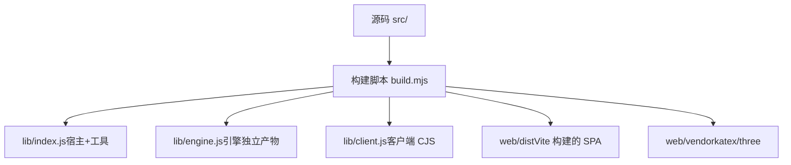
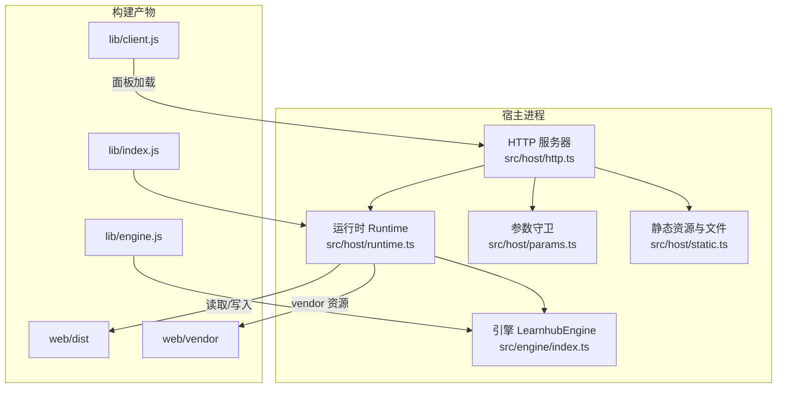
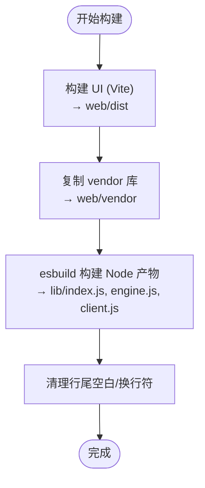
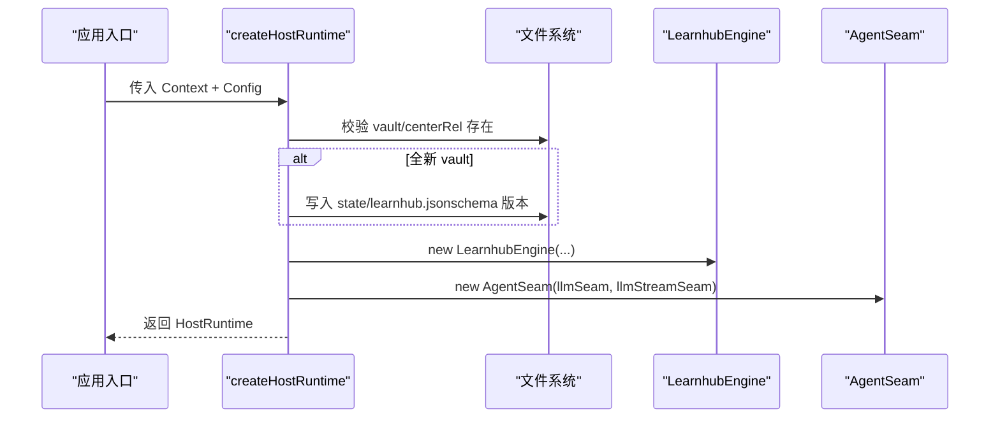
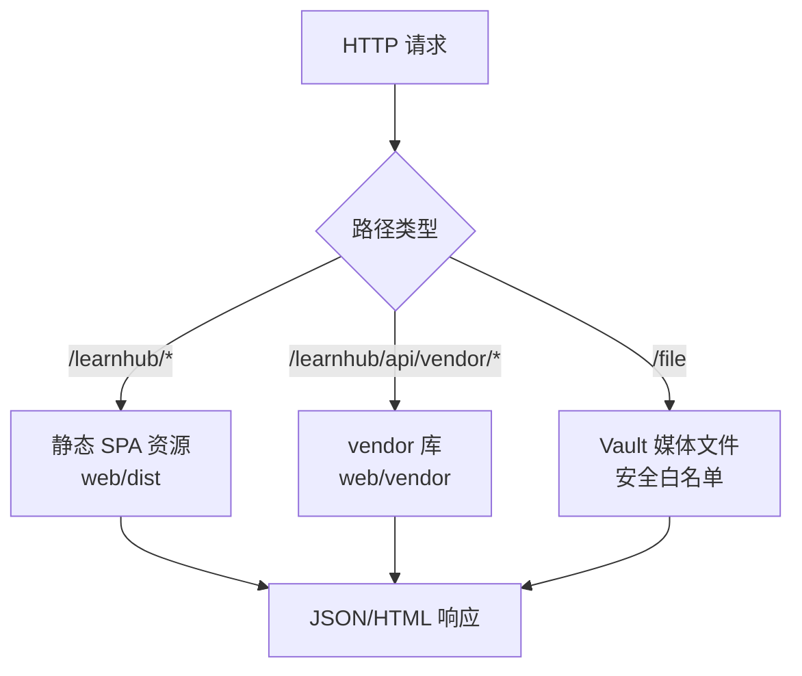
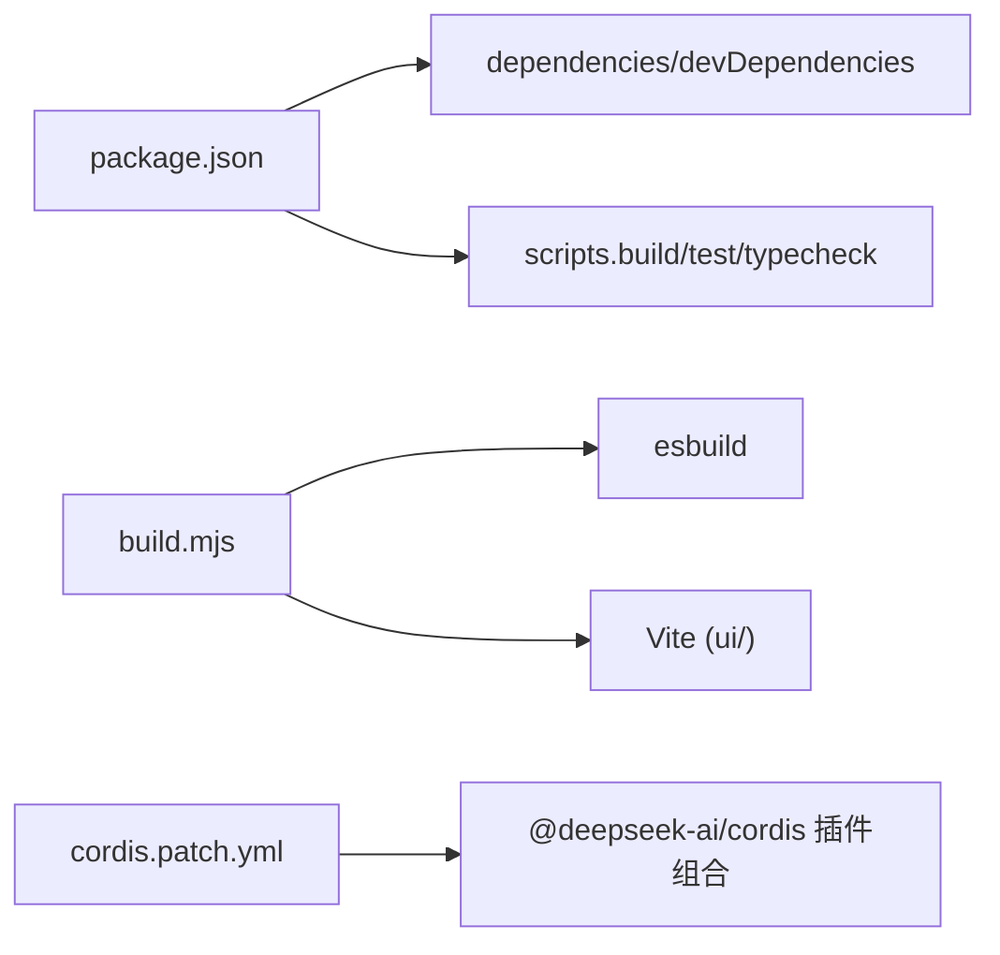
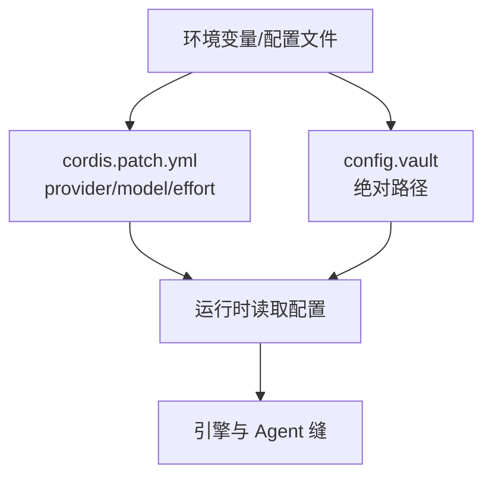

# 容器化部署

<cite>
**本文引用的文件**
- [package.json](file://package.json)
- [build.mjs](file://build.mjs)
- [cordis.patch.yml](file://cordis.patch.yml)
- [src/host/http.ts](file://src/host/http.ts)
- [src/host/static.ts](file://src/host/static.ts)
- [src/host/runtime.ts](file://src/host/runtime.ts)
- [src/host/params.ts](file://src/host/params.ts)
- [src/engine/index.ts](file://src/engine/index.ts)
- [src/engine/paths.ts](file://src/engine/paths.ts)
- [ui/src/pages/InsightPage/RuntimeCard.tsx](file://ui/src/pages/InsightPage/RuntimeCard.tsx)
</cite>

## 目录
1. [简介](#简介)
2. [项目结构](#项目结构)
3. [核心组件](#核心组件)
4. [架构总览](#架构总览)
5. [详细组件分析](#详细组件分析)
6. [依赖关系分析](#依赖关系分析)
7. [性能与镜像大小优化](#性能与镜像大小优化)
8. [环境变量与配置管理](#环境变量与配置管理)
9. [Kubernetes 部署清单与 Helm Chart](#kubernetes-部署清单与-helm-chart)
10. [服务发现、容器间通信与数据持久化](#服务发现容器间通信与数据持久化)
11. [健康检查、监控与日志收集](#健康检查监控与日志收集)
12. [水平扩展与负载均衡策略](#水平扩展与负载均衡策略)
13. [完整部署示例](#完整部署示例)
14. [故障排除指南](#故障排除指南)
15. [结论](#结论)

## 简介
本文件面向将 learnhub-plugin（学习中心插件）容器化并部署到 Kubernetes 的工程团队，覆盖从镜像构建、多阶段构建优化、镜像体积控制，到编排配置、服务发现、数据持久化、环境变量注入、健康检查、监控与日志、水平扩展与负载均衡的完整实践。文档严格基于仓库现有代码与构建脚本进行分析，确保可落地、可验证。

## 项目结构
- 应用由 Node.js ESM 模块构成，通过 esbuild 构建服务端产物（lib/index.js、lib/engine.js、lib/client.js），并通过 Vite 构建前端 SPA（ui/ → web/dist）。
- 宿主运行时负责装配引擎、Agent 缝、任务注册表、运行旗标与路径校验；HTTP 层提供面板静态资源与 API。
- 构建脚本会：
  - 构建 UI 并规范化行尾空白，避免 CI 门禁失败
  - 复制 vendor 库（katex/three）到 web/vendor
  - 构建 Node 端 ESM 产物并外部化 native/宿主依赖
  - 同步 skills 到 DSH_HOME/skills（本地开发用）

**图表来源**
- [build.mjs:18-77](file://build.mjs#L18-L77)
- [build.mjs:101-141](file://build.mjs#L101-L141)

**章节来源**
- [package.json:1-83](file://package.json#L1-L83)
- [build.mjs:1-166](file://build.mjs#L1-L166)

## 核心组件
- 宿主运行时（HostRuntime）：集中承载引擎实例、Agent 缝、语料捕获器、vault/centerRel 路径、任务注册表与运行旗标；启动时校验 vault 存在性并初始化 schema 版本。
- HTTP 技术层：定义页面与资产 MIME、统一 JSON 响应、POST 请求体解析、KaTeX 自动注入逻辑。
- 参数守卫：统一的必填/可选参数校验与类型转换，错误以 ParamError 抛出，便于统一处理。
- 引擎入口：LearnhubEngine 暴露门面方法，内部通过 paths 管理 state 目录（运行日志、生成语料、质量评审等）。

**章节来源**
- [src/host/runtime.ts:23-193](file://src/host/runtime.ts#L23-L193)
- [src/host/http.ts:1-55](file://src/host/http.ts#L1-L55)
- [src/host/params.ts:1-230](file://src/host/params.ts#L1-L230)
- [src/engine/index.ts:187-214](file://src/engine/index.ts#L187-L214)
- [src/engine/paths.ts:51-65](file://src/engine/paths.ts#L51-L65)

## 架构总览
learnhub 插件在宿主环境中以 Cordis 插件形式加载，暴露 agent 工具与 /learnhub 路由；同时提供静态面板与 API。运行时通过 runtime 装配引擎与 Agent 缝，HTTP 层提供面板与文件伺服能力。

**图表来源**
- [src/host/http.ts:1-55](file://src/host/http.ts#L1-L55)
- [src/host/runtime.ts:135-193](file://src/host/runtime.ts#L135-L193)
- [src/host/static.ts:52-82](file://src/host/static.ts#L52-L82)
- [build.mjs:18-77](file://build.mjs#L18-L77)
- [build.mjs:101-141](file://build.mjs#L101-L141)

## 详细组件分析

### 构建与产物（多阶段构建与体积优化）
- 前端构建：调用 ui/node_modules/vite 构建 SPA，输出至 web/dist；对 HTML/JS/CSS/SVG/JSON/Map 进行 LF 归一与行尾空白清理，避免 CI 门禁失败。
- Vendor 库：复制 katex 与 three 到 web/vendor，供面板沙箱同源加载。
- 后端构建：使用 esbuild 构建 lib/index.js（宿主）、lib/engine.js（引擎）、lib/client.js（客户端 CJS），目标 Node 22，外部化 @deepseek-ai/*、node:*、@open-spaced-repetition/*，避免将原生/宿主依赖打包进镜像。
- 技能同步：构建后把 skills/* 复制到 DSH_HOME/skills（仅本地开发场景）。

**图表来源**
- [build.mjs:18-77](file://build.mjs#L18-L77)
- [build.mjs:87-141](file://build.mjs#L87-L141)
- [build.mjs:143-163](file://build.mjs#L143-L163)

**章节来源**
- [build.mjs:1-166](file://build.mjs#L1-L166)

### 运行时装配与路径校验
- 创建 HostRuntime 时校验 config.vault 与 centerRel，不存在则直接报错；首次启动为全新 vault 写入 schema 版本。
- 构造引擎、Agent 缝与语料捕获器；记录 LLM 调用日志与用量信息。
- 提供 run/apiRun 包装，统一记录运行日志与异常。

**图表来源**
- [src/host/runtime.ts:135-193](file://src/host/runtime.ts#L135-L193)

**章节来源**
- [src/host/runtime.ts:135-193](file://src/host/runtime.ts#L135-L193)

### HTTP 层与静态资源
- 定义 PAGE_DIST/VENDOR_DIST 与 MIME 映射，统一 sendJson/readJson。
- 面板缺失时返回明确提示；/file 路由限制白名单扩展名，防止路径穿越。
- 注入 KaTeX 自动渲染脚本，使交互件支持数学公式。

**图表来源**
- [src/host/http.ts:1-55](file://src/host/http.ts#L1-L55)
- [src/host/static.ts:52-82](file://src/host/static.ts#L52-L82)

**章节来源**
- [src/host/http.ts:1-55](file://src/host/http.ts#L1-L55)
- [src/host/static.ts:52-82](file://src/host/static.ts#L52-L82)

### 参数守卫与命令通道
- 统一 need/opt* 系列函数，强制“省略或合法”的可选语义，非法即 fail loud。
- readArgs 根据通道声明与 bind 顺序组装引擎实参，必填清单优先通道 required。

**章节来源**
- [src/host/params.ts:1-230](file://src/host/params.ts#L1-L230)

### 引擎路径与状态区
- 引擎 paths 提供 state 子目录约定：运行日志、生成语料、质量评审、课程注册表等。
- 这些路径是容器内数据持久化的关键挂载点。

**章节来源**
- [src/engine/paths.ts:51-65](file://src/engine/paths.ts#L51-L65)

## 依赖关系分析
- 构建期依赖：esbuild、vite（在 ui/ 下）、typescript。
- 运行期依赖：Node 22+；@deepseek-ai/*、@open-spaced-repetition/*、node:* 被外部化，不打包进镜像。
- 插件组合：通过 cordis.patch.yml 注入 dsh-learnhub、time-context、schedule 三个能力。

**图表来源**
- [package.json:1-83](file://package.json#L1-L83)
- [build.mjs:87-141](file://build.mjs#L87-L141)
- [cordis.patch.yml:1-14](file://cordis.patch.yml#L1-L14)

**章节来源**
- [package.json:1-83](file://package.json#L1-L83)
- [build.mjs:87-141](file://build.mjs#L87-L141)
- [cordis.patch.yml:1-14](file://cordis.patch.yml#L1-L14)

## 性能与镜像大小优化
- 外部化宿主依赖：将 @deepseek-ai/*、node:*、@open-spaced-repetition/* 设为 external，避免将原生二进制与宿主模块打包进镜像，显著减小体积并提升兼容性。
- 分离产物：lib/index.js（宿主）、lib/engine.js（引擎）、lib/client.js（客户端）按需加载，减少不必要依赖。
- 前端产物最小化：Vite 构建已压缩；构建脚本统一 LF 与去除行尾空白，避免额外包。
- Vendor 库按需复制：仅复制 katex/three 必要文件，避免全量 node_modules。

建议的多阶段 Dockerfile 思路（概念说明）：
- 构建阶段：安装 Node 22，执行 npm ci（仅构建依赖），构建 ui/ 与 lib/*。
- 运行阶段：仅拷贝 web/dist、web/vendor、lib/* 与 package.json 中声明的 files，使用非 root 用户运行。

[本节为通用指导，不直接分析具体文件]

## 环境变量与配置管理
- 机器级配置：通过 cordis.patch.yml 的 id: dsh-learnhub 行配置 provider/model/fastEffort/deepEffort/quizAuditRate 等；面板“运行环境”卡片只读展示当前配置。
- 部署路径：config.vault 必须指向宿主机绝对路径；容器化时需通过 VolumeMount 映射到容器内一致路径。
- 环境变量注入：
  - 建议在 Pod Spec 中以 env 注入 DSH_HOME（默认 ~/.dsh），以便 skills 同步与配置读取。
  - 若需要动态切换模型/思考档，可在容器启动前重写 cordis.patch.yml 对应行，或通过宿主 profile 机制覆盖。

**图表来源**
- [src/host/runtime.ts:23-44](file://src/host/runtime.ts#L23-L44)
- [src/host/runtime.ts:135-193](file://src/host/runtime.ts#L135-L193)
- [ui/src/pages/InsightPage/RuntimeCard.tsx:1-27](file://ui/src/pages/InsightPage/RuntimeCard.tsx#L1-L27)

**章节来源**
- [src/host/runtime.ts:23-44](file://src/host/runtime.ts#L23-L44)
- [src/host/runtime.ts:135-193](file://src/host/runtime.ts#L135-L193)
- [ui/src/pages/InsightPage/RuntimeCard.tsx:1-27](file://ui/src/pages/InsightPage/RuntimeCard.tsx#L1-L27)

## Kubernetes 部署清单与 Helm Chart
以下为概念性清单，用于指导实际部署。请结合企业规范调整命名空间、资源配额、存储类与安全上下文。

- Deployment
  - 镜像：包含 web/dist、web/vendor、lib/* 的自定义镜像
  - 副本数：按负载设置 replicas
  - 端口：暴露 HTTP 端口（如 3000）
  - 环境变量：DSH_HOME=/data/dsh（或其他路径）
  - 卷挂载：
    - data：持久化 vault 与 state（含运行日志、生成语料、质量评审）
    - config：挂载 cordis.patch.yml（或作为 ConfigMap）
  - 健康检查：livenessProbe/readinessProbe 探测 /learnhub 或专用健康接口
- Service
  - ClusterIP/Ingress 暴露 /learnhub 与 /learnhub/api/*
- Ingress
  - 域名绑定 /learnhub 路由
- PersistentVolumeClaim
  - 容量与访问模式（ReadWriteOnce/ReadOnlyMany）
- ConfigMap/Secret
  - 配置与敏感信息（如 LLM 凭据）

[本节为概念性指导，不直接分析具体文件]

## 服务发现、容器间通信与数据持久化
- 服务发现：通过 Kubernetes Service 名称解析（如 http://learnhub-service:port/learnhub）实现跨 Pod 访问。
- 容器间通信：
  - 面板与 API：同 Pod 内共享网络命名空间，可直接访问 localhost:port
  - 外部依赖：AnkiConnect、LLM 提供商通过环境变量配置 endpoint/provider/model
- 数据持久化：
  - 关键目录：state（运行日志、生成语料、质量评审、注册表）、vault（课程内容）
  - 建议挂载同一 PVC 到多个只读副本以实现共享读取（注意写一致性）

[本节为概念性指导，不直接分析具体文件]

## 健康检查、监控与日志收集
- 健康检查：
  - readinessProbe：探测 /learnhub 是否可返回内容（需先构建 UI）
  - livenessProbe：周期性探测关键路径，失败触发重启
- 监控：
  - 指标：可通过 Prometheus 抓取 HTTP 指标（如需自行集成）
  - 运行日志：写入 state/运行日志.md，建议通过 sidecar 或 DaemonSet 采集到集中日志系统
- 面板观测：
  - “运行环境”卡片显示当前 provider/model/effort，便于快速确认配置生效

**章节来源**
- [src/host/static.ts:52-82](file://src/host/static.ts#L52-L82)
- [src/engine/paths.ts:51-65](file://src/engine/paths.ts#L51-L65)
- [ui/src/pages/InsightPage/RuntimeCard.tsx:1-27](file://ui/src/pages/InsightPage/RuntimeCard.tsx#L1-L27)

## 水平扩展与负载均衡策略
- 无状态扩展：HTTP 层与引擎调用本身无会话态，适合水平扩展。
- 负载均衡：
  - Ingress/Service 层做请求分发
  - 生成任务队列（jobs）需考虑分布式锁或外部队列（如 Redis/Kafka）以避免重复执行
- 缓存与亲和性：
  - 可按 courseRoot 做粘性会话（避免频繁重建调度器缓存）
  - 合理设置 podAntiAffinity 提高可用性

[本节为概念性指导，不直接分析具体文件]

## 完整部署示例
以下流程基于仓库现有构建与运行时行为设计：

- 构建镜像
  - 阶段一：安装 Node 22，npm ci（仅构建依赖），构建 ui/ 与 lib/*
  - 阶段二：仅拷贝 web/dist、web/vendor、lib/* 与 package.json 中 files
- 配置
  - 通过 ConfigMap 挂载 cordis.patch.yml（或写入镜像）
  - 通过 Secret 注入 LLM 凭据（provider/model 等）
- 运行
  - 设置 DSH_HOME=/data/dsh
  - 挂载 PVC 到 /data/dsh（vault 与 state）
  - 暴露端口并配置 Ingress
- 验证
  - 访问 /learnhub 面板
  - 查看“运行环境”卡片确认配置
  - 检查 state/运行日志.md 是否有调用记录

[本节为概念性指导，不直接分析具体文件]

## 故障排除指南
- 面板缺失
  - 现象：/learnhub 返回 500 并提示缺少构建产物
  - 原因：未执行构建或 web/dist 未正确拷贝
  - 解决：重新执行构建并确保 web/dist 存在于镜像
- 路径穿越与不支持的文件类型
  - 现象：/file 路由拒绝访问或返回 404
  - 原因：路径包含 .. 或扩展名不在白名单
  - 解决：修正请求路径与扩展名
- 配置缺失或无效
  - 现象：启动时报错 config.vault 缺失或目录不存在
  - 原因：未正确挂载 vault 或未配置 cordis.patch.yml
  - 解决：挂载 vault 并配置 vault 绝对路径
- 参数错误
  - 现象：API 返回 ParamError（缺少必填参数/非法可选参数）
  - 原因：请求体或查询串字段缺失或类型不符
  - 解决：对照命令声明补齐参数与类型

**章节来源**
- [src/host/static.ts:52-82](file://src/host/static.ts#L52-L82)
- [src/host/params.ts:32-93](file://src/host/params.ts#L32-L93)
- [src/host/runtime.ts:135-193](file://src/host/runtime.ts#L135-L193)

## 结论
learnhub-plugin 的容器化部署应围绕“外部化宿主依赖、分离前后端产物、显式配置与持久化路径”展开。通过多阶段构建与严格的产物裁剪，可获得更小、更安全的镜像；借助 Kubernetes 的 Service/Ingress/PVC/ConfigMap/Secret，可实现稳定可扩展的部署形态。配合健康检查、日志采集与面板观测，能够保障生产环境的可运维性与可观测性。