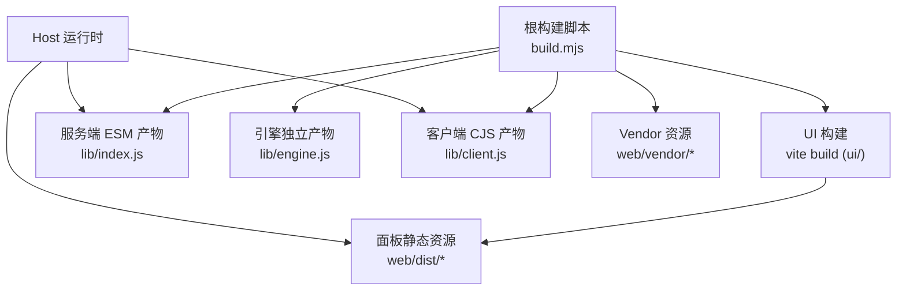
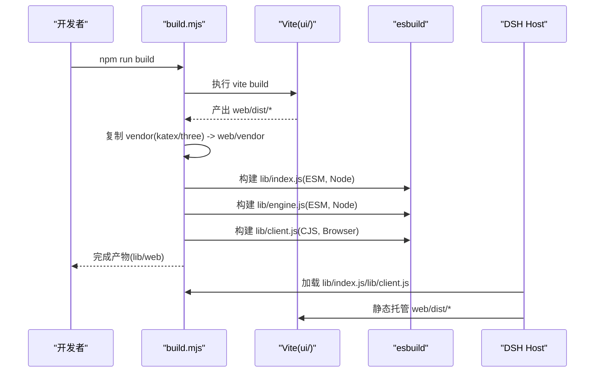
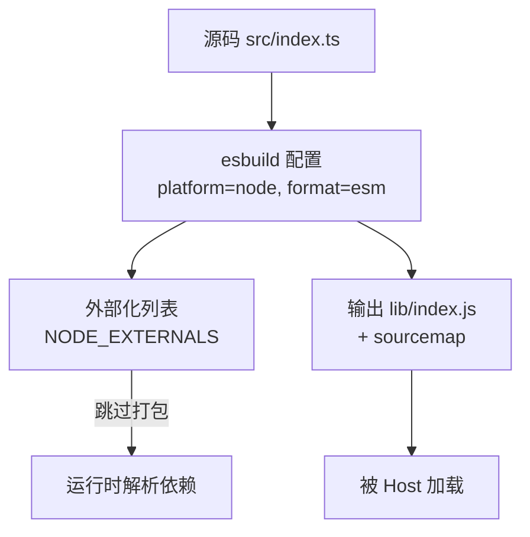
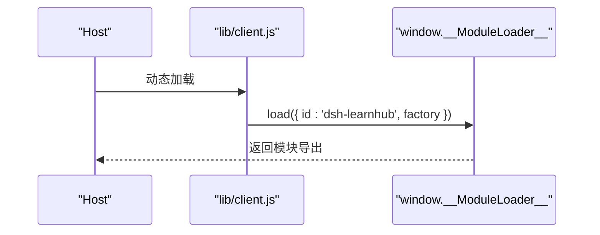
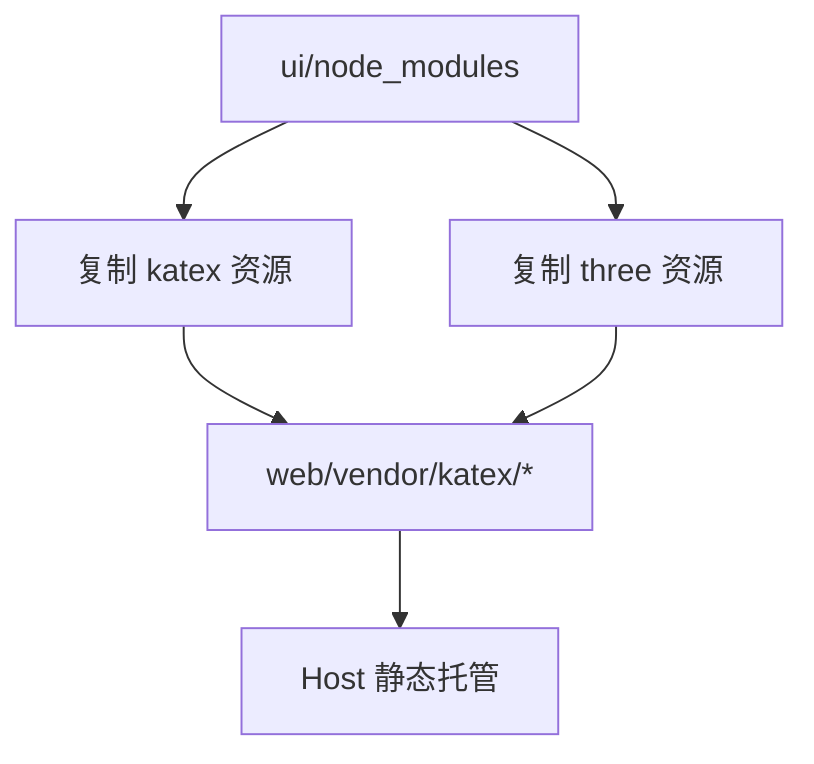
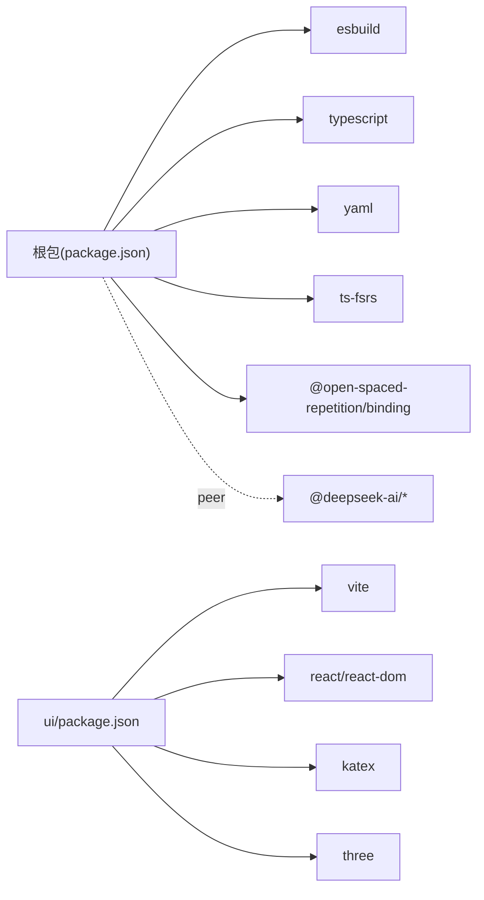

# 构建与打包

<cite>
**本文引用的文件**
- [build.mjs](file://build.mjs)
- [package.json](file://package.json)
- [ui/vite.config.ts](file://ui/vite.config.ts)
- [ui/package.json](file://ui/package.json)
- [tsconfig.json](file://tsconfig.json)
- [cordis.patch.yml](file://cordis.patch.yml)
</cite>

## 目录
1. [简介](#简介)
2. [项目结构](#项目结构)
3. [核心组件](#核心组件)
4. [架构总览](#架构总览)
5. [详细组件分析](#详细组件分析)
6. [依赖分析](#依赖分析)
7. [性能考虑](#性能考虑)
8. [故障排查指南](#故障排查指南)
9. [结论](#结论)
10. [附录：命令与配置示例](#附录命令与配置示例)

## 简介
本仓库采用“根级 esbuild + ui 子工程 Vite”的混合构建方案，产出三类目标：
- 服务端 ESM 产物（lib/index.js）：作为 cordis 插件暴露工具与 /learnhub/api 路由。
- 客户端 CJS 产物（lib/client.js）：浏览器侧单文件模块，通过宿主提供的 window.__ModuleLoader__ 加载。
- 引擎独立产物（lib/engine.js）：不含 cordis 工具与 HTTP 层的纯引擎入口，供脚本/测试消费。

同时，UI 面板 SPA 由 Vite 构建到 web/dist，并由 host 直接静态托管；katex、three.js 等第三方资源以 vendor 形式随构建复制并同源提供。

## 项目结构
构建相关的关键位置与职责：
- 根 build.mjs：编排 UI 构建、vendor 复制、esbuild 多产物构建、技能同步与空白行清理。
- ui/vite.config.ts：Vite 构建 React 面板，输出至 ../web/dist，base 为相对路径。
- ui/package.json：定义面板依赖（React、katex、three 等）与构建脚本。
- package.json：定义根脚本 npm run build、exports 映射、peer/dev 依赖。
- tsconfig.json：类型检查与 JSX 策略（client 使用宿主注入的 JSX 运行时）。
- cordis.patch.yml：组合包 patch，声明 dsh-learnhub 及时间上下文/定时任务能力。

图表来源
- [build.mjs:18-47](file://build.mjs#L18-L47)
- [build.mjs:52-77](file://build.mjs#L52-L77)
- [build.mjs:101-141](file://build.mjs#L101-L141)
- [ui/vite.config.ts:4-13](file://ui/vite.config.ts#L4-L13)

章节来源
- [build.mjs:1-166](file://build.mjs#L1-L166)
- [ui/vite.config.ts:1-15](file://ui/vite.config.ts#L1-L15)
- [package.json:18-47](file://package.json#L18-L47)

## 核心组件
- 构建编排器（build.mjs）
  - 先执行 UI 构建，确保 web/dist 就绪。
  - 复制 katex/three 等 vendor 资源到 web/vendor，供交互件在沙箱 CSP 下同源加载。
  - 三次 esbuild 调用分别生成 lib/index.js、lib/engine.js、lib/client.js。
  - 统一清理产物中的尾随空白行，避免 whitespace 门禁失败。
  - 将 skills/* 同步到 DSH_HOME/skills，使 skill-filesystem 可扫描。
- Vite 面板构建（ui/vite.config.ts）
  - base: './' 保证资源引用相对化，适配 /learnhub/* 前缀下的静态托管。
  - outDir: '../web/dist'，与 host 静态目录对齐。
  - chunkSizeWarningLimit: 1500，控制分包体积告警阈值。
- 产物与导出（package.json）
  - main/exports 指向 lib/index.js 与 lib/client.js。
  - files 包含 lib 与 web，发布时仅携带必要产物。
  - scripts.build 调用 node build.mjs 完成全量构建。

章节来源
- [build.mjs:18-166](file://build.mjs#L18-L166)
- [ui/vite.config.ts:4-13](file://ui/vite.config.ts#L4-L13)
- [package.json:18-47](file://package.json#L18-L47)

## 架构总览
构建流水线按顺序执行：
1) 准备 UI 依赖并运行 vite build，输出到 web/dist。
2) 复制 vendor 资源（katex 与 three）到 web/vendor。
3) 使用 esbuild 构建三个目标：
   - 服务端 ESM：平台 node，格式 esm，外部化 NODE_EXTERNALS。
   - 引擎独立 ESM：同服务端但入口不同，不含 cordis/http。
   - 客户端 CJS：平台 browser，格式 cjs，外部化 react/react-dom 等。
4) 清理产物尾随空白行，同步 skills 到 DSH_HOME。

图表来源
- [build.mjs:18-47](file://build.mjs#L18-L47)
- [build.mjs:52-77](file://build.mjs#L52-L77)
- [build.mjs:101-141](file://build.mjs#L101-L141)
- [ui/vite.config.ts:4-13](file://ui/vite.config.ts#L4-L13)

## 详细组件分析

### 服务端 ESM 产物（lib/index.js）
- 入口：src/index.ts
- 构建参数：platform=node，format=esm，target=node22，sourcemap=true，external=NODE_EXTERNALS。
- 外部化策略：@deepseek-ai/*、node:*、@open-spaced-repetition/* 不打包进产物，运行时由宿主或系统提供。
- 兼容性：注入 createRequire 垫片以兼容产物内对 CJS 依赖（如 yaml）的动态 require。
- 用途：作为 cordis 插件暴露工具与 /learnhub/api 路由。

图表来源
- [build.mjs:87-112](file://build.mjs#L87-L112)
- [package.json:18-23](file://package.json#L18-L23)

章节来源
- [build.mjs:87-112](file://build.mjs#L87-L112)
- [package.json:18-23](file://package.json#L18-L23)

### 引擎独立产物（lib/engine.js）
- 入口：src/engine/index.ts
- 构建参数：与 lib/index.js 相同，但入口不同，不包含 cordis 工具与 HTTP 层。
- 用途：供脚本、测试或轻量场景直接消费引擎能力。

章节来源
- [build.mjs:114-126](file://build.mjs#L114-L126)

### 客户端 CJS 产物（lib/client.js）
- 入口：src/client/index.tsx
- 构建参数：platform=browser，format=cjs，target=es2022，jsx=automatic，sourcemap=true。
- 外部化：react、react-dom、react/jsx-runtime、react/jsx-dev-runtime、scheduler 不打包，由宿主提供。
- 包装：通过 banner/footer 将模块包裹在 window.__ModuleLoader__.load 中，实现与宿主的握手加载。

图表来源
- [build.mjs:96-141](file://build.mjs#L96-L141)

章节来源
- [build.mjs:96-141](file://build.mjs#L96-L141)

### 依赖外部化策略（NODE_EXTERNALS）与原生模块处理
- NODE_EXTERNALS 包含 @deepseek-ai/*、node:*、@open-spaced-repetition/*。
- 目的：避免将宿主环境或平台原生模块打入产物，保持产物轻量化与可移植性。
- 原生模块：napi .node 二进制按平台分发，不可打包；运行时从 node_modules 动态 import。优化器是唯一消费者，调用点隔离在引擎内部。

章节来源
- [build.mjs:92-95](file://build.mjs#L92-L95)

### UI 资源打包流程（katex、three.js 等）
- 首次构建若 ui/node_modules 缺失，自动执行 npm install。
- 运行 vite build，输出到 ../web/dist。
- 复制 vendor 资源：
  - katex：min.css、min.js、auto-render.min.js、fonts/*.woff2。
  - three：three.module.js、three.core.js、examples/jsm/controls/OrbitControls.js。
- 这些资源通过 host 的 /learnhub/api/vendor/* 同源提供，满足沙箱 CSP 限制。

图表来源
- [build.mjs:18-47](file://build.mjs#L18-L47)
- [build.mjs:52-77](file://build.mjs#L52-L77)

章节来源
- [build.mjs:18-47](file://build.mjs#L18-L47)
- [build.mjs:52-77](file://build.mjs#L52-L77)
- [ui/vite.config.ts:4-13](file://ui/vite.config.ts#L4-L13)

### 源码映射与代码优化
- 所有 esbuild 构建均开启 sourcemap=true，便于调试。
- 未显式启用压缩/死代码消除；如需生产优化可在对应构建项中添加 minify 选项。
- Vite 构建默认进行前端优化（如 tree-shaking、CSS 处理），可通过扩展 vite.config.ts 进一步调整。

章节来源
- [build.mjs:101-141](file://build.mjs#L101-L141)
- [ui/vite.config.ts:4-13](file://ui/vite.config.ts#L4-L13)

### 技能同步与补丁
- 构建末尾将 skills/* 复制到 <DSH_HOME>/skills，供 skill-filesystem 扫描。
- cordis.patch.yml 声明 dsh-learnhub 以及 time-context、schedule 能力，用于组合包部署。

章节来源
- [build.mjs:143-158](file://build.mjs#L143-L158)
- [cordis.patch.yml:1-14](file://cordis.patch.yml#L1-L14)

## 依赖分析
- 根依赖
  - devDependencies：esbuild、typescript、@types/node。
  - dependencies：yaml、ts-fsrs、@open-spaced-repetition/binding（原生绑定）。
  - peerDependencies：@deepseek-ai/* 系列（由宿主提供）。
- 面板依赖
  - dependencies：react、react-dom、katex、echarts、mermaid 等。
  - devDependencies：vite、@vitejs/plugin-react、three（构建期用）。
- 构建期依赖
  - Vite 仅在 ui/ 安装，构建时按需拉取。
  - esbuild 在根安装，负责 Node/Browser 双端构建。

图表来源
- [package.json:49-81](file://package.json#L49-L81)
- [ui/package.json:12-46](file://ui/package.json#L12-L46)

章节来源
- [package.json:49-81](file://package.json#L49-L81)
- [ui/package.json:12-46](file://ui/package.json#L12-L46)

## 性能考虑
- 构建阶段
  - 首次构建会安装 ui/node_modules，后续增量构建更快。
  - 建议缓存 node_modules 与 Vite 缓存目录以提升 CI 速度。
  - 若需生产压缩，可在 esbuild 构建项添加 minify 选项；Vite 已默认优化前端资源。
- 产物体积
  - 通过 external 将大型库（react、@deepseek-ai/*）排除出产物，减少包体。
  - vendor 资源按需复制，避免多余文件进入发布包。
- 运行时
  - 原生模块（napi）按平台分发，避免跨平台打包问题。
  - 客户端 CJS 通过宿主提供 React 运行时，降低重复加载。

[本节为通用指导，无需特定文件来源]

## 故障排查指南
- 构建时报 vendor 源缺失
  - 现象：复制 katex/three 资源时报错。
  - 解决：确保 ui/node_modules 存在（首次构建会自动安装），必要时手动在 ui/ 执行 npm install。
- 产物校验失败（whitespace 门禁）
  - 现象：CRLF 或行尾空白导致门禁失败。
  - 解决：构建脚本已统一转换为 LF 并清理尾随空白；若仍失败，检查是否修改了构建后逻辑。
- 原生模块加载失败
  - 现象：运行时找不到 .node 文件或平台不匹配。
  - 解决：确认宿主环境与目标平台一致，且 node_modules 中存在对应平台的原生绑定。
- 面板资源 404
  - 现象：/learnhub/* 无法加载资源。
  - 解决：确认 host 正确静态托管 web/dist，并确保 base 为相对路径（已在 vite.config.ts 设置）。

章节来源
- [build.mjs:18-47](file://build.mjs#L18-L47)
- [build.mjs:52-77](file://build.mjs#L52-L77)
- [ui/vite.config.ts:4-13](file://ui/vite.config.ts#L4-L13)

## 结论
本项目通过根级 esbuild 与 ui 子工程 Vite 的组合，实现了服务端 ESM、客户端 CJS 与引擎独立产物的统一构建流程。借助 NODE_EXTERNALS 与 vendor 策略，既保证了产物轻量化与可移植性，又满足了沙箱 CSP 下的资源加载需求。配合 sourcemap 与严格的空白行清理，提升了开发与调试体验。

[本节为总结，无需特定文件来源]

## 附录：命令与配置示例
- 常用命令
  - 构建全部产物：npm run build
  - 校验产物语法：npm run check
  - 类型检查：npm run typecheck
  - 运行测试：npm run test
- 自定义构建配置示例
  - 在 build.mjs 中为 esbuild 添加 minify 以启用压缩：
    - 在服务端/引擎/客户端构建项中增加 minify: true。
  - 在 ui/vite.config.ts 中调整分包阈值或启用更多优化：
    - 修改 chunkSizeWarningLimit 或添加 build.rollupOptions 配置。
  - 扩展 NODE_EXTERNALS：
    - 在 build.mjs 中追加需要外部化的依赖模式，避免打包进产物。
  - 新增 vendor 资源：
    - 在 copyVendor 函数中添加新的 from/to 映射，确保构建期可用。

章节来源
- [package.json:38-47](file://package.json#L38-L47)
- [build.mjs:92-141](file://build.mjs#L92-L141)
- [ui/vite.config.ts:4-13](file://ui/vite.config.ts#L4-L13)