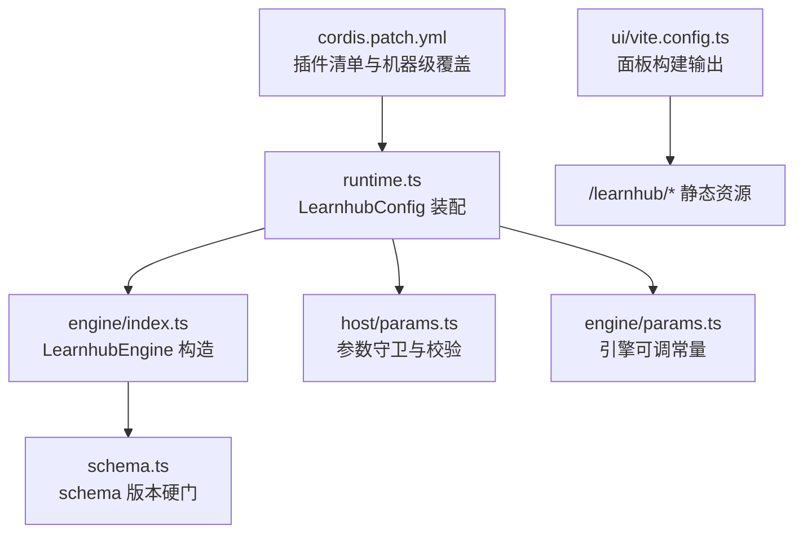
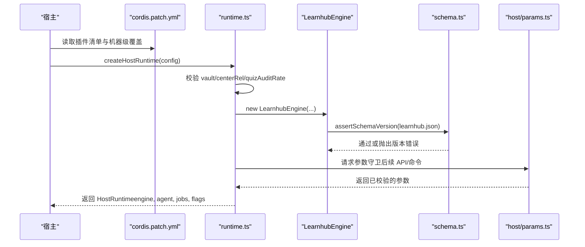
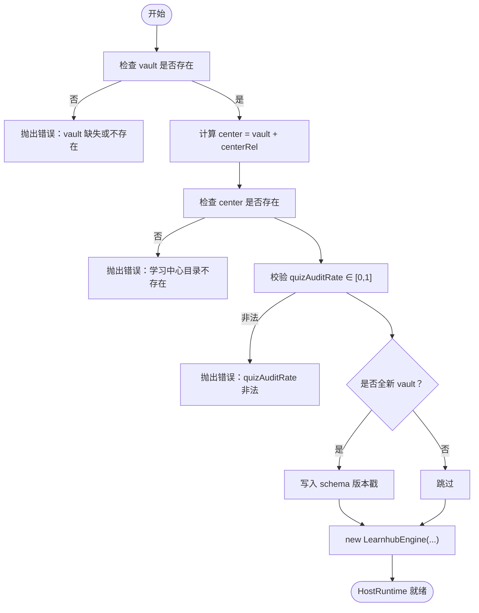
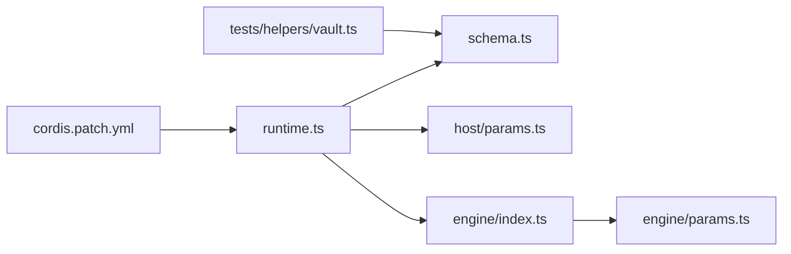

# 环境配置

<cite>
**本文引用的文件**
- [cordis.patch.yml](file://cordis.patch.yml)
- [preset/learnhub/preset.yml](file://preset/learnhub/preset.yml)
- [src/host/runtime.ts](file://src/host/runtime.ts)
- [src/host/params.ts](file://src/host/params.ts)
- [src/engine/schema.ts](file://src/engine/schema.ts)
- [src/engine/params.ts](file://src/engine/params.ts)
- [ui/vite.config.ts](file://ui/vite.config.ts)
- [tests/helpers/vault.ts](file://tests/helpers/vault.ts)
</cite>

## 目录
1. [简介](#简介)
2. [项目结构](#项目结构)
3. [核心组件](#核心组件)
4. [架构总览](#架构总览)
5. [详细组件分析](#详细组件分析)
6. [依赖关系分析](#依赖关系分析)
7. [性能考量](#性能考量)
8. [故障排除指南](#故障排除指南)
9. [结论](#结论)
10. [附录：常见配置场景与示例](#附录：常见配置场景与示例)

## 简介
本文件聚焦于本插件的环境配置体系，覆盖以下主题：
- 环境变量与部署配置的位置、加载方式与差异（开发 vs 生产）
- cordis.patch.yml 插件清单与参数说明
- preset.yml 预设的作用与自定义方法
- 引擎参数与数据验证规则（含“可选参数收紧”策略）
- 安全最佳实践（敏感信息、路径与权限）
- 热重载与动态更新机制的边界与限制
- 常见问题与排障步骤

## 项目结构
与环境配置直接相关的文件与职责如下：
- cordis.patch.yml：宿主侧插件清单补丁，声明要注入的插件（如 learnhub、时间上下文、定时任务等），以及机器级 vault 路径覆盖方式。
- preset/learnhub/preset.yml：学习系统专用预设元信息（名称、描述），用于宿主或面板展示与组织。
- src/host/runtime.ts：运行时装配入口，负责解析 LearnhubConfig（vault、centerRel、provider、model、effort、quizAuditRate、corpusDir 等），校验并构造引擎与宿主运行时。
- src/host/params.ts：统一的参数守卫与校验层，定义必填/可选参数的严格语义（fail loud）。
- src/engine/schema.ts：schema 版本硬门，确保数据仓库版本匹配当前引擎主版本。
- src/engine/params.ts：引擎内部可调常量参数表（FSRS 期望保留率、复习占比、日均容量等）。
- ui/vite.config.ts：前端构建产物输出路径与前缀，影响面板资源访问。
- tests/helpers/vault.ts：测试工厂写入 learnhub.json（schema.version、day_cutoff），体现引擎启动前必须落盘的关键配置。

图表来源
- [cordis.patch.yml:1-14](file://cordis.patch.yml#L1-L14)
- [src/host/runtime.ts:23-44](file://src/host/runtime.ts#L23-L44)
- [src/host/runtime.ts:135-193](file://src/host/runtime.ts#L135-L193)
- [src/engine/schema.ts:1-80](file://src/engine/schema.ts#L1-L80)
- [src/host/params.ts:1-230](file://src/host/params.ts#L1-L230)
- [src/engine/params.ts:1-20](file://src/engine/params.ts#L1-L20)
- [ui/vite.config.ts:1-14](file://ui/vite.config.ts#L1-L14)

章节来源
- [cordis.patch.yml:1-14](file://cordis.patch.yml#L1-L14)
- [src/host/runtime.ts:23-44](file://src/host/runtime.ts#L23-L44)
- [src/host/runtime.ts:135-193](file://src/host/runtime.ts#L135-L193)
- [src/engine/schema.ts:1-80](file://src/engine/schema.ts#L1-L80)
- [src/host/params.ts:1-230](file://src/host/params.ts#L1-L230)
- [src/engine/params.ts:1-20](file://src/engine/params.ts#L1-L20)
- [ui/vite.config.ts:1-14](file://ui/vite.config.ts#L1-L14)
- [tests/helpers/vault.ts:123-135](file://tests/helpers/vault.ts#L123-L135)

## 核心组件
- 插件清单补丁（cordis.patch.yml）
  - 作用：在宿主侧以 patch 形式插入 learnhub 插件及辅助插件（时间上下文、定时任务），并通过 id 覆盖机器级 config（例如 vault 根路径）。
  - 关键点：machine-level 的 config.vault 不写死在此文件中，而是由各机器的 profile patch 按 id 覆盖。
- 运行时装配（runtime.ts）
  - 接收 LearnhubConfig：vault（必填）、centerRel（相对路径）、provider/model（AI 路由）、fastEffort/deepEffort（思考档档位）、quizAuditRate（出题第二意见抽样率）、corpusDir（语料落盘覆盖）。
  - 校验：vault 缺失或目录不存在即失败；quizAuditRate 必须在 0–1 之间；fresh vault 自动写入 schema 版本戳。
- 参数守卫（host/params.ts）
  - 统一必填/可选参数校验，采用 fail loud 策略：键存在但类型不符即抛错；错误消息中文且可定位到路由。
- 数据版本硬门（engine/schema.ts）
  - 启动时读取 learnhub.json 中的 schema.version，非当前主版本则拒绝加载并提示迁移脚本。
- 引擎可调参数（engine/params.ts）
  - 集中管理 FSRS、复习预算、日均容量、难度中性值等常量，作为调度与推荐算法的核心输入。
- 面板构建（ui/vite.config.ts）
  - 设置 base 为相对路径，构建产物输出到 web/dist，供 host 以 /learnhub/* 提供静态资源。

章节来源
- [cordis.patch.yml:1-14](file://cordis.patch.yml#L1-L14)
- [src/host/runtime.ts:23-44](file://src/host/runtime.ts#L23-L44)
- [src/host/runtime.ts:135-193](file://src/host/runtime.ts#L135-L193)
- [src/host/params.ts:1-230](file://src/host/params.ts#L1-L230)
- [src/engine/schema.ts:1-80](file://src/engine/schema.ts#L1-L80)
- [src/engine/params.ts:1-20](file://src/engine/params.ts#L1-L20)
- [ui/vite.config.ts:1-14](file://ui/vite.config.ts#L1-L14)

## 架构总览
下图展示了从插件清单到运行时装配、再到引擎启动与数据版本校验的整体流程。

图表来源
- [cordis.patch.yml:1-14](file://cordis.patch.yml#L1-L14)
- [src/host/runtime.ts:135-193](file://src/host/runtime.ts#L135-L193)
- [src/engine/schema.ts:59-80](file://src/engine/schema.ts#L59-L80)
- [src/host/params.ts:1-230](file://src/host/params.ts#L1-L230)

## 详细组件分析

### 插件清单与机器级覆盖（cordis.patch.yml）
- 功能：以 insert 形式注入 dsh-learnhub 插件，以及 time-context 与 schedule 两个辅助插件。
- 覆盖机制：机器级 config.vault 不在本文件写死，由各机器的 profile patch 按 id 覆盖本行 config（patch 按行整体替换 config）。
- 使用建议：
  - 将不同环境的 vault 路径放入对应机器的 profile patch，避免硬编码。
  - 如需启用/禁用辅助插件，修改此文件后重新加载宿主。

章节来源
- [cordis.patch.yml:1-14](file://cordis.patch.yml#L1-L14)

### 运行时装配与 LearnhubConfig（runtime.ts）
- 关键配置项：
  - vault：必填，绝对路径，不存在即报错。
  - centerRel：学习中心相对 vault 的路径，默认“学习中心”。
  - provider/model：AI 生成/判卷的 seam provider 与模型名。
  - fastEffort/deepEffort：控制思考档档位（off/low），用于大纲/修复轮等。
  - quizAuditRate：0–1 的数值，控制出题第二意见抽样率；装配时 fail loud。
  - corpusDir：生成语料落盘目录覆盖，缺省为本 vault 的 state/生成语料。
- 行为：
  - 新鲜 vault 会写入 schema 版本戳，避免旧库误用。
  - 构造 HostRuntime 后，agent 缝、语料捕获器、任务注册表一并就绪。

图表来源
- [src/host/runtime.ts:135-193](file://src/host/runtime.ts#L135-L193)

章节来源
- [src/host/runtime.ts:23-44](file://src/host/runtime.ts#L23-L44)
- [src/host/runtime.ts:135-193](file://src/host/runtime.ts#L135-L193)

### 参数守卫与数据验证（host/params.ts）
- 必填参数：need/requireString/requireBoolean/requireNumber/requireObject/requireOneOf/needQuery。
- 可选参数：optText/optTrimmed/optRaw/optString/optNumber/optFinite/optBoolean/optTrue/optObject/optList。
- 策略：
  - 可选参数“省略或合法”，若键存在但类型不符则 fail loud（抛 ParamError）。
  - 错误消息统一中文，并由分发层附加路由信息，便于定位。
- 适用面：所有宿主 API/命令的参数解析，保证一致性与可维护性。

章节来源
- [src/host/params.ts:1-230](file://src/host/params.ts#L1-L230)

### 数据版本硬门（engine/schema.ts）
- 位置：学习中心/state/learnhub.json 的 schema.version。
- 行为：
  - 启动同步读取，非当前主版本（CURRENT_SCHEMA_VERSION）即拒绝加载，并提示一次性迁移脚本。
  - 无 schema 块或 JSON 损坏视为史前库，同样拒载。
- 意义：确保数据仓库与引擎版本强一致，避免隐式兼容带来的风险。

章节来源
- [src/engine/schema.ts:1-80](file://src/engine/schema.ts#L1-L80)
- [tests/helpers/vault.ts:123-135](file://tests/helpers/vault.ts#L123-L135)

### 引擎可调参数（engine/params.ts）
- 内容：FSRS 期望保留率、前置解锁门槛、mastery 稳定性阈值、复习占比、单题估时、新节点首学预算、日均容量、过载因子、软重启空窗、恢复模式清偿率、扫描初始稳定性/难度、FSRS 难度中性值、XP 时间账本基线等。
- 用途：调度、推荐、估算、负载保护等核心算法的输入。
- 调整建议：仅在本文件集中调整，避免散落修改导致不一致。

章节来源
- [src/engine/params.ts:1-20](file://src/engine/params.ts#L1-L20)

### 预设配置（preset/learnhub/preset.yml）
- 内容：name 与 description，用于标识学习系统专用预设。
- 作用：宿主或面板展示时使用，帮助识别与组织预设。
- 自定义方法：
  - 复制并修改该文件，保持 name/description 字段清晰表达用途。
  - 在宿主侧选择对应 preset 进行加载。

章节来源
- [preset/learnhub/preset.yml:1-3](file://preset/learnhub/preset.yml#L1-L3)

### 面板构建与静态资源（ui/vite.config.ts）
- 配置要点：base 设为相对路径，构建产物输出到 ../web/dist，供 host 以 /learnhub/* 提供静态资源。
- 影响：面板资源引用必须是相对路径，避免跨域或路径错位问题。

章节来源
- [ui/vite.config.ts:1-14](file://ui/vite.config.ts#L1-L14)

## 依赖关系分析
- runtime.ts 依赖 host/params.ts 进行参数校验，依赖 engine/schema.ts 进行版本硬门，依赖 engine/index.ts 构造引擎。
- cordis.patch.yml 决定宿主加载哪些插件，从而影响 runtime 可用的能力集（如时间上下文、定时任务）。
- engine/params.ts 被引擎内部多处消费，影响调度与推荐逻辑。
- tests/helpers/vault.ts 在测试中写入 learnhub.json，确保引擎启动时 schema 版本正确。

图表来源
- [cordis.patch.yml:1-14](file://cordis.patch.yml#L1-L14)
- [src/host/runtime.ts:135-193](file://src/host/runtime.ts#L135-L193)
- [src/engine/schema.ts:59-80](file://src/engine/schema.ts#L59-L80)
- [src/host/params.ts:1-230](file://src/host/params.ts#L1-L230)
- [src/engine/params.ts:1-20](file://src/engine/params.ts#L1-L20)
- [tests/helpers/vault.ts:123-135](file://tests/helpers/vault.ts#L123-L135)

章节来源
- [cordis.patch.yml:1-14](file://cordis.patch.yml#L1-L14)
- [src/host/runtime.ts:135-193](file://src/host/runtime.ts#L135-L193)
- [src/engine/schema.ts:59-80](file://src/engine/schema.ts#L59-L80)
- [src/host/params.ts:1-230](file://src/host/params.ts#L1-L230)
- [src/engine/params.ts:1-20](file://src/engine/params.ts#L1-L20)
- [tests/helpers/vault.ts:123-135](file://tests/helpers/vault.ts#L123-L135)

## 性能考量
- 启动阶段：schema 版本硬门为同步读，成本可控但不可忽略，应避免频繁重启。
- 参数校验：fail loud 策略减少静默降级带来的隐性性能损耗与调试成本。
- 生成语料：corpusDir 可覆盖到持久目录，便于离线评审与抽样，避免临时 vault 清理导致的数据丢失。
- 面板资源：相对路径 base 减少跨域与缓存问题，提升加载稳定性。

[本节为通用指导，不直接分析具体文件]

## 故障排除指南
- 启动时报 vault 缺失或目录不存在
  - 检查 cordis.patch.yml 的机器级覆盖是否正确设置了 vault。
  - 确认 vault 路径存在且可读。
- 学习中心目录不存在
  - 检查 centerRel 配置，确保 vault + centerRel 指向有效目录。
- quizAuditRate 非法
  - 确保值为 0–1 的数值；0 表示关闭第二意见门。
- schema 版本硬门失败
  - 运行一次性迁移脚本升级 learnhub.json 的 schema.version。
  - 检查 learnhub.json 是否损坏或缺失。
- 面板资源 404
  - 确认 ui/vite.config.ts 的 outDir 与 host 静态资源映射一致。
  - 确认 base 为相对路径，资源引用未使用绝对路径。

章节来源
- [src/host/runtime.ts:135-193](file://src/host/runtime.ts#L135-L193)
- [src/engine/schema.ts:59-80](file://src/engine/schema.ts#L59-L80)
- [ui/vite.config.ts:1-14](file://ui/vite.config.ts#L1-L14)

## 结论
本项目的配置体系围绕“插件清单补丁 + 运行时装配 + 参数守卫 + 数据版本硬门”展开，强调：
- 机器级配置通过 cordis.patch.yml 的 id 覆盖，避免硬编码。
- 运行时对关键配置进行严格校验，fail loud 保障可观测性。
- 数据仓库版本与引擎强一致，防止隐式兼容风险。
- 面板构建与静态资源路径明确，便于部署与维护。

[本节为总结，不直接分析具体文件]

## 附录：常见配置场景与示例
- 多环境部署（开发 vs 生产）
  - 在各自机器的 profile patch 中设置不同的 vault 与 centerRel。
  - 生产环境建议开启更严格的 quizAuditRate 与日志记录。
- 自定义预设
  - 复制 preset/learnhub/preset.yml，修改 name/description，并在宿主侧选择加载。
- 调整引擎参数
  - 在 src/engine/params.ts 中集中调整 FSRS、复习占比、日均容量等常量。
- 生成语料落盘
  - 通过 LearnhubConfig.corpusDir 指定持久目录，便于离线评审。
- 面板构建
  - 确保 ui/vite.config.ts 的 outDir 与 host 静态资源映射一致，base 为相对路径。

[本节为通用指导，不直接分析具体文件]