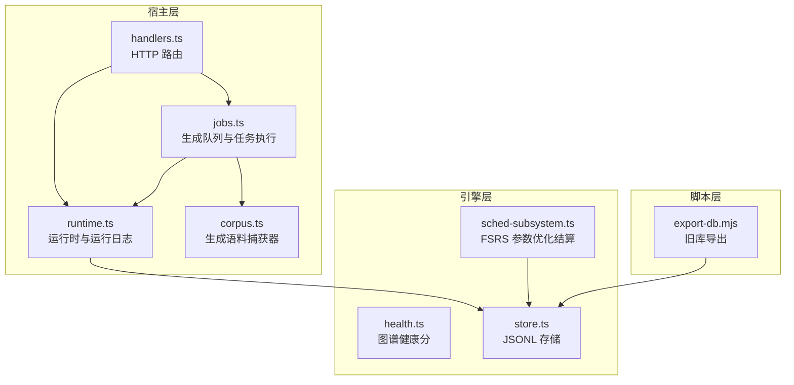
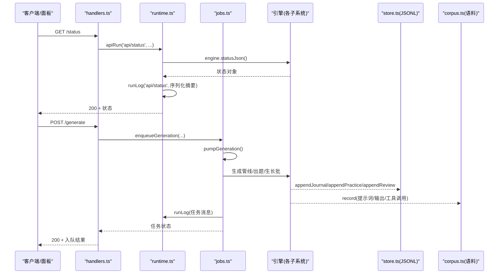
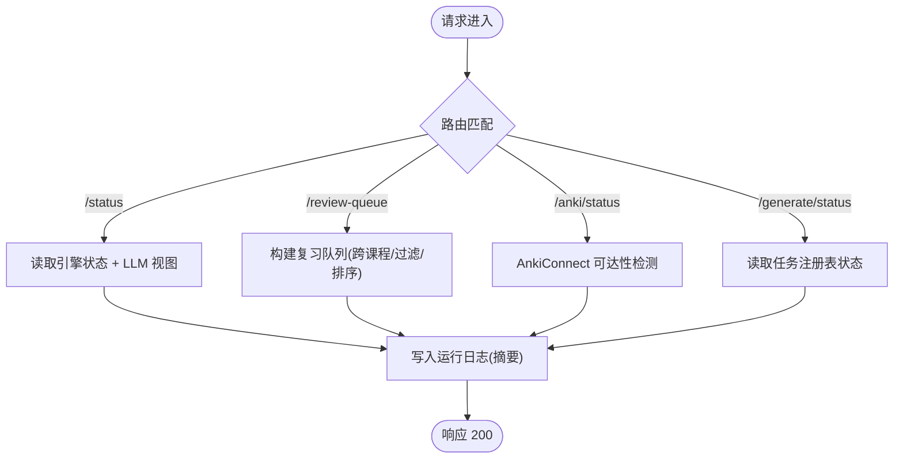
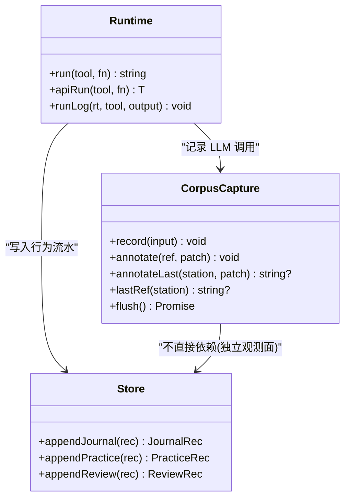
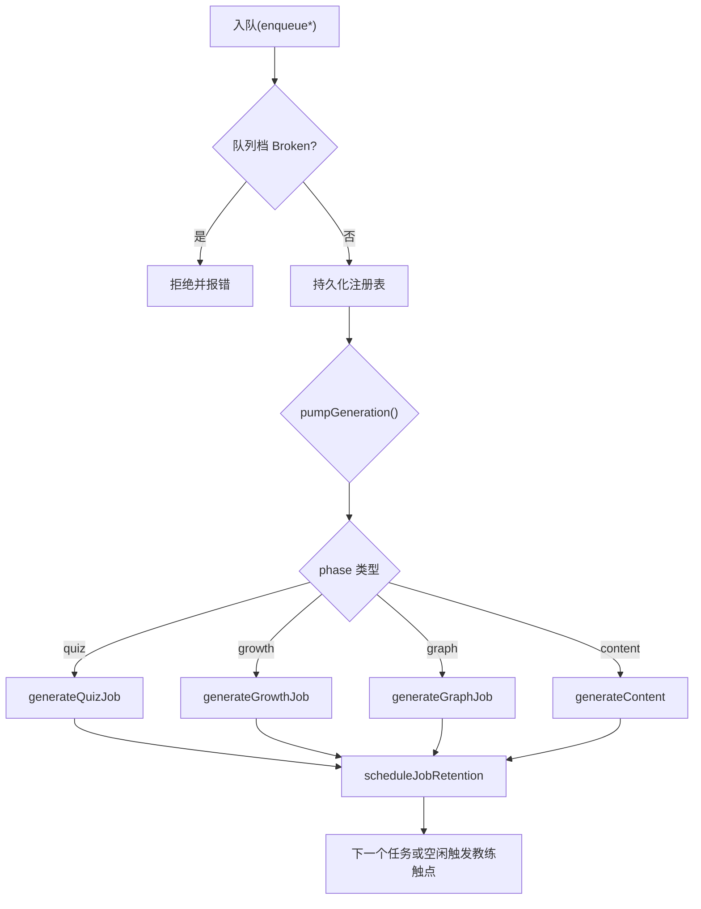
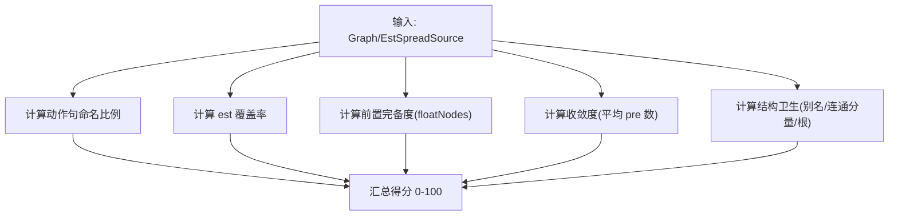
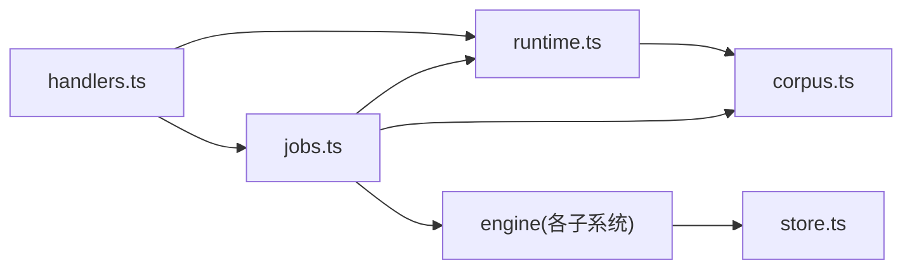

# 监控与运维

<cite>
**本文引用的文件**
- [health.ts](file://src/engine/health.ts)
- [runtime.ts](file://src/host/runtime.ts)
- [handlers.ts](file://src/host/handlers.ts)
- [jobs.ts](file://src/host/jobs.ts)
- [corpus.ts](file://src/host/corpus.ts)
- [store.ts](file://src/engine/store.ts)
- [export-db.mjs](file://scripts/export-db.mjs)
- [schema.ts](file://src/engine/schema.ts)
- [sched-subsystem.ts](file://src/engine/sched-subsystem.ts)
- [memory-health.test.ts](file://tests/memory-health.test.ts)
</cite>

## 目录
1. [简介](#简介)
2. [项目结构](#项目结构)
3. [核心组件](#核心组件)
4. [架构总览](#架构总览)
5. [详细组件分析](#详细组件分析)
6. [依赖关系分析](#依赖关系分析)
7. [性能考量](#性能考量)
8. [故障排查指南](#故障排查指南)
9. [结论](#结论)
10. [附录](#附录)

## 简介
本章节面向“监控与运维”目标，系统化说明：
- 系统健康检查与状态监控接口
- 日志收集、格式化与存储策略
- 性能指标采集与监控系统集成点
- 错误追踪与问题诊断工具
- 备份恢复策略与数据迁移方案
- 容量规划与资源监控配置
- 自动化运维脚本与告警规则建议
- 系统维护与升级流程
- 运维最佳实践与故障恢复预案

## 项目结构
围绕监控与运维的关键代码分布在宿主层（HTTP 路由、运行时、任务队列）、引擎层（健康分、存储、调度子系统）以及脚本层（导出、扫描）。

图表来源
- [handlers.ts:101-180](file://src/host/handlers.ts#L101-L180)
- [runtime.ts:138-255](file://src/host/runtime.ts#L138-L255)
- [jobs.ts:269-740](file://src/host/jobs.ts#L269-L740)
- [corpus.ts:186-342](file://src/host/corpus.ts#L186-L342)
- [health.ts:53-105](file://src/engine/health.ts#L53-L105)
- [store.ts:46-200](file://src/engine/store.ts#L46-L200)
- [sched-subsystem.ts:402-423](file://src/engine/sched-subsystem.ts#L402-L423)
- [export-db.mjs:1-60](file://scripts/export-db.mjs#L1-L60)

章节来源
- [handlers.ts:101-180](file://src/host/handlers.ts#L101-L180)
- [runtime.ts:138-255](file://src/host/runtime.ts#L138-L255)
- [jobs.ts:269-740](file://src/host/jobs.ts#L269-L740)
- [corpus.ts:186-342](file://src/host/corpus.ts#L186-L342)
- [health.ts:53-105](file://src/engine/health.ts#L53-L105)
- [store.ts:46-200](file://src/engine/store.ts#L46-L200)
- [sched-subsystem.ts:402-423](file://src/engine/sched-subsystem.ts#L402-L423)
- [export-db.mjs:1-60](file://scripts/export-db.mjs#L1-L60)

## 核心组件
- 健康检查与状态接口
  - /status：返回引擎状态 JSON 与 LLM 配置视图，用于面板展示与外部探针。
  - /review-queue：复习队列，按遗忘风险排序，支持课程/节点过滤与难度带偏好。
  - /anki/status：Anki 通道可达性与镜像状态。
  - /generate/status：生成任务注册表状态。
- 运行日志
  - 每次引擎调用输出到“运行日志.md”，失败也留痕；LLM 调用附带 token 用量与耗时。
- 生成语料捕获
  - 全量记录 LLM 调用的提示词、原始输出、工具调用载荷、模型/供应商信息，环形保留成功与失败样本，便于离线评审与回归定位。
- 任务队列与执行
  - 全局单并发 FIFO 队列，支持内容生成、纯出题、生长批、图域任务；具备取消、恢复、保留期清扫与断点续跑。
- 存储与审计
  - journal/practice/review-log 以 JSONL 追加；提案与快照集中管理；FSRS 参数优化结果写回沉淀。
- 数据迁移与导出
  - 旧 SQLite 权威库的 journal/practice 表导出为 JSONL；schema 版本硬门保障升级安全。

章节来源
- [handlers.ts:101-180](file://src/host/handlers.ts#L101-L180)
- [runtime.ts:195-255](file://src/host/runtime.ts#L195-L255)
- [corpus.ts:186-342](file://src/host/corpus.ts#L186-L342)
- [jobs.ts:269-740](file://src/host/jobs.ts#L269-L740)
- [store.ts:46-200](file://src/engine/store.ts#L46-L200)
- [sched-subsystem.ts:402-423](file://src/engine/sched-subsystem.ts#L402-L423)
- [export-db.mjs:1-60](file://scripts/export-db.mjs#L1-L60)

## 架构总览
下图展示了从 HTTP 请求到引擎调用、运行日志与语料落盘的完整链路，以及任务队列的执行泵。

图表来源
- [handlers.ts:101-180](file://src/host/handlers.ts#L101-L180)
- [runtime.ts:195-255](file://src/host/runtime.ts#L195-L255)
- [jobs.ts:269-740](file://src/host/jobs.ts#L269-L740)
- [store.ts:46-200](file://src/engine/store.ts#L46-L200)
- [corpus.ts:186-342](file://src/host/corpus.ts#L186-L342)

## 详细组件分析

### 健康检查与状态监控接口
- /status：聚合引擎状态与 LLM 配置视图，适合外部健康探针与面板轮询。
- /review-queue：暴露到期题卡队列，可用于负载预报与学习压力监控。
- /anki/status：对外部同步通道的可达性探测。
- /generate/status：生成任务注册表状态，便于观察队列堆积与失败率。

图表来源
- [handlers.ts:101-180](file://src/host/handlers.ts#L101-L180)
- [runtime.ts:195-255](file://src/host/runtime.ts#L195-L255)

章节来源
- [handlers.ts:101-180](file://src/host/handlers.ts#L101-L180)

### 运行日志与生成语料捕获
- 运行日志：每个引擎调用通过 run/apiRun 统一落盘“运行日志.md”，失败路径同样记录；LLM 调用附带 token 用量与耗时。
- 生成语料：所有 LLM 适配器出口经 corpus.capture.record 落盘，包含 frontmatter（时间戳、站名、kind、effort、outcome、code、truncated、durationMs、usage、provider、model、字符数）、提示词、原始输出与工具调用段；按站环形保留成功/失败样本，失败可补标 outcome/code。

图表来源
- [runtime.ts:195-255](file://src/host/runtime.ts#L195-L255)
- [corpus.ts:186-342](file://src/host/corpus.ts#L186-L342)
- [store.ts:46-200](file://src/engine/store.ts#L46-L200)

章节来源
- [runtime.ts:195-255](file://src/host/runtime.ts#L195-L255)
- [corpus.ts:186-342](file://src/host/corpus.ts#L186-L342)

### 任务队列与执行泵
- 入队：内容生成、纯出题、生长批、图域任务统一入队，键为 course/node，重复入队幂等。
- 执行泵：全局单并发 FIFO，phase 分流至不同执行器；支持取消、恢复、终态保留期清扫。
- 教练触点：队列空闲时触发就绪深度检查与复诊结算，自动拉批受阻尼控制。

图表来源
- [jobs.ts:269-740](file://src/host/jobs.ts#L269-L740)

章节来源
- [jobs.ts:269-740](file://src/host/jobs.ts#L269-L740)

### 图谱健康分与记忆健康
- 图谱健康分：基于动作句命名比例、est 覆盖率、前置完备度、收敛度、结构卫生五项（每项 0–20），综合为 0–100 分数，辅助质量基线评估。
- 记忆健康：结合 FSRS 调度与复习日志，提供逾期/逐日到期预报、状态分布、真实保留率、校准与遗忘曲线统计；与 reviewQueue 口径一致。

图表来源
- [health.ts:53-105](file://src/engine/health.ts#L53-L105)

章节来源
- [health.ts:53-105](file://src/engine/health.ts#L53-L105)
- [memory-health.test.ts:75-149](file://tests/memory-health.test.ts#L75-L149)

### 存储与审计
- JSONL 追加：journal/practice/review-log 以行追加方式持久化，读侧对缺失/损坏采取健壮处理。
- 提案与快照：提案清单与整图快照集中管理，apply 后形成不可变历史。
- FSRS 参数优化：评估未优于基线则跳过写回；正典与缓存镜像双写，失败上抛中止。

章节来源
- [store.ts:46-200](file://src/engine/store.ts#L46-L200)
- [sched-subsystem.ts:402-423](file://src/engine/sched-subsystem.ts#L402-L423)

### 备份恢复与数据迁移
- 旧库导出：将 SQLite 的 journal/practice 表导出为 JSONL，追加到 state 目录，避免覆盖现有数据。
- Schema 版本硬门：启动时校验 learnhub.json 的 schema.version，非当前版本即阻断并指引迁移脚本。

章节来源
- [export-db.mjs:1-60](file://scripts/export-db.mjs#L1-L60)
- [schema.ts:24-60](file://src/engine/schema.ts#L24-L60)

## 依赖关系分析
- handlers 依赖 runtime 进行 API 包装与日志记录，依赖 jobs 进行任务入队与状态查询。
- runtime 装配 engine、agent、corpus 与 flags，提供 run/apiRun 统一入口。
- jobs 依赖 llm 配置、engine 门面与 corpus 捕获器，负责队列执行与教练触点。
- store 被多个子系统消费，提供统一的 JSONL 读写原语。
- corpus 作为观测面，不阻塞主流程，失败静默。

图表来源
- [handlers.ts:101-180](file://src/host/handlers.ts#L101-L180)
- [runtime.ts:138-255](file://src/host/runtime.ts#L138-L255)
- [jobs.ts:269-740](file://src/host/jobs.ts#L269-L740)
- [store.ts:46-200](file://src/engine/store.ts#L46-L200)

章节来源
- [handlers.ts:101-180](file://src/host/handlers.ts#L101-L180)
- [runtime.ts:138-255](file://src/host/runtime.ts#L138-L255)
- [jobs.ts:269-740](file://src/host/jobs.ts#L269-L740)
- [store.ts:46-200](file://src/engine/store.ts#L46-L200)

## 性能考量
- 队列单并发：避免多任务争抢导致 I/O 与 LLM 调用风暴；任务间互斥保证题库写一致性。
- 运行日志截断：单条日志上限防止大输出拖慢 IO。
- 语料环形保留：成功/失败桶大小限制，避免磁盘无界增长。
- 教练触点节流：会话开始检查点 30 分钟节流，降低频繁读侧 loadView 开销。
- FSRS 参数优化：仅当新评估优于基线才写回，减少无效变更。

[本节为通用指导，无需特定文件引用]

## 故障排查指南
- 生成任务档损坏（broken 态）：队列写回闸拒绝操作，需修复任务档后再恢复；清扫在 broken 期间延后。
- 任务失败与语料定位：失败路径会补标最近一条语料的 outcome/code，可通过“生成语料/<站>/文件名”快速定位。
- 运行日志：查看“运行日志.md”，包含调用摘要与失败堆栈；LLM 调用附带 token 用量与耗时便于成本归因。
- 复习队列与健康分：通过 /review-queue 与 health 分数判断学习压力与图谱质量是否异常。
- 旧库迁移：若 schema 版本不匹配，按错误提示运行迁移脚本；必要时使用 export-db 导出历史数据。

章节来源
- [jobs.ts:269-740](file://src/host/jobs.ts#L269-L740)
- [corpus.ts:186-342](file://src/host/corpus.ts#L186-L342)
- [runtime.ts:195-255](file://src/host/runtime.ts#L195-L255)
- [handlers.ts:101-180](file://src/host/handlers.ts#L101-L180)
- [schema.ts:24-60](file://src/engine/schema.ts#L24-L60)
- [export-db.mjs:1-60](file://scripts/export-db.mjs#L1-L60)

## 结论
本系统提供了完善的监控与运维能力：
- 健康检查与状态接口便于外部探针与面板展示。
- 运行日志与生成语料捕获实现端到端可观测与回溯。
- 任务队列与执行泵确保生成过程可控、可恢复。
- 存储与审计保障数据一致性与可追溯。
- 迁移与导出脚本支撑平滑升级与数据保全。
建议结合业务规模制定告警规则与容量规划，并在日常维护中遵循最佳实践。

[本节为总结，无需特定文件引用]

## 附录

### 容量规划与资源监控配置建议
- 队列容量：关注 /generate/status 的任务堆积与失败率，设置阈值告警。
- 语料磁盘：监控“生成语料/<站>”目录大小，按桶上限与环形修剪策略评估扩容。
- LLM 成本：通过运行日志中的 token 用量与耗时，建立成本看板与预算告警。
- 存储增长：监控 journal/practice/review-log 的增长速率，设定清理与归档策略。

[本节为通用指导，无需特定文件引用]

### 自动化运维脚本与告警规则配置
- 导出脚本：scripts/export-db.mjs 用于旧库数据导出，建议在升级前执行并校验行数。
- 扫描脚本：scripts/scan-host-state.mjs 用于检测宿主模块级可变状态，纳入 CI 门禁。
- 告警规则建议：
  - /generate/status 队列长度 > N 且持续 > T 分钟
  - 任务失败率 > P%（近 1 小时）
  - 运行日志中出现 ERROR 频率突增
  - 语料 bad 桶接近上限
  - LLM 调用超时/空输出占比上升

[本节为通用指导，无需特定文件引用]

### 系统维护与升级流程
- 升级前：运行 schema 版本检查；如有旧库，先执行 export-db 导出。
- 升级中：保持队列暂停（queuePaused），避免写入冲突。
- 升级后：恢复队列（resumeQueue），验证 /status 与 /generate/status；抽查运行日志与语料。
- 回滚：如出现严重问题，回退版本并恢复任务档与状态文件。

[本节为通用指导，无需特定文件引用]

### 运维最佳实践与故障恢复预案
- 最佳实践
  - 所有引擎调用必须走 run/apiRun，确保日志与异常留痕。
  - 生成任务入队前检查队列档是否 broken，避免覆盖现场。
  - 使用 corpus.annotateLast 在失败路径补标最近语料，便于快速定位。
  - 定期审查运行日志与语料桶，发现异常及时干预。
- 故障恢复预案
  - 队列档损坏：修复后重启进程，恢复队列；必要时清空残留任务。
  - 任务长时间运行：检查取消旗标与超时，必要时手动取消并重试。
  - 数据不一致：通过 store 的 JSONL 与快照对账，必要时重建投影。

[本节为通用指导，无需特定文件引用]