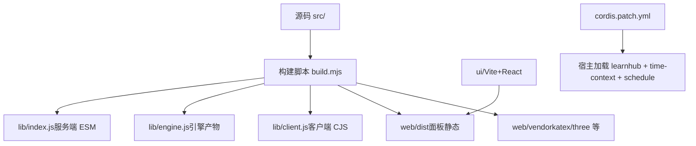
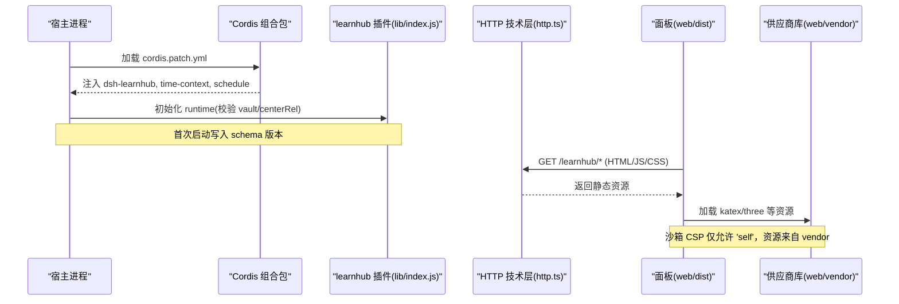
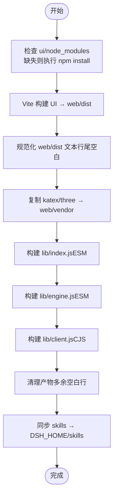
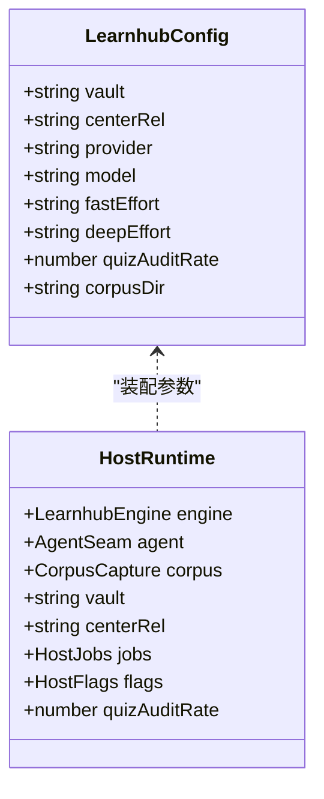
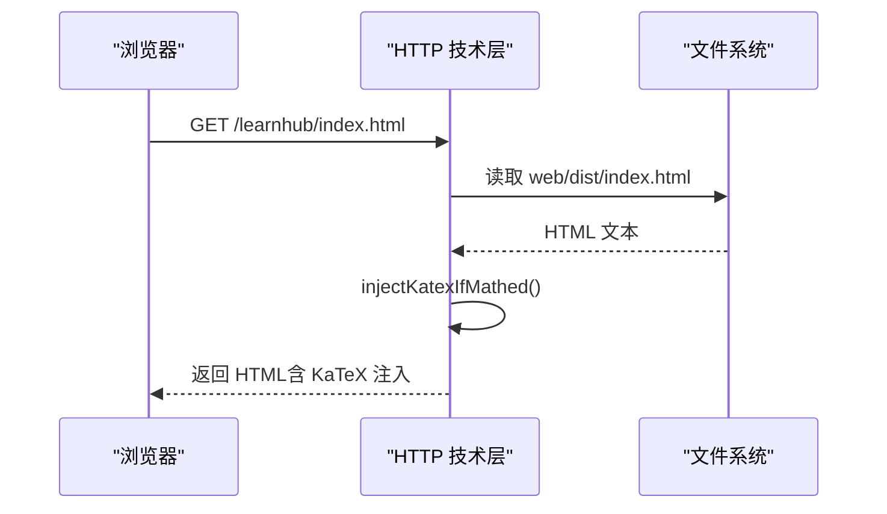
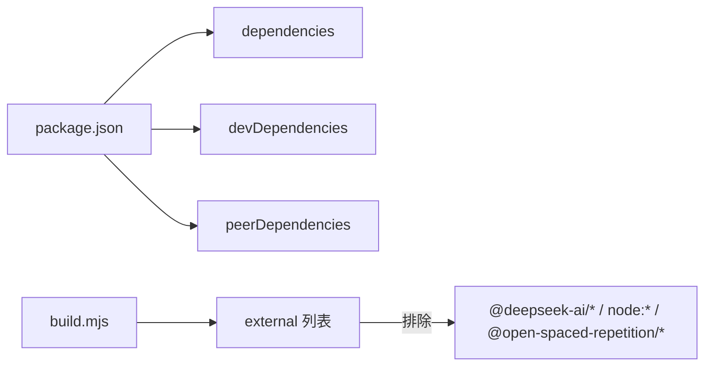

# 部署指南

<cite>
**本文引用的文件**
- [package.json](file://package.json)
- [build.mjs](file://build.mjs)
- [ui/vite.config.ts](file://ui/vite.config.ts)
- [cordis.patch.yml](file://cordis.patch.yml)
- [preset/learnhub/preset.yml](file://preset/learnhub/preset.yml)
- [preset/learnhub/user-root-composition.yml](file://preset/learnhub/user-root-composition.yml)
- [src/host/runtime.ts](file://src/host/runtime.ts)
- [src/host/http.ts](file://src/host/http.ts)
- [scripts/spike.mjs](file://scripts/spike.mjs)
</cite>

## 目录
1. [简介](#简介)
2. [项目结构](#项目结构)
3. [核心组件](#核心组件)
4. [架构总览](#架构总览)
5. [详细组件分析](#详细组件分析)
6. [依赖分析](#依赖分析)
7. [性能考虑](#性能考虑)
8. [故障排查指南](#故障排查指南)
9. [结论](#结论)
10. [附录](#附录)

## 简介
本指南面向生产与开发环境的部署与运维，覆盖构建流程、打包配置、部署拓扑、容器化方案、环境变量与安全、监控与日志、性能调优、备份恢复与灾难恢复，以及自动化脚本示例。内容基于仓库中的构建脚本、宿主运行时与 HTTP 层等实现进行说明，确保与实际代码一致。

## 项目结构
- 产物与入口
  - 服务端 ESM：lib/index.js（插件主入口，暴露工具与 /learnhub 路由）
  - 引擎独立产物：lib/engine.js（不含 cordis 工具与 HTTP 层，供脚本/测试消费）
  - 客户端 CJS：lib/client.js（通过 window.__ModuleLoader__.load 注入宿主模块系统）
  - 面板静态资源：web/dist（由 Vite 构建产出，被宿主以 /learnhub/* 伺服）
  - 交互件供应商库：web/vendor（katex、three 等，沙箱 CSP 下唯一取库来源）
- 前端构建
  - ui/ 使用 Vite + React，输出到 ../web/dist，base 为相对路径以便挂在 /learnhub 前缀下
- 宿主装配
  - cordis.patch.yml 声明 host 插件 id 与时间上下文/定时提醒能力
  - preset/learnhub 提供预设名称与用户根 composition 引用占位

图表来源
- [build.mjs:18-166](file://build.mjs#L18-L166)
- [ui/vite.config.ts:4-14](file://ui/vite.config.ts#L4-L14)
- [cordis.patch.yml:1-14](file://cordis.patch.yml#L1-L14)

章节来源
- [package.json:18-47](file://package.json#L18-L47)
- [build.mjs:18-166](file://build.mjs#L18-L166)
- [ui/vite.config.ts:4-14](file://ui/vite.config.ts#L4-L14)
- [cordis.patch.yml:1-14](file://cordis.patch.yml#L1-L14)

## 核心组件
- 宿主运行时（runtime）
  - 负责装配引擎、agent 缝、语料捕获器、任务注册表、标志位与运行日志
  - 校验部署路径（vault、centerRel），首次启动时写入 schema 版本信息
  - 暴露 run/apiRun 统一调用与日志记录
- HTTP 技术层
  - 定义面板静态目录、vendor 目录、MIME 映射
  - 提供 JSON 请求解析与响应序列化
  - 在交互件 HTML 中按需注入 KaTeX 自动渲染
- 构建与打包
  - 先构建 UI 面板并规范化行尾空白
  - 复制 vendor 库（katex/three）到 web/vendor
  - 分别构建服务端 ESM、引擎产物、客户端 CJS，并清理多余空白行
  - 将 skills 同步至 DSH_HOME/skills 目录

章节来源
- [src/host/runtime.ts:23-193](file://src/host/runtime.ts#L23-L193)
- [src/host/http.ts:1-55](file://src/host/http.ts#L1-L55)
- [build.mjs:18-166](file://build.mjs#L18-L166)

## 架构总览
下图展示从宿主加载到面板访问的端到端链路：cordis 组合包注入 learnhub 插件与时间/调度能力；构建产物 lib/index.js 暴露工具与 /learnhub 路由；HTTP 层服务 web/dist 与 vendor；面板通过相对路径引用资源。

图表来源
- [cordis.patch.yml:1-14](file://cordis.patch.yml#L1-L14)
- [src/host/runtime.ts:135-193](file://src/host/runtime.ts#L135-L193)
- [src/host/http.ts:1-55](file://src/host/http.ts#L1-L55)
- [build.mjs:18-77](file://build.mjs#L18-L77)

## 详细组件分析

### 构建与打包流程
- 前置条件
  - Node.js >= 22（见 engines 字段）
  - 首次构建会在 ui/ 执行 npm install 安装依赖
- 步骤
  - 构建 UI 面板（Vite），输出到 web/dist，并规范化行尾空白
  - 复制 vendor 库（katex 与 three）到 web/vendor
  - 构建服务端 ESM（lib/index.js）、引擎产物（lib/engine.js）、客户端 CJS（lib/client.js）
  - 清理产物中的多余空白行
  - 将 skills 目录同步到 DSH_HOME/skills（若未设置则默认 ~/.dsh）
- 环境差异
  - 开发：可通过 scripts/dev-server.mjs 启动本地调试（如存在）
  - 生产：直接复用同一套构建产物，无需额外开关；注意外部依赖（@deepseek-ai/*、node:*、@open-spaced-repetition/*）保持 external，避免打包进产物

图表来源
- [build.mjs:18-166](file://build.mjs#L18-L166)
- [ui/vite.config.ts:4-14](file://ui/vite.config.ts#L4-L14)

章节来源
- [package.json:15-47](file://package.json#L15-L47)
- [build.mjs:18-166](file://build.mjs#L18-L166)
- [ui/vite.config.ts:4-14](file://ui/vite.config.ts#L4-L14)

### 宿主运行时与配置
- LearnhubConfig 关键字段
  - vault：必填，绝对路径，用于存放课程数据与状态
  - centerRel：学习中心相对路径，默认“学习中心”
  - provider/model：AI 生成/判卷的模型提供者与模型名
  - fastEffort/deepEffort：不同复杂度节点的思考档位
  - quizAuditRate：出题第二意见门抽样率（0–1）
  - corpusDir：生成语料落盘目录覆盖
- 启动行为
  - 校验 vault 与 center 目录存在性
  - 首次启动在 state/learnhub.json 写入当前 schema 版本
  - 构造引擎、agent 缝、语料捕获器与任务注册表
  - 运行日志写入 centerStateDir/运行日志.md

图表来源
- [src/host/runtime.ts:23-193](file://src/host/runtime.ts#L23-L193)

章节来源
- [src/host/runtime.ts:23-193](file://src/host/runtime.ts#L23-L193)

### HTTP 与面板伺服
- 静态资源
  - PAGE_DIST：面板 dist 目录
  - VENDOR_DIST：vendor 目录（katex/three）
  - ASSET_MIME：面板资源 MIME 映射
  - FILE_MIME：二进制媒体扩展名映射
- 请求处理
  - sendJson：统一 JSON 响应头与缓存控制
  - readJson：解析 POST JSON 体
  - injectKatexIfMathed：检测到公式定界符时注入 KaTeX 自动渲染脚本与样式

图表来源
- [src/host/http.ts:1-55](file://src/host/http.ts#L1-L55)

章节来源
- [src/host/http.ts:1-55](file://src/host/http.ts#L1-L55)

### 宿主装配与组合包
- cordis.patch.yml 注入
  - id: dsh-learnhub（host 引擎插件）
  - id: time-context（会话级时间上下文）
  - id: schedule（会话级定时提醒）
- preset 与 composition
  - preset.yml 定义预设名称与描述
  - user-root-composition.yml 提供 include 占位，需替换为真实仓库路径

章节来源
- [cordis.patch.yml:1-14](file://cordis.patch.yml#L1-L14)
- [preset/learnhub/preset.yml:1-3](file://preset/learnhub/preset.yml#L1-L3)
- [preset/learnhub/user-root-composition.yml:1-9](file://preset/learnhub/user-root-composition.yml#L1-L9)

### 冒烟与质量评测脚本
- spike.mjs：驱动宿主 /learnhub/api/spike 接口，收集工具调用通道报告，支持 runs/stations/quiz-count/temperature/corpus 等参数
- 超时策略：使用 node:http 避免 fetch 默认头超时导致长任务中断

章节来源
- [scripts/spike.mjs:1-100](file://scripts/spike.mjs#L1-L100)

## 依赖分析
- 运行时依赖
  - @deepseek-ai/cordis（peerDependency，宿主提供）
  - @deepseek-ai/dsh-llm、@deepseek-ai/dsh-tools、@deepseek-ai/dsh-schedule、@deepseek-ai/dsh-time-context（可选 peer）
  - ts-fsrs、yaml（运行时依赖）
- 构建期依赖
  - esbuild（构建脚本）
  - vite、react（前端构建）
- 外部化策略
  - 构建时将 @deepseek-ai/*、node:*、@open-spaced-repetition/* 标记为 external，避免打包进产物，运行时由宿主或系统提供

图表来源
- [package.json:49-81](file://package.json#L49-L81)
- [build.mjs:87-95](file://build.mjs#L87-L95)

章节来源
- [package.json:49-81](file://package.json#L49-L81)
- [build.mjs:87-95](file://build.mjs#L87-L95)

## 性能考虑
- 构建优化
  - 外部化第三方依赖以减少产物体积
  - 面板 chunkSizeWarningLimit 设置为 1500，避免过大分包
  - 构建后清理多余空白行，减少体积与校验失败风险
- 运行时优化
  - fastEffort/deepEffort 可调节不同复杂度的思考档位，平衡速度与质量
  - quizAuditRate 控制第二意见门抽样率，降低高成本调用频率
  - 运行日志截断上限 1500 字符，避免日志膨胀影响 IO
- 建议
  - 生产环境根据负载调整 AI 模型与 effort 档位
  - 对高频调用路径开启合理的采样与节流
  - 定期清理运行日志与生成语料，避免磁盘增长

[本节为通用指导，不直接分析具体文件]

## 故障排查指南
- 常见错误
  - config.vault 缺失或目录不存在：启动时报错，需在机器 profile patch 中配置 vault
  - 学习中心目录不存在：需确保 vault/centerRel 指向有效目录
  - vendor 源缺失：构建时报错，需先在 ui/ 执行 npm install
  - 面板资源 404：确认 base 为相对路径且 web/dist 已构建
- 日志定位
  - 运行日志：centerStateDir/运行日志.md，记录每次引擎调用摘要与失败信息
  - 生成任务状态：state/生成任务.json，包含阶段、进度与失败清单
  - 冒烟报告：scripts/spike.mjs 输出的 JSON 报告，便于定位协议问题
- 快速自检
  - 执行 npm run build 确保产物完整
  - 访问 /learnhub/api/status（如宿主暴露）确认服务可用
  - 使用 spike.mjs --runs 1 做最小化连通性验证

章节来源
- [src/host/runtime.ts:135-193](file://src/host/runtime.ts#L135-L193)
- [src/host/runtime.ts:217-253](file://src/host/runtime.ts#L217-L253)
- [scripts/spike.mjs:1-100](file://scripts/spike.mjs#L1-L100)

## 结论
本项目采用清晰的构建与宿主装配分离：构建脚本负责产物打包与资源准备，宿主运行时负责配置校验与运行时装配。通过 cordis.patch.yml 注入插件与能力，HTTP 层提供面板与 API 能力。生产部署需关注 vault 路径、AI 模型配置、vendor 资源与日志管理；结合 spike 脚本可进行质量评测与回归验证。

[本节为总结，不直接分析具体文件]

## 附录

### 部署拓扑与基础设施要求
- 服务器
  - Node.js >= 22
  - 磁盘空间：面板静态资源、vendor、运行日志与生成语料
  - 内存：根据并发与 AI 调用规模评估
- 依赖服务
  - Cordis 宿主（提供 @deepseek-ai/* 能力）
  - AI 模型提供方（provider/model 由运行时配置）
  - 可选：AnkiConnect（导出卡片）

[本节为通用指导，不直接分析具体文件]

### 环境变量与配置
- 环境变量
  - DSH_HOME：skills 同步目标根目录（默认 ~/.dsh）
- 运行时配置（LearnhubConfig）
  - vault、centerRel、provider、model、fastEffort、deepEffort、quizAuditRate、corpusDir
- 安全建议
  - 限制 /learnhub 路由访问范围（反向代理/鉴权）
  - 仅开放必要端口，启用 HTTPS
  - 谨慎暴露 /learnhub/api 接口，避免未授权访问

章节来源
- [build.mjs:143-158](file://build.mjs#L143-L158)
- [src/host/runtime.ts:23-193](file://src/host/runtime.ts#L23-L193)

### 容器化部署方案
- Docker 镜像
  - 基础镜像：Node.js 22+
  - 构建步骤：
    - 复制源码与依赖
    - 执行 npm ci（或 npm install）
    - 执行 npm run build（构建 lib 与 web/dist/web/vendor）
    - 运行宿主进程加载 cordis.patch.yml 与插件
- 编排配置（Kubernetes 示例要点）
  - Deployment：副本数、资源限制（CPU/内存）、健康检查
  - Service：暴露 /learnhub 与 API 端口
  - ConfigMap/Secret：注入 provider/model 等敏感配置
  - Ingress：HTTPS 终止与域名绑定
- 注意事项
  - 将 vault 挂载为持久卷（PV/PVC）
  - 日志与语料目录单独挂载，便于备份与轮转
  - vendor 与 web/dist 作为只读层，避免运行时修改

[本节为通用指导，不直接分析具体文件]

### 监控与日志收集
- 应用日志
  - 运行日志：centerStateDir/运行日志.md
  - 生成任务状态：state/生成任务.json
- 指标采集
  - 统计 AI 调用次数、token 用量、延迟（可从 agent 缝日志中提取）
  - 面板访问与错误率（通过反向代理/网关日志）
- 日志轮转与保留
  - 按天轮转运行日志，保留策略依合规要求设定
  - 生成语料目录定期归档与清理

[本节为通用指导，不直接分析具体文件]

### 性能调优与资源分配
- 构建阶段
  - 并行构建（esbuild 已内建优化）
  - 合理设置 chunkSizeWarningLimit，避免大包
- 运行阶段
  - 调整 fastEffort/deepEffort 与 quizAuditRate
  - 限制并发与超时，避免雪崩
  - 使用 CDN 缓存静态资源（web/dist）

[本节为通用指导，不直接分析具体文件]

### 备份恢复与灾难恢复
- 备份范围
  - vault 根目录（课程数据与状态）
  - 运行日志与生成语料目录
  - 配置文件（cordis.patch.yml、preset 等）
- 恢复流程
  - 停止服务
  - 回滚 vault 与配置
  - 重启服务并校验 schema 版本
- 演练建议
  - 定期演练恢复流程，验证数据一致性
  - 建立灰度发布与回滚机制

[本节为通用指导，不直接分析具体文件]

### 部署脚本与自动化流程示例
- 本地构建与部署
  - npm run build
  - 启动宿主进程（由宿主负责加载 cordis.patch.yml 与插件）
- 冒烟与质量评测
  - npm run spike -- --runs 1 --stations 课程大纲,题目生成
- CI/CD 流水线建议
  - 安装依赖 → 类型检查 → 单元测试 → 构建 → 冒烟测试 → 推送制品
  - 制品包括 lib、web/dist、web/vendor
- 关键脚本参考
  - build.mjs：构建全流程
  - scripts/spike.mjs：冒烟评测驱动

章节来源
- [package.json:38-47](file://package.json#L38-L47)
- [build.mjs:18-166](file://build.mjs#L18-L166)
- [scripts/spike.mjs:1-100](file://scripts/spike.mjs#L1-L100)