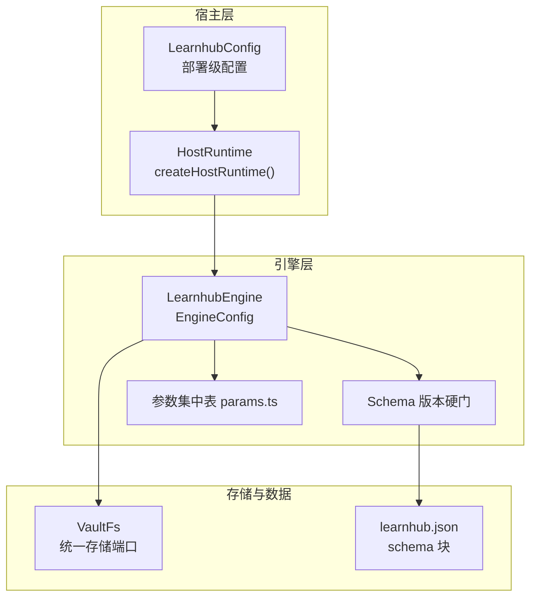
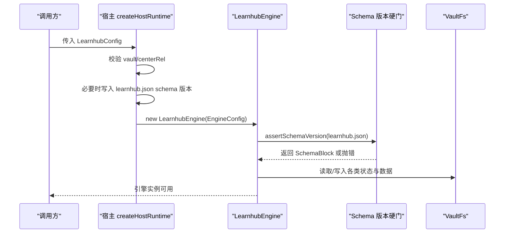
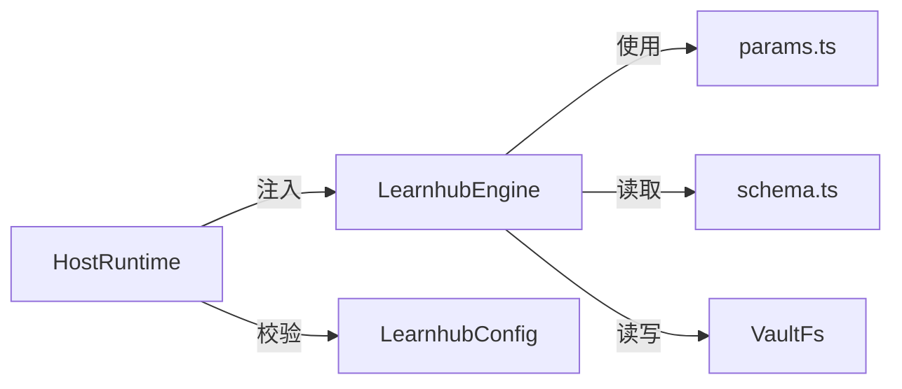

# 配置管理

<cite>
**本文引用的文件**
- [src/engine/index.ts](file://src/engine/index.ts)
- [src/host/runtime.ts](file://src/host/runtime.ts)
- [src/engine/params.ts](file://src/engine/params.ts)
- [src/engine/schema.ts](file://src/engine/schema.ts)
- [src/engine/types.ts](file://src/engine/types.ts)
- [src/engine/xp.ts](file://src/engine/xp.ts)
- [preset/learnhub/preset.yml](file://preset/learnhub/preset.yml)
- [preset/learnhub/user-root-composition.yml](file://preset/learnhub/user-root-composition.yml)
- [ui/src/api.ts](file://ui/src/api.ts)
- [ui/src/types.ts](file://ui/src/types.ts)
</cite>

## 目录
1. [简介](#简介)
2. [项目结构](#项目结构)
3. [核心组件](#核心组件)
4. [架构总览](#架构总览)
5. [详细组件分析](#详细组件分析)
6. [依赖关系分析](#依赖关系分析)
7. [性能考量](#性能考量)
8. [故障诊断指南](#故障诊断指南)
9. [结论](#结论)
10. [附录](#附录)

## 简介
本文件面向“学习引擎”的配置管理体系，系统性说明：
- 引擎与宿主层的配置项结构与含义（学习参数、内容生成设置、系统调优）
- 预设模板系统与默认/自定义预设的创建方式
- 配置验证机制与数据模式定义
- 环境变量与外部配置的优先级规则
- 配置的动态更新与热重载机制
- 最佳实践与推荐设置
- 配置迁移与版本兼容性处理
- 具体示例与故障诊断方法

## 项目结构
配置相关的关键位置与职责：
- 宿主运行时装配层：负责部署路径校验、AI 路由、任务注册表、标志位等可变态配置入口
- 引擎门面与子系统：接收运行时注入的时钟、随机源、文件系统端口，并基于 schema 硬门加载数据
- 参数集中表：学习算法、XP 账本、复诊与生长闸门等可调参数的唯一权威来源
- 数据模式与版本：schema 主版本与断裂策略，确保库升级时的安全边界
- 预设模板：描述性元信息与用户根占位 composition 引用
- UI 侧 API：暴露部分运行时可动态调整的配置接口（如睡眠建议、校准提示等）

**图表来源**
- [src/host/runtime.ts:24-44](file://src/host/runtime.ts#L24-L44)
- [src/host/runtime.ts:138-193](file://src/host/runtime.ts#L138-L193)
- [src/engine/index.ts:133-147](file://src/engine/index.ts#L133-L147)
- [src/engine/schema.ts:16-79](file://src/engine/schema.ts#L16-L79)
- [src/engine/params.ts:1-59](file://src/engine/params.ts#L1-L59)

**章节来源**
- [src/host/runtime.ts:24-44](file://src/host/runtime.ts#L24-L44)
- [src/host/runtime.ts:138-193](file://src/host/runtime.ts#L138-L193)
- [src/engine/index.ts:133-147](file://src/engine/index.ts#L133-L147)
- [src/engine/schema.ts:16-79](file://src/engine/schema.ts#L16-L79)
- [src/engine/params.ts:1-59](file://src/engine/params.ts#L1-L59)

## 核心组件
- 宿主运行时 LearnhubConfig：部署级配置，包含 vault、centerRel、AI provider/model、effort 档位、出题审计抽样率、语料落盘目录覆盖等
- 引擎配置 EngineConfig：引擎运行所需的最小注入集（vault、centerRel、clock、rng、fs），以及内部路径解析与子系统装配
- 参数集中表 params.ts：学习算法阈值、XP 定价、复习/新课预算、复诊期、生长闸门等全局可调参数
- Schema 版本与断裂：learnhub.json 中的 schema.version 作为启动硬门，旧库拒载并指引迁移脚本
- 类型与状态：课程阶段、FSRS 状态、图节点字段、练习/复习流水等数据结构定义

**章节来源**
- [src/host/runtime.ts:24-44](file://src/host/runtime.ts#L24-L44)
- [src/engine/index.ts:133-147](file://src/engine/index.ts#L133-L147)
- [src/engine/params.ts:1-59](file://src/engine/params.ts#L1-L59)
- [src/engine/schema.ts:16-79](file://src/engine/schema.ts#L16-L79)
- [src/engine/types.ts:8-11](file://src/engine/types.ts#L8-L11)
- [src/engine/types.ts:30-61](file://src/engine/types.ts#L30-L61)
- [src/engine/types.ts:81-101](file://src/engine/types.ts#L81-L101)
- [src/engine/types.ts:147-200](file://src/engine/types.ts#L147-L200)

## 架构总览
配置从宿主到引擎的装配流程如下：
- 宿主 createHostRuntime 接收 LearnhubConfig，校验 vault/centerRel，必要时初始化 learnhub.json 的 schema 版本戳
- 构造 LearnhubEngine 时传入 EngineConfig（vault、centerRel、clock、rng、fs），并在构造函数中执行 schema 版本硬门
- 引擎内部通过 Paths、Store、Registry、各子系统完成资源装配；所有读盘落盘经 VaultFs 端口
- 参数集中表提供学习算法与 XP 账本的默认值，可在 state/learnhub.json 中覆盖部分行为（如每日目标、日界）

**图表来源**
- [src/host/runtime.ts:138-193](file://src/host/runtime.ts#L138-L193)
- [src/engine/index.ts:212-225](file://src/engine/index.ts#L212-L225)
- [src/engine/schema.ts:63-79](file://src/engine/schema.ts#L63-L79)

**章节来源**
- [src/host/runtime.ts:138-193](file://src/host/runtime.ts#L138-L193)
- [src/engine/index.ts:212-225](file://src/engine/index.ts#L212-L225)
- [src/engine/schema.ts:63-79](file://src/engine/schema.ts#L63-L79)

## 详细组件分析

### 宿主层配置：LearnhubConfig
- 部署路径
  - vault：必填，机器级绝对路径
  - centerRel：可选，相对 vault 的学习中心路径，缺省为“学习中心”
- AI 生成/判卷
  - provider/model：选择 LLM 提供者与模型名
  - fastEffort/deepEffort：分层 effort 档位，影响思考深度与耗时
- 质量与安全
  - quizAuditRate：第二意见门抽样率，范围 0–1，非数值在装配时报错
- 生成语料
  - corpusDir：覆盖生成语料落盘目录，便于离线评审

这些配置在 createHostRuntime 中严格校验，错误立即失败，避免静默降级。

**章节来源**
- [src/host/runtime.ts:24-44](file://src/host/runtime.ts#L24-L44)
- [src/host/runtime.ts:138-193](file://src/host/runtime.ts#L138-L193)

### 引擎层配置：EngineConfig
- 必需注入
  - vault：笔记仓库根目录
  - centerRel：学习中心相对路径
  - clock：当前时刻适配器
  - rng：随机源适配器
  - fs：VaultFs 存储端口
- 内部装配
  - 路径解析、Registry、Store、Content、Bank、Concepts、LearnerCards、ErrorCards、Skills、Habits、NoteManifest、AnkiMirror、Sessions、Lab/Channels/Learner/Project/Bank/Graph/Content/Sched/Growth 等子系统
- 调度缓存
  - 按 courseRoot 缓存 FSRS 调度器，减少重复构建成本

**章节来源**
- [src/engine/index.ts:133-147](file://src/engine/index.ts#L133-L147)
- [src/engine/index.ts:149-201](file://src/engine/index.ts#L149-L201)
- [src/engine/index.ts:212-329](file://src/engine/index.ts#L212-L329)

### 参数集中表：params.ts
- 学习与复习
  - 期望保留率、前置解锁门槛、mastered 稳定性阈值、复习占比、单题估时、日均处理能力、过载因子、软重启空窗、恢复清偿比例
- 扫描与 FSRS
  - scan 初始稳定性/难度、difficulty 中性值
- XP 时间账本
  - 题型 XP 基价、乱猜判定与惩罚、满分奖励、无历史估算、里程碑定价、每日 XP 目标缺省、日界缺省、连续打卡宽容天数
- 掌握度交叉与入档推荐
  - 两轴高低分界、样本下限、升/降档均分阈值
- 自评校准
  - 过信检出阈值、JOL 抽查加强密度
- 复诊与插入调速
  - 复诊期缺省/上下界、集中度降幅、保留率回升、样本下限
- 三率与韧性闸门
  - 滚动窗口、样本下限、通过率地板、插入速率上限、旁支节点上限、韧性高放宽、韧性阈值

这些参数是学习算法与教练策略的核心开关，建议在理解业务含义后谨慎调整。

**章节来源**
- [src/engine/params.ts:1-59](file://src/engine/params.ts#L1-L59)

### 数据模式与版本：schema.ts
- 主版本常量 CURRENT_SCHEMA_VERSION：引擎只认当前主版本
- 断裂档案 SchemaBreak：记录迁移前的来源版本、日期、归档课程清单、备注
- 解析与断言
  - parseSchemaBlock：从 learnhub.json 原文提取 schema 块，损坏或缺失视为史前库
  - assertSchemaVersion：同步硬门，非当前版本抛错并指引一次性迁移脚本
- 设计原则
  - 零兼容代码、宣告式断裂、旧库整体归档、breaks 仅存档不消费

**章节来源**
- [src/engine/schema.ts:16-79](file://src/engine/schema.ts#L16-L79)

### 类型与状态：types.ts
- 课程阶段 Stage、内容状态 ContentStatus
- FSRS 状态块 FsrsBlock、课程笔记 frontmatter Fm（含 sections、tier、practice_ema 等）
- 图节点 GNode（含 est、bloom、difficulty、teaches/assumes/misconceptions）
- 练习/复习/日志流水 PracticeRec、ReviewRec、JournalRec
- 概念档位 CONCEPT_TIERS、Bloom 层级 BLOOM_LEVELS

这些类型定义了引擎读写的数据契约，是配置生效的作用域与约束基础。

**章节来源**
- [src/engine/types.ts:8-11](file://src/engine/types.ts#L8-L11)
- [src/engine/types.ts:30-61](file://src/engine/types.ts#L30-L61)
- [src/engine/types.ts:81-101](file://src/engine/types.ts#L81-L101)
- [src/engine/types.ts:147-200](file://src/engine/types.ts#L147-L200)

### 预设模板系统
- preset.yml：描述预设名称与用途（学习伙伴专用 preset）
- user-root-composition.yml：用户根占位，使用 include 插件引用真实 composition，保持单一事实来源；安装时需将 path 替换为本机仓库绝对路径

创建自定义预设的步骤：
- 复制现有 preset 目录，修改 name/description
- 在 user-root-composition.yml 中指向本机仓库的真实路径
- 将 preset 安装至宿主预设目录（例如 ~/.dsh/.agent-presets/learnhub/agent.cordis.yml）

**章节来源**
- [preset/learnhub/preset.yml:1-3](file://preset/learnhub/preset.yml#L1-L3)
- [preset/learnhub/user-root-composition.yml:1-9](file://preset/learnhub/user-root-composition.yml#L1-L9)

### 环境变量与外部配置优先级
- 宿主 LearnhubConfig 由调用方（如 Cordis profile patch）注入，属于部署级配置，优先级最高
- 引擎 EngineConfig 由宿主装配注入，属于运行时最小注入集
- 参数集中表 params.ts 提供默认值，state/learnhub.json 可覆盖部分行为（如 daily_xp_goal、day_cutoff）
- 未显式声明的环境变量不在本仓库中直接消费；若存在宿主层环境变量，应遵循宿主层约定，本仓库以 LearnhubConfig 为主

**章节来源**
- [src/host/runtime.ts:24-44](file://src/host/runtime.ts#L24-L44)
- [src/engine/xp.ts:83-83](file://src/engine/xp.ts#L83-L83)

### 动态更新与热重载
- 运行时标志 HostFlags：queuePaused、pumping、lastSessionStartAt、genQueueBroken 等，用于控制队列与泵单并发、会话节流与任务档破损态
- 生成任务注册表 GenJobs：持久化于 state/生成任务.json，支持恢复与清理
- UI 侧 API 暴露部分可动态调整的配置项（如睡眠建议、校准提示、JOL 配置），通过 REST 接口 GET/PUT 进行读取与更新
- 注意：引擎核心参数（params.ts）为编译期常量，不建议运行时热更；如需变更，应通过重新装配宿主运行时或调整 state/learnhub.json 中可覆盖字段

**章节来源**
- [src/host/runtime.ts:105-133](file://src/host/runtime.ts#L105-L133)
- [ui/src/api.ts:85-93](file://ui/src/api.ts#L85-L93)
- [ui/src/api.ts:245-247](file://ui/src/api.ts#L245-L247)

### 配置最佳实践与推荐设置
- 部署路径
  - 明确设置 vault 与 centerRel，确保目录存在且可写
- AI 生成
  - 根据节点复杂度选择 fastEffort/deepEffort，平衡质量与耗时
  - quizAuditRate 起步设为较低值（如 0.25），逐步提升
- 学习参数
  - 依据团队节奏调整 DAILY_CAPACITY、OVERLOAD_FACTOR、REVIEW_RATIO
  - 合理设置每日 XP 目标与日界，保证可持续学习节奏
- 复诊与生长
  - 复诊期 RECHECK_DAYS_DEFAULT 与阈值需结合课程难度与学员水平
  - 生长闸门参数（GROWTH_*）用于控制插入与旁支，避免过度扩张
- 版本与迁移
  - 升级前备份 vault；遇到 schema 版本硬门，按提示执行一次性迁移脚本

[本节为通用指导，不直接分析具体文件]

### 配置迁移与版本兼容性
- 启动硬门：learnhub.json 的 schema.version 必须等于 CURRENT_SCHEMA_VERSION，否则抛错并指引迁移
- 断裂策略：旧库整体归档，breaks 记录迁移历史，engine 零消费
- 迁移脚本：scripts/migrate-v2.mjs（或对应版本脚本）负责归档与版本戳更新

**章节来源**
- [src/engine/schema.ts:16-79](file://src/engine/schema.ts#L16-L79)

### 具体配置示例与故障诊断
- 常见错误
  - config.vault 缺失或目录不存在：在 createHostRuntime 中立即报错
  - quizAuditRate 非 0–1 数值：装配时 fail loud
  - schema 版本不匹配：启动即抛错，需执行迁移脚本
- 诊断步骤
  - 检查 vault/centerRel 是否存在且可访问
  - 查看 learnhub.json 的 schema.version 是否为当前主版本
  - 确认 AI provider/model 是否可用
  - 对于生成任务失败，检查 HostFlags.genQueueBroken 与任务注册表
  - 对 UI 动态配置，通过 /sleep、/calibration/hints、/jol 等接口读取与更新

**章节来源**
- [src/host/runtime.ts:138-193](file://src/host/runtime.ts#L138-L193)
- [src/engine/schema.ts:63-79](file://src/engine/schema.ts#L63-L79)
- [ui/src/api.ts:85-93](file://ui/src/api.ts#L85-L93)
- [ui/src/api.ts:245-247](file://ui/src/api.ts#L245-L247)

## 依赖关系分析
- 宿主运行时依赖：Context、LLM 适配、CorpusCapture、Clock、Rng、VaultFs
- 引擎依赖：Paths、Store、Registry、各子系统（Lab/Channels/Learner/Project/Bank/Graph/Content/Sched/Growth）
- 参数集中表被多处消费（学习算法、XP 账本、复诊与生长闸门）
- Schema 版本硬门在引擎构造早期执行，阻断后续加载

**图表来源**
- [src/host/runtime.ts:138-193](file://src/host/runtime.ts#L138-L193)
- [src/engine/index.ts:212-329](file://src/engine/index.ts#L212-L329)
- [src/engine/params.ts:1-59](file://src/engine/params.ts#L1-L59)
- [src/engine/schema.ts:16-79](file://src/engine/schema.ts#L16-L79)

**章节来源**
- [src/host/runtime.ts:138-193](file://src/host/runtime.ts#L138-L193)
- [src/engine/index.ts:212-329](file://src/engine/index.ts#L212-L329)
- [src/engine/params.ts:1-59](file://src/engine/params.ts#L1-L59)
- [src/engine/schema.ts:16-79](file://src/engine/schema.ts#L16-L79)

## 性能考量
- 调度器缓存：按 courseRoot 缓存 FSRS 实例，避免重复构建
- 参数集中表：集中维护阈值，减少分散配置带来的不一致
- 生成任务：注册表持久化，支持恢复与清理，避免中断导致的状态丢失
- 随机源与时钟：通过端口注入，便于测试与确定性控制

**章节来源**
- [src/engine/index.ts:198-210](file://src/engine/index.ts#L198-L210)
- [src/engine/params.ts:1-59](file://src/engine/params.ts#L1-L59)

## 故障诊断指南
- 启动失败
  - 检查 vault/centerRel 是否存在
  - 检查 learnhub.json 的 schema.version 是否匹配
  - 检查 AI provider/model 是否可用
- 生成任务异常
  - 查看 HostFlags.genQueueBroken 与任务注册表
  - 检查 quizAuditRate 是否在 0–1 范围内
- 动态配置
  - 通过 UI API 读取/更新 sleep、calibration hints、jol 等配置
  - 确认接口返回与预期一致

**章节来源**
- [src/host/runtime.ts:138-193](file://src/host/runtime.ts#L138-L193)
- [src/engine/schema.ts:63-79](file://src/engine/schema.ts#L63-L79)
- [ui/src/api.ts:85-93](file://ui/src/api.ts#L85-L93)
- [ui/src/api.ts:245-247](file://ui/src/api.ts#L245-L247)

## 结论
本项目的配置管理采用“宿主装配 + 引擎注入 + 参数集中表 + schema 硬门”的分层设计：
- 宿主层负责部署级配置与校验
- 引擎层通过最小注入集装配子系统，并以 schema 硬门保障数据安全
- 参数集中表提供学习算法与 XP 账本的权威默认值
- 预设模板与 UI API 提供灵活的扩展与动态调整能力
- 迁移与版本策略确保长期演进的可控性与可追溯性

## 附录
- 关键接口与类型
  - LearnhubConfig：宿主部署级配置
  - EngineConfig：引擎运行时注入配置
  - SchemaBlock/SchemaBreak：版本与断裂档案
  - Fm/FsrsBlock/GNode/PracticeRec/ReviewRec/JournalRec：数据契约

**章节来源**
- [src/host/runtime.ts:24-44](file://src/host/runtime.ts#L24-L44)
- [src/engine/index.ts:133-147](file://src/engine/index.ts#L133-L147)
- [src/engine/schema.ts:16-79](file://src/engine/schema.ts#L16-L79)
- [src/engine/types.ts:30-61](file://src/engine/types.ts#L30-L61)
- [src/engine/types.ts:81-101](file://src/engine/types.ts#L81-L101)
- [src/engine/types.ts:147-200](file://src/engine/types.ts#L147-L200)