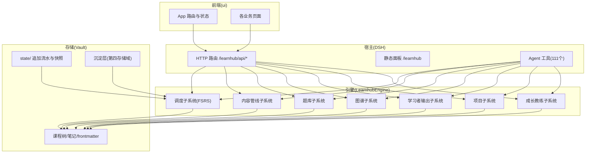
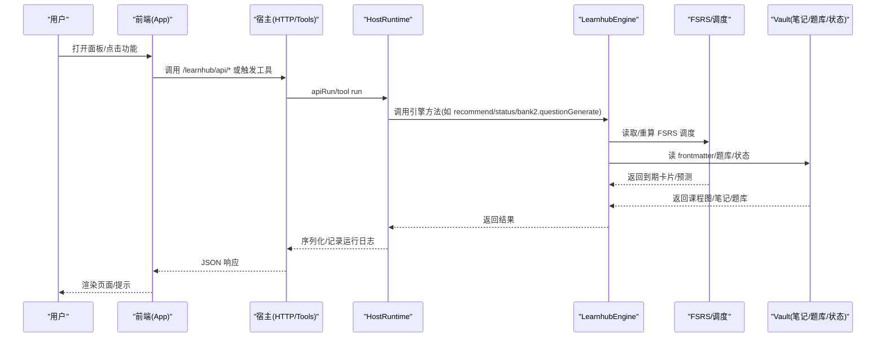
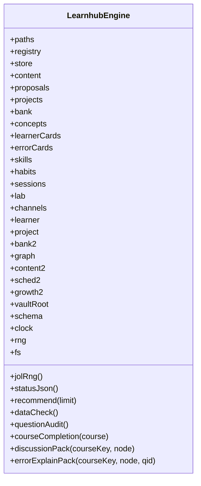
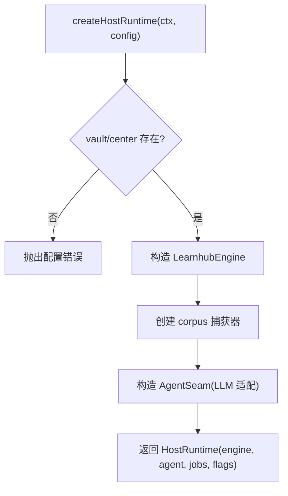
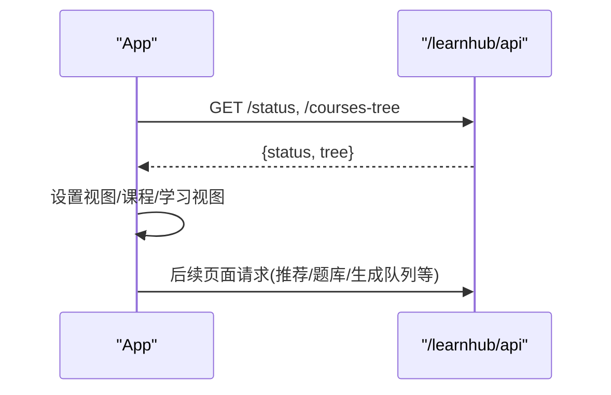
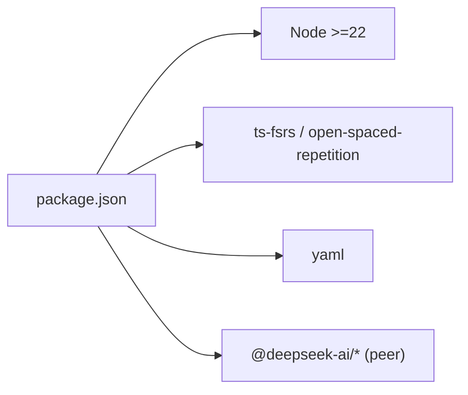

# 项目概述

<cite>
**本文引用的文件**
- [package.json](file://package.json)
- [CONTEXT.md](file://CONTEXT.md)
- [AGENTS.md](file://AGENTS.md)
- [src/index.ts](file://src/index.ts)
- [src/engine/index.ts](file://src/engine/index.ts)
- [src/host/runtime.ts](file://src/host/runtime.ts)
- [ui/src/App.tsx](file://ui/src/App.tsx)
</cite>

## 目录
1. [简介](#简介)
2. [项目结构](#项目结构)
3. [核心组件](#核心组件)
4. [架构总览](#架构总览)
5. [详细组件分析](#详细组件分析)
6. [依赖关系分析](#依赖关系分析)
7. [性能考量](#性能考量)
8. [故障排查指南](#故障排查指南)
9. [结论](#结论)
10. [附录：快速开始](#附录：快速开始)

## 简介
LearnHub 学习中心插件是一个基于 DeepSeek Harness（DSH）的学习引擎插件，提供“智能学习调度 + AI 驱动内容生成 + 知识图谱管理 + 学习者追踪”的完整学习解决方案。它包含 111 个 agent 工具、独立的 Web 面板与侧边栏入口，面向 Obsidian Vault 的事实源，实现题目级 FSRS 刷卡调度、课程图谱、XP 时间账本等能力。

核心价值
- 智能学习调度：以 FSRS 为核心的到期复习队列、今日推荐、错误对比卡、Anki 镜像通道，统一调度事实源在 Vault。
- AI 驱动的内容生成：大纲/节正文/题目的多站生成流水线，输出契约稳定、质量量规可审、语料可回放。
- 知识图谱管理：教练回合滚动生长、终点锚方向标记、概念登记表受控词表、边实验账本复诊。
- 学习者追踪：JOL 预测、自评校准画像、真实保留率、XP 时间账本、周复盘 Weekly Kata、沙盘推演。

技术栈
- 后端/引擎：TypeScript、Node.js（>=22），FSRS（ts-fsrs / open-spaced-repetition binding）。
- 前端：React + Vite（独立 SPA），通过宿主 HTTP 路由暴露 /learnhub 面板与 API。
- 宿主集成：DeepSeek Harness（@deepseek-ai/cordis、dsh-llm、dsh-tools、dsh-schedule、dsh-time-context）。

术语对齐
- 节点/节段/复杂度档位/题目/学习日/日界/推进/复习队列/掌握度/作答正确率/真实保留率/我的卡/XP/无绑定 XP/课程/笔记源/卡池镜像/Vault 先验检索/Anki 镜像/提案/前置/成分技能/实践节点/练习证据/续跑/拆节/机器块/生成站/输出契约/格式契约稳定/内容质量/生成语料/质量量规/多样性仪表/已生成/生成队列/任务注册表/悬空任务记录/定向补生成/今天学它/JOL 预测/难度带/挑战点/讲给我听/项目/里程碑/渐退档/回执/无界实践区/习惯/执行意图/技能条目/执行事件/自评校准/先做后教/N-of-1 实验/沙盘/周复盘/目标反编译/项目执行事件流/掌握交叉/练习会话/直通卡/判卷逃生门/唯一答案填空/瑕疵题/申诉/勘误/冲正/错误对比卡/思维轨迹/预测门/休眠题/概念/概念登记表/误解目录/出生打标/富化覆盖层/边实验账本/节段难度档/宣告式断裂/存档/沉淀层/学习者档案/种子/终点锚/终点节点/交汇节点/影响预览/罗盘/教练回合/生长批/前瞻深度/生长式图/行为摘要/复诊/卡点自报/概念足迹/上游图摘要/全图摘要/契约后置/修复策略单源/质量评审报告/图质量面审计——详见领域词典。

**章节来源**
- [package.json:1-83](file://package.json#L1-L83)
- [CONTEXT.md:1-478](file://CONTEXT.md#L1-L478)

## 项目结构
仓库采用“引擎 + 宿主 + 前端”的分层组织：
- src/engine：纯 TS 学习引擎门面与子系统（图谱、内容、题库、调度、项目、学习者输出、成长教练等）。
- src/host：宿主运行时装配、HTTP 路由、Agent 工具注册、任务队列、LLM 适配与语料捕获。
- ui：React 前端 SPA，提供课程工作台、洞察、今日、生成队列、提案收件箱等页面。
- docs：ADR、设计文档、研究语料与质量评审报告。
- skills：面向 Agent 的技能说明。
- scripts：构建、冒烟、类型扫描、数据导出等工程脚本。

**图表来源**
- [src/index.ts:56-90](file://src/index.ts#L56-L90)
- [src/host/runtime.ts:138-193](file://src/host/runtime.ts#L138-L193)
- [src/engine/index.ts:149-398](file://src/engine/index.ts#L149-L398)
- [ui/src/App.tsx:47-179](file://ui/src/App.tsx#L47-L179)

**章节来源**
- [src/index.ts:1-91](file://src/index.ts#L1-L91)
- [src/host/runtime.ts:1-255](file://src/host/runtime.ts#L1-L255)
- [src/engine/index.ts:1-859](file://src/engine/index.ts#L1-L859)
- [ui/src/App.tsx:1-180](file://ui/src/App.tsx#L1-L180)

## 核心组件
- LearnhubEngine（引擎门面）：聚合图谱、内容、题库、调度、项目、学习者输出、成长教练等子系统；提供 status/recommend/doctor/rebuild/discussionPack/errorExplainPack 等统一入口；维护 FSRS 调度器缓存、学习日计算、Broken/Missing 处理。
- HostRuntime（宿主运行时）：装配 vault/centerRel、LLM 配置、Agent 缝、生成任务注册表与标志位；提供 resolveEngineEntry/run/apiRun 等调用封装与运行日志。
- Agent 工具面：按域分组注册 111 个工具，承载生成、出题、图谱操作、学习者产出、项目与习惯等能力。
- 前端 App：基于 React 的路由与状态框架，加载课程树与状态，提供工作区导航、主题切换、帮助抽屉与错误恢复。

关键职责边界
- 所有数据访问必须经 engine 模块；工具/路由/UI 不得绕过 engine 直写文件。
- 宿主技术层函数一律接收 runtime 参数，避免模块级可变状态。
- 生成任务注册表持久化到 state，重启恢复并清理悬挂任务。

**章节来源**
- [src/engine/index.ts:149-398](file://src/engine/index.ts#L149-L398)
- [src/host/runtime.ts:118-193](file://src/host/runtime.ts#L118-L193)
- [src/index.ts:56-90](file://src/index.ts#L56-L90)
- [ui/src/App.tsx:47-179](file://ui/src/App.tsx#L47-L179)

## 架构总览
系统由三层构成：宿主（DSH）、引擎（TS 学习引擎）、前端（React SPA）。宿主负责装配与暴露 API/面板/工具；引擎封装全部学习与生成逻辑；前端通过 API 消费引擎能力。

**图表来源**
- [src/host/runtime.ts:233-253](file://src/host/runtime.ts#L233-L253)
- [src/engine/index.ts:534-569](file://src/engine/index.ts#L534-L569)

**章节来源**
- [src/host/runtime.ts:138-193](file://src/host/runtime.ts#L138-L193)
- [src/engine/index.ts:534-569](file://src/engine/index.ts#L534-L569)

## 详细组件分析

### 引擎门面 LearnhubEngine
- 构造期：校验 schema 版本、初始化路径、注册表、存储、内容、题库、概念登记、学习者产出、项目、会话、各子系统（Graph/Content/Bank/Sched/Growth/Lab/Channels/Learner/Project）。
- 调度缓存：按课程根缓存 FSRS 实例，减少重复创建成本。
- 学习日：读取日界与当前学习日，作为一切调度/结算/“今日”视图的统一口径。
- 诊断与体检：dataCheck/questionAudit/courseCompletion/statusJson/recommend/doctor/rebuild。
- 上下文包：discussionPack/errorExplainPack 为对话与讲解提供最小必要上下文。

**图表来源**
- [src/engine/index.ts:149-398](file://src/engine/index.ts#L149-L398)
- [src/engine/index.ts:534-569](file://src/engine/index.ts#L534-L569)
- [src/engine/index.ts:755-800](file://src/engine/index.ts#L755-L800)

**章节来源**
- [src/engine/index.ts:149-398](file://src/engine/index.ts#L149-L398)
- [src/engine/index.ts:534-569](file://src/engine/index.ts#L534-L569)
- [src/engine/index.ts:755-800](file://src/engine/index.ts#L755-L800)

### 宿主运行时 HostRuntime
- 装配：校验 vault/centerRel、首启 seed、构造引擎、agent 缝、语料捕获器、任务表与标志位。
- 调用封装：resolveEngineEntry 解析引擎入口；run/apiRun 包装调用与运行日志；失败也留痕。
- LLM 注入：通过 AgentSeam 注入 complete/stream/onCall，统一记录 token 用量与耗时。

**图表来源**
- [src/host/runtime.ts:138-193](file://src/host/runtime.ts#L138-L193)

**章节来源**
- [src/host/runtime.ts:138-193](file://src/host/runtime.ts#L138-L193)
- [src/host/runtime.ts:233-253](file://src/host/runtime.ts#L233-L253)

### 前端 App
- 路由与状态：基于 hash 的双向同步，支持课程工作台参数段路由、视图保活、夜间模式。
- 数据加载：并行拉取 status 与 coursesTree，失败时显示错误与重试。
- 导航：openCourse/openLesson/locateInGraph/locateJob 等集中式跳转。

**图表来源**
- [ui/src/App.tsx:62-81](file://ui/src/App.tsx#L62-L81)
- [ui/src/App.tsx:92-117](file://ui/src/App.tsx#L92-L117)

**章节来源**
- [ui/src/App.tsx:47-179](file://ui/src/App.tsx#L47-L179)

## 依赖关系分析
- 运行时依赖：Node >=22；peerDependencies 指向 dsh-* 系列（cordis、dsh-llm、dsh-tools、dsh-schedule、dsh-time-context），可选安装。
- 核心依赖：ts-fsrs 与 open-spaced-repetition binding 用于 FSRS 间隔重复；yaml 用于 YAML 解析。
- 开发依赖：esbuild、typescript、测试与类型检查脚本。

**图表来源**
- [package.json:1-83](file://package.json#L1-L83)

**章节来源**
- [package.json:1-83](file://package.json#L1-L83)

## 性能考量
- FSRS 调度器缓存：按课程根缓存 FSRS 实例，避免每答一题重建带来的开销。
- 学习日与截止时刻：统一从 learnhub.json 读取，减少重复 I/O。
- 生成任务持久化：注册表全量落盘，重启恢复；broken 态拒绝写回防止覆盖损坏。
- 批量只读体检：dataCheck/questionAudit 仅扫描不写入，适合定期健康检查。
- 前端并行加载：status 与 coursesTree 并行获取，缩短首屏等待。

[本节为通用性能建议，无需特定文件引用]

## 故障排查指南
- 启动时报 vault 不存在：检查 profile patch 中 dsh-learnhub 的 vault 配置。
- 端口占用 3080：确认是否已有宿主进程，探活 /learnhub/api/status。
- peer 缺失报错：执行 link-peers 补齐 @deepseek-ai/* 的 junction。
- 生成任务档 Broken：根据错误信息修复或删除该文件后重启宿主；期间禁止写回注册表。
- 面板加载失败：查看运行日志与错误消息，必要时重试加载。

**章节来源**
- [AGENTS.md:27-47](file://AGENTS.md#L27-L47)
- [src/host/runtime.ts:138-163](file://src/host/runtime.ts#L138-L163)
- [src/host/runtime.ts:233-253](file://src/host/runtime.ts#L233-L253)

## 结论
LearnHub 将“智能调度 + AI 生成 + 图谱治理 + 学习者追踪”整合为一个可插拔的 DSH 插件，以 Vault 为事实源，以 FSRS 为核心调度机制，以 Agent 工具与 Web 面板为交互界面。其清晰的层次划分（宿主/引擎/前端）、严格的契约与审计（输出契约、质量量规、生成语料、边实验账本）以及丰富的学习者模型（JOL、自评校准、真实保留率、XP 账本）使其既适合初学者上手，也为高级用户提供足够的扩展与治理能力。

[本节为总结性内容，无需特定文件引用]

## 附录：快速开始
- 环境要求：Node >=22。
- 安装与链接：确保 dsh 宿主可用；若出现 peer 缺失，执行 link-peers 脚本补齐。
- 配置 vault：在机器级 profile patch（~/.dsh/profiles/web/cordis.patch.yml）中为 learnhub 配置 vault 根目录与 centerRel（默认“学习中心”）。
- 启动宿主：npx @deepseek-ai/dsh web，后台运行后查看本地 URL。
- 访问面板：浏览器打开 /learnhub 面板；API 端点位于 /learnhub/api/*。
- 首次自检：插件加载后会执行一次 status 自检，确认引擎通路正常。
- 常用命令：
  - 构建：npm run build
  - 类型检查：npm run typecheck
  - 测试：npm run test
  - 冒烟：npm run smoke

**章节来源**
- [AGENTS.md:27-47](file://AGENTS.md#L27-L47)
- [package.json:38-47](file://package.json#L38-L47)
- [src/index.ts:56-90](file://src/index.ts#L56-L90)