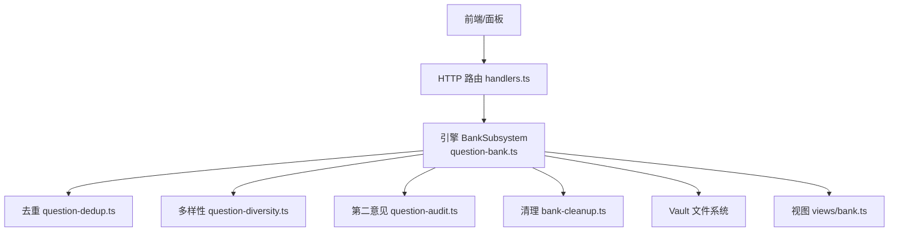
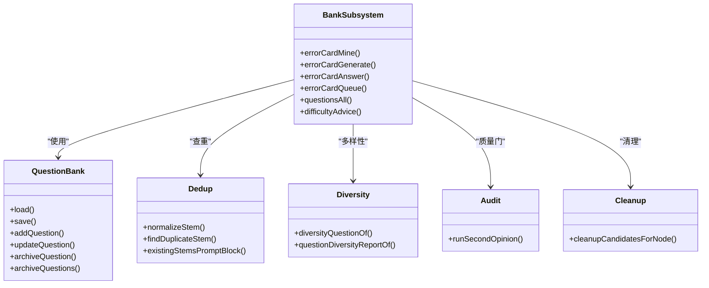
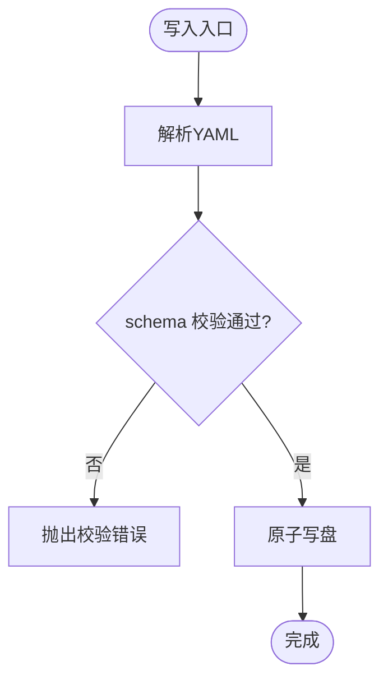
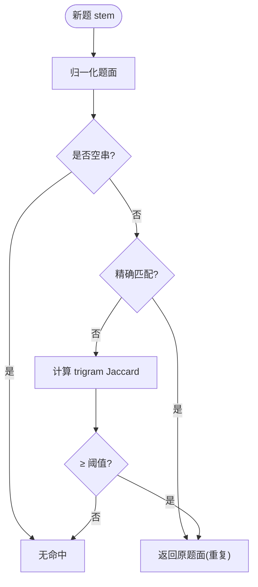
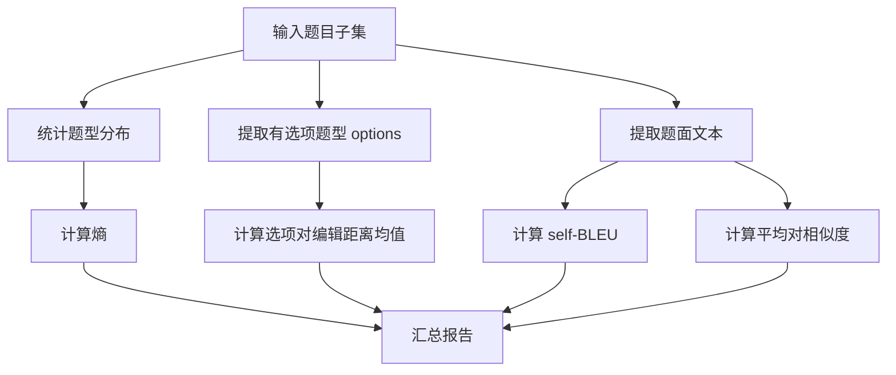
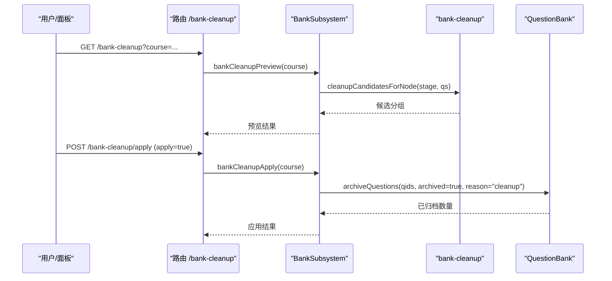
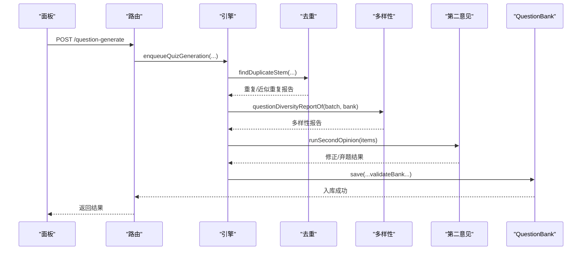
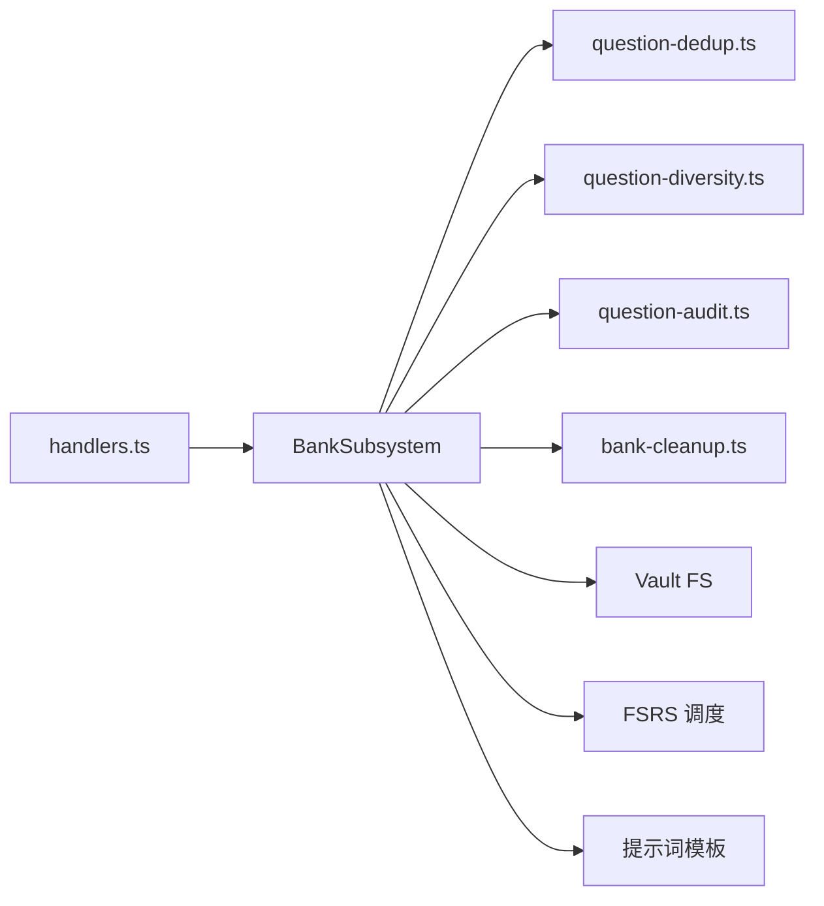

# 题库管理系统

<cite>
**本文引用的文件**
- [question-bank.ts](file://src/engine/question-bank.ts)
- [question-dedup.ts](file://src/engine/question-dedup.ts)
- [question-diversity.ts](file://src/engine/question-diversity.ts)
- [bank-cleanup.ts](file://src/engine/bank-cleanup.ts)
- [question-audit.ts](file://src/engine/question-audit.ts)
- [handlers.ts](file://src/host/handlers.ts)
- [题库.ts](file://src/commands/题库.ts)
- [bank.ts](file://src/engine/views/bank.ts)
</cite>

## 目录
1. [简介](#简介)
2. [项目结构](#项目结构)
3. [核心组件](#核心组件)
4. [架构总览](#架构总览)
5. [详细组件分析](#详细组件分析)
6. [依赖关系分析](#依赖关系分析)
7. [性能考虑](#性能考虑)
8. [故障排查指南](#故障排查指南)
9. [结论](#结论)
10. [附录：API 与管理工具](#附录api-与管理工具)

## 简介
本系统提供课程节点级“题库”能力，覆盖题目存储、分类与元数据管理；题目去重（精确与近似）、多样性度量与报告；题库清理与维护策略；题目的导入导出与工作流（编辑、审核、发布）；以及面向查询的性能优化建议。所有实现以 YAML 为持久格式，通过引擎模块进行校验、调度与审计，并通过宿主路由暴露 API。

## 项目结构
- 引擎层
  - 题库读写与校验：question-bank.ts
  - 去重与相似度：question-dedup.ts
  - 多样性度量：question-diversity.ts
  - 一键清理规则：bank-cleanup.ts
  - 第二意见质量门：question-audit.ts
  - 视图类型定义：views/bank.ts
- 宿主层
  - HTTP 路由与处理器：handlers.ts
  - 命令注册表（面板/Agent 通道）：commands/题库.ts

图表来源
- [handlers.ts:255-280](file://src/host/handlers.ts#L255-L280)
- [question-bank.ts:513-788](file://src/engine/question-bank.ts#L513-L788)
- [question-dedup.ts:1-89](file://src/engine/question-dedup.ts#L1-L89)
- [question-diversity.ts:1-303](file://src/engine/question-diversity.ts#L1-L303)
- [bank-cleanup.ts:1-29](file://src/engine/bank-cleanup.ts#L1-L29)
- [bank.ts:1-229](file://src/engine/views/bank.ts#L1-L229)

章节来源
- [handlers.ts:255-280](file://src/host/handlers.ts#L255-L280)
- [题库.ts:9-362](file://src/commands/题库.ts#L9-L362)

## 核心组件
- 题库存储与校验
  - 单文件一节点 YAML，包含 node/questions 数组；每道题具备 id、kind、q、answer、options、explanation、difficulty、uses、tags、tol、section、invokes、archived/archived_reason、fsrs/stats 等字段。
  - 严格 schema 校验与写入门禁，确保题型与答案形态一致。
- 去重机制
  - 精确重复：题面归一化后字符串相等。
  - 近似重复：字符 trigram Jaccard 相似度超过阈值判定高度相似。
- 多样性保证
  - 题型分布熵、干扰项对编辑距离、题面 self-BLEU、平均对相似度等多维指标，用于评估批内与题库累计的多样性。
- 清理与维护
  - 基于规则识别“基本不会再有用”的题目并归档（不物理删除），支持预览与批量应用。
- 质量门
  - 第二意见门：抽样让模型独立解题并与答案键对账，不一致则修复或弃题。
- 工作流
  - 生成→去重→多样性报告→第二意见→入库；编辑/更新/归档/申诉复核/一键清理等管理操作。

章节来源
- [question-bank.ts:82-262](file://src/engine/question-bank.ts#L82-L262)
- [question-dedup.ts:14-89](file://src/engine/question-dedup.ts#L14-L89)
- [question-diversity.ts:33-97](file://src/engine/question-diversity.ts#L33-L97)
- [bank-cleanup.ts:10-28](file://src/engine/bank-cleanup.ts#L10-L28)
- [question-audit.ts:26-79](file://src/engine/question-audit.ts#L26-L79)

## 架构总览
题库子系统围绕“BankSubsystem”聚合多种能力：错误卡、题目管理、难度建议、清理、勘误冲正等。它通过窄接口依赖时钟、FS、store、registry、概念登记、调度器、提示词加载等外部能力，避免环依赖。

图表来源
- [question-bank.ts:513-788](file://src/engine/question-bank.ts#L513-L788)
- [question-dedup.ts:14-89](file://src/engine/question-dedup.ts#L14-L89)
- [question-diversity.ts:46-97](file://src/engine/question-diversity.ts#L46-L97)
- [question-audit.ts:168-279](file://src/engine/question-audit.ts#L168-L279)
- [bank-cleanup.ts:17-28](file://src/engine/bank-cleanup.ts#L17-L28)

## 详细组件分析

### 题目存储结构与元数据
- 存储位置：课程根/题库/<节点>.yaml，单文件一节点。
- 题目对象关键字段：
  - 身份与分类：id、kind（单选/判断/填空/多选/数值/排序/配对/反思/开放）、section（来源节）、uses（前置技能）、invokes（出生标记的概念引用）。
  - 内容：q（题干）、answer（按题型约束）、options（选项）、tol（数值容差）、explanation（解析）。
  - 元数据：difficulty（难度）、tags（标签）。
  - 状态与调度：archived/archived_reason、fsrs（题目级间隔/到期）、stats（作答统计）。
- 写入与读取：
  - 读取时解析 YAML 并执行 schema 校验，缺失题库视为空库，Broken 抛错。
  - 写入前全量校验，原子写盘；单题增改走白名单合并，身份/调度/统计/归档字段需独立操作。

图表来源
- [question-bank.ts:275-318](file://src/engine/question-bank.ts#L275-L318)
- [question-bank.ts:337-376](file://src/engine/question-bank.ts#L337-L376)

章节来源
- [question-bank.ts:82-262](file://src/engine/question-bank.ts#L82-L262)
- [question-bank.ts:275-318](file://src/engine/question-bank.ts#L275-L318)
- [question-bank.ts:337-403](file://src/engine/question-bank.ts#L337-L403)

### 题目去重机制（语义相似性检测与重复识别）
- 精确重复：题面归一化（去空白与标点、大小写折叠）后完全相等即判重复。
- 近似重复：字符 trigram 集合的 Jaccard 相似度 ≥ 阈值（默认 0.8）判为高度相似。
- 已有题面清单：仅非归档题参与比对，且只携带 q/kind/difficulty，不含答案。
- 提示词注入：将最近若干条已有题面片段注入出题提示，辅助模型避免撞题。

图表来源
- [question-dedup.ts:17-74](file://src/engine/question-dedup.ts#L17-L74)

章节来源
- [question-dedup.ts:14-89](file://src/engine/question-dedup.ts#L14-L89)

### 题目多样性保证算法
- 题型分布熵：按 kind 计数计算香农熵（bit），衡量题型多样性。
- 干扰项对编辑距离：单选/多选题内 options 两两 Levenshtein 距离均值，批内按题量平均，并记录最差一题。
- 题面 self-BLEU：每道题相对其余题面的 BLEU（1–4 阶，加一平滑，标准 brevity penalty），按长度加权平均。
- 平均对相似度：字符 trigram Jaccard 按题面长度加权，作为 self-BLEU 的第二读数，对样本量更稳健。
- 输出：批内与题库累计两个范围的报告，缺席项如实缺席而非 0。

图表来源
- [question-diversity.ts:99-293](file://src/engine/question-diversity.ts#L99-L293)

章节来源
- [question-diversity.ts:1-303](file://src/engine/question-diversity.ts#L1-L303)

### 题库清理与维护策略
- 规则：
  - 跳过节点（stage=skipped）的全部未归档题 → 归档。
  - 已完成节点（review/mastered）中从未调度的休眠题 → 归档。
- 流程：
  - 扫描各节点 stage 与题库行，产出候选分组（含题面摘录样本）。
  - 确认后将候选批量归档（reason=cleanup），可逆恢复。
- 目标：释放空间、减少噪声，永不物理删除。

图表来源
- [handlers.ts:255-258](file://src/host/handlers.ts#L255-L258)
- [bank-cleanup.ts:17-28](file://src/engine/bank-cleanup.ts#L17-L28)
- [question-bank.ts:427-452](file://src/engine/question-bank.ts#L427-L452)

章节来源
- [bank-cleanup.ts:10-28](file://src/engine/bank-cleanup.ts#L10-L28)
- [question-bank.ts:427-452](file://src/engine/question-bank.ts#L427-L452)

### 题目导入导出与格式支持
- 导入/保存：
  - 通过 question-save 接收 YAML 文本，经 validateBank 校验后落盘到 <课程根>/题库/<节点>.yaml。
  - 支持题型：single_choice、true_false、fill_in_blank、multi_choice、numeric、ordering、matching、reflection、open_question。
- 导出：
  - 题库文件本身即为 YAML 导出格式；另有 Anki 导出通道（按 vault 到期集校准/重建镜象卡组）。
- 格式要点：
  - 含反斜杠/冒号等特殊字符的标量需用单引号包裹，禁用双引号以避免控制字符损坏。

章节来源
- [题库.ts:296-320](file://src/commands/题库.ts#L296-L320)
- [handlers.ts:453-464](file://src/host/handlers.ts#L453-L464)

### 题目编辑、审核与发布工作流
- 编辑：
  - question-update：白名单字段 patch 合并（q/options/answer/explanation/difficulty/section/uses/tags/tol），整库重新校验后写盘。
  - 归档/恢复：question-archive 单独操作，记录原因（too_easy/manual/cleanup/skip/erratum）。
- 审核：
  - 第二意见门：抽样独立解题，与答案键对账；不一致进入修复轮，仍不一致则弃题。
- 发布：
  - 生成任务入队（question-generate），完成后经去重、多样性报告、第二意见门，最终入库。

图表来源
- [handlers.ts:504-528](file://src/host/handlers.ts#L504-L528)
- [question-dedup.ts:48-89](file://src/engine/question-dedup.ts#L48-L89)
- [question-diversity.ts:296-303](file://src/engine/question-diversity.ts#L296-L303)
- [question-audit.ts:168-279](file://src/engine/question-audit.ts#L168-L279)
- [question-bank.ts:309-318](file://src/engine/question-bank.ts#L309-L318)

章节来源
- [题库.ts:201-224](file://src/commands/题库.ts#L201-L224)
- [question-audit.ts:95-162](file://src/engine/question-audit.ts#L95-L162)
- [question-bank.ts:309-376](file://src/engine/question-bank.ts#L309-L376)

### 错题对比卡（错误模式挖掘与复习）
- 挖矿：从练习流水中挖掘高频错误模式（同一题多次实质答错）。
- 生成：构造材料（题干/答案/解析/错答/误解先验/节正文节选）调用模型产出对比卡 YAML，过 schema 门禁后落盘。
- 复习：三选一自动判分，一卡一天一次推进，无绑定 XP。

章节来源
- [question-bank.ts:523-754](file://src/engine/question-bank.ts#L523-L754)

## 依赖关系分析
- 耦合与内聚
  - BankSubsystem 聚合多能力，但通过 BankDeps 窄面解耦外部依赖，避免环依赖。
  - 去重与多样性为纯函数模块，零副作用，便于测试与复用。
- 直接/间接依赖
  - question-bank.ts 依赖 grading、notes、prompts、concepts、complexity、dates、srs、xp、error-cards、question-dedup、question-diversity、question-audit、bank-cleanup 等。
  - handlers.ts 通过路由分发到 engine.bank2.* 方法，再落到具体子系统。
- 外部集成点
  - LLM 调用（独立解题、修复轮、错误卡生成）。
  - Vault 文件系统（YAML 读写）。
  - 调度器（FSRS 题目级间隔/到期）。
  - 注册表/图视图（课程、节点、节信息）。

图表来源
- [handlers.ts:255-280](file://src/host/handlers.ts#L255-L280)
- [question-bank.ts:513-788](file://src/engine/question-bank.ts#L513-L788)

章节来源
- [question-bank.ts:460-511](file://src/engine/question-bank.ts#L460-L511)
- [handlers.ts:255-280](file://src/host/handlers.ts#L255-L280)

## 性能考虑
- 索引建立
  - 当前以 YAML 文件为存储，按节点组织；建议在应用层维护轻量索引（如节点→题库路径映射、qid→索引），以减少遍历开销。
- 查询优化
  - 全量列举（questions-all）适合小库；大库可按 course/node 分页与过滤，减少一次性 IO。
  - 去重与多样性计算为 O(n^2) 级别，应在批处理或后台任务中运行，避免阻塞在线请求。
- 缓存机制
  - 调度器实例缓存（schedCache）在 FSRS 写回后失效；可对题库文档、图视图做短期缓存，结合变更事件失效。
  - 错误卡队列与题目列表可按学习日/课程粒度缓存，降低重复扫描成本。
- I/O 与并发
  - 原子写盘避免竞争；生成任务串行队列避免交错写库。
  - 批量归档/恢复一次 load-validate-write，减少文件重写次数。

[本节为通用指导，不直接分析具体文件]

## 故障排查指南
- 常见错误
  - YAML 解析失败或 schema 校验失败：检查题型与答案形态是否符合约束（如 multi_choice 至少两个正确项）。
  - 重复题被拒收：查看去重报告，调整题干或降低相似度阈值。
  - 第二意见不一致：检查答案键与题型判卷逻辑；必要时进入修复轮或弃题。
  - 清理误归档：通过面板恢复归档题，或调整清理规则阈值。
- 定位手段
  - 使用 question-audit 获取违规清单（LaTeX 用法、双引号转义、过长解析等）。
  - 查看错误卡队列与挖矿结果，定位高频错法。
  - 通过 difficulty-advice 发现难度带失配与过于简单题。

章节来源
- [question-bank.ts:139-262](file://src/engine/question-bank.ts#L139-L262)
- [question-audit.ts:168-279](file://src/engine/question-audit.ts#L168-L279)
- [题库.ts:121-140](file://src/commands/题库.ts#L121-L140)

## 结论
本题库系统以 YAML 为核心载体，提供严格的 schema 校验、完善的去重与多样性度量、可配置的清理与维护策略，以及第二意见质量门保障答案键一致性。通过清晰的模块化设计与窄接口依赖，系统在可扩展性与可维护性之间取得平衡。配合宿主路由与命令注册表，形成完整的编辑、审核、发布与管理闭环。

[本节为总结，不直接分析具体文件]

## 附录：API 与管理工具
- 题库管理 API（部分）
  - GET /bank-cleanup：一键清理预览
  - POST /bank-cleanup/apply：应用清理（归档候选）
  - GET /difficulty-advice：难度带校准建议
  - POST /difficulty-advice-dismiss：忽略/恢复建议
  - POST /question-add：新增题目
  - POST /question-archive：归档/恢复题目
  - GET /question-audit：题库合规审计
  - POST /question-dispute/review：瑕疵题申诉复核
  - POST /question-dispute/apply：申诉结算（rekey/void/overridden）
  - POST /question-forget：忘记申报
  - POST /question-generate：生成题目（入队）
  - GET /questions：列出节点题目（不含答案）
  - POST /question-rate：自评难度结算
  - POST /question-save：保存题库 YAML
  - PUT /question-update：更新题目（白名单字段）
  - GET /questions-all：全题库条目（不含答案）
- 管理工具
  - 命令注册表声明了各工具的参数、通道（agent/panel）与路由，便于自动化与面板集成。
  - 面板侧提供题目管理、错误卡管理、生成进度与状态等交互界面。

章节来源
- [题库.ts:9-362](file://src/commands/题库.ts#L9-L362)
- [handlers.ts:255-606](file://src/host/handlers.ts#L255-L606)