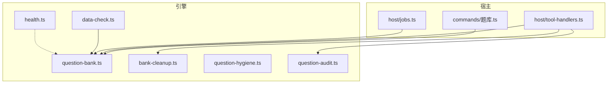
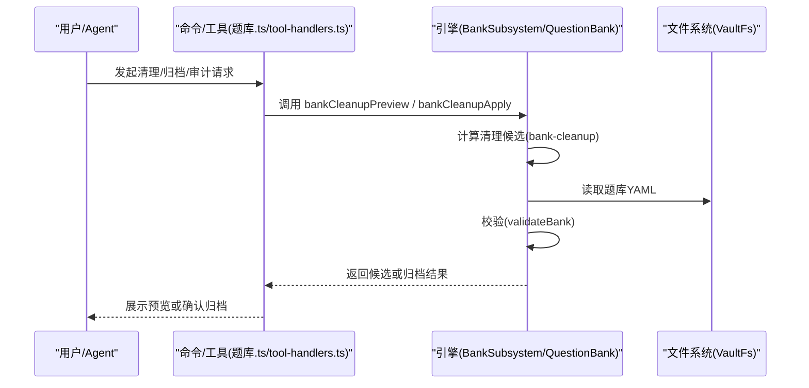
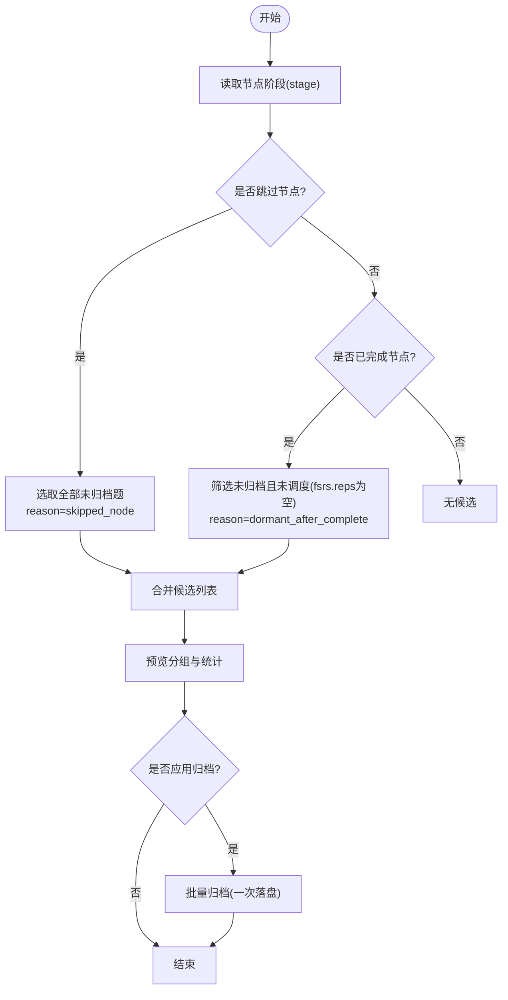
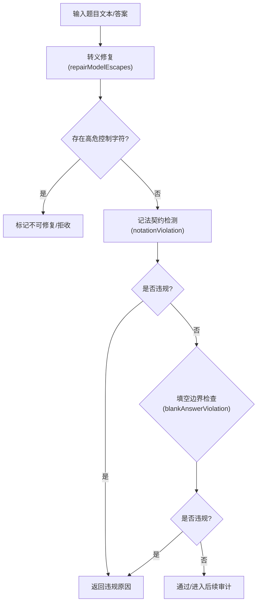
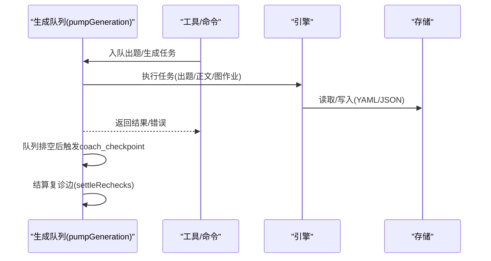
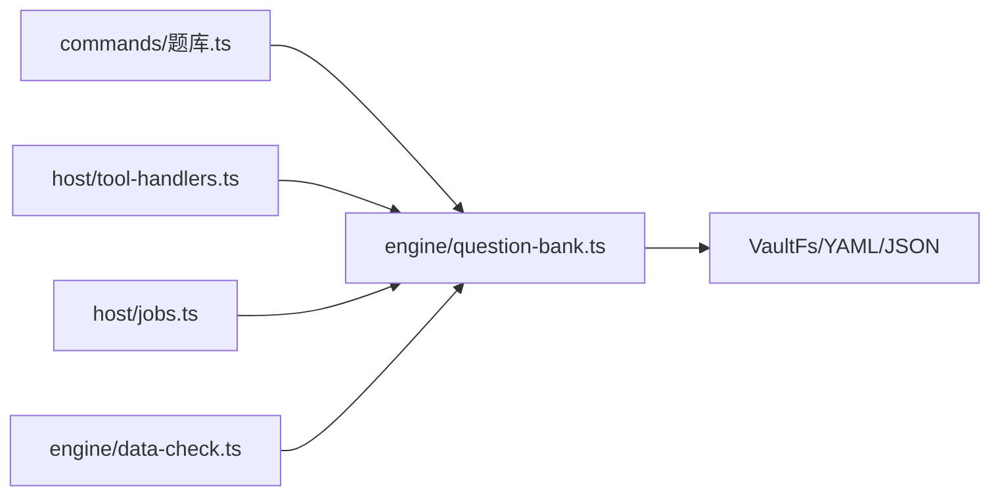

# 题库维护工具

<cite>
**本文引用的文件**
- [src/engine/bank-cleanup.ts](file://src/engine/bank-cleanup.ts)
- [src/engine/question-bank.ts](file://src/engine/question-bank.ts)
- [src/engine/question-hygiene.ts](file://src/engine/question-hygiene.ts)
- [src/engine/question-audit.ts](file://src/engine/question-audit.ts)
- [src/commands/题库.ts](file://src/commands/题库.ts)
- [src/host/tool-handlers.ts](file://src/host/tool-handlers.ts)
- [src/host/jobs.ts](file://src/host/jobs.ts)
- [src/engine/data-check.ts](file://src/engine/data-check.ts)
- [src/engine/health.ts](file://src/engine/health.ts)
</cite>

## 目录
1. [简介](#简介)
2. [项目结构](#项目结构)
3. [核心组件](#核心组件)
4. [架构总览](#架构总览)
5. [详细组件分析](#详细组件分析)
6. [依赖关系分析](#依赖关系分析)
7. [性能考量](#性能考量)
8. [故障恢复与备份恢复](#故障恢复与备份恢复)
9. [结论](#结论)
10. [附录：常用维护任务速查](#附录：常用维护任务速查)

## 简介
本文件面向“题库维护工具”的完整使用与维护说明，覆盖以下目标：
- 题库清理策略：过期题目识别、低质量题目检测、存储空间优化（归档不删除）。
- 自动清理规则的配置与触发条件。
- 题目卫生检查：格式验证、内容完整性检查、逻辑一致性验证。
- 批量操作工具：批量归档、批量修复、批量导出。
- 维护任务的调度策略与自动化流程。
- 故障恢复与备份恢复操作指南。
- 维护操作的性能影响与最佳实践建议。

## 项目结构
围绕题库维护的核心代码分布在引擎层与宿主层：
- 引擎层
  - 题库读写与校验：question-bank.ts
  - 一键清理候选计算：bank-cleanup.ts
  - 题目卫生检查与修复：question-hygiene.ts
  - 出题第二意见门（答案键一致性）：question-audit.ts
  - 数据体检（只读盘点）：data-check.ts
  - 图谱健康分（辅助评估）：health.ts
- 宿主层
  - 命令注册与路由：commands/题库.ts
  - 工具处理器（Agent/面板入口）：host/tool-handlers.ts
  - 生成队列与任务恢复：host/jobs.ts

图表来源
- [src/engine/question-bank.ts:264-453](file://src/engine/question-bank.ts#L264-L453)
- [src/engine/bank-cleanup.ts:10-28](file://src/engine/bank-cleanup.ts#L10-L28)
- [src/engine/question-hygiene.ts:157-192](file://src/engine/question-hygiene.ts#L157-L192)
- [src/engine/question-audit.ts:168-279](file://src/engine/question-audit.ts#L168-L279)
- [src/engine/data-check.ts:240-287](file://src/engine/data-check.ts#L240-L287)
- [src/commands/题库.ts:9-362](file://src/commands/题库.ts#L9-L362)
- [src/host/tool-handlers.ts:101-119](file://src/host/tool-handlers.ts#L101-L119)
- [src/host/jobs.ts:696-739](file://src/host/jobs.ts#L696-L739)

章节来源
- [src/engine/question-bank.ts:264-453](file://src/engine/question-bank.ts#L264-L453)
- [src/engine/bank-cleanup.ts:10-28](file://src/engine/bank-cleanup.ts#L10-L28)
- [src/engine/question-hygiene.ts:157-192](file://src/engine/question-hygiene.ts#L157-L192)
- [src/engine/question-audit.ts:168-279](file://src/engine/question-audit.ts#L168-L279)
- [src/engine/data-check.ts:240-287](file://src/engine/data-check.ts#L240-L287)
- [src/commands/题库.ts:9-362](file://src/commands/题库.ts#L9-L362)
- [src/host/tool-handlers.ts:101-119](file://src/host/tool-handlers.ts#L101-L119)
- [src/host/jobs.ts:696-739](file://src/host/jobs.ts#L696-L739)

## 核心组件
- 题库读写与校验（QuestionBank）
  - 提供加载、保存、单题增改、证据写回、归档/恢复、批量归档等能力；所有写入前均通过 schema 校验。
- 一键清理（bank-cleanup）
  - 基于节点阶段与题目状态计算清理候选（跳过节点的全部未归档题；已完成节点的休眠题），支持预览与批量归档。
- 题目卫生（question-hygiene）
  - 转义损坏修复、记法契约检测、唯一答案填空边界检查、存量体检。
- 出题第二意见门（question-audit）
  - 独立解题抽样对账，不一致时触发修复轮，仍不一致则弃题并报告。
- 数据体检（data-check）
  - 只读盘点题库、笔记源、错误卡、提案、生成任务等，输出 Missing/Broken/Archived/Hint 四类发现。
- 健康分（health）
  - 图谱健康分用于整体质量基线提示，辅助维护决策。

章节来源
- [src/engine/question-bank.ts:264-453](file://src/engine/question-bank.ts#L264-L453)
- [src/engine/bank-cleanup.ts:10-28](file://src/engine/bank-cleanup.ts#L10-L28)
- [src/engine/question-hygiene.ts:157-192](file://src/engine/question-hygiene.ts#L157-L192)
- [src/engine/question-audit.ts:168-279](file://src/engine/question-audit.ts#L168-L279)
- [src/engine/data-check.ts:240-287](file://src/engine/data-check.ts#L240-L287)
- [src/engine/health.ts:53-104](file://src/engine/health.ts#L53-L104)

## 架构总览
题库维护在宿主侧暴露命令与工具接口，调用引擎层进行读取、校验、清理、审计与落盘。生成队列负责将出题等耗时任务串行化执行，并提供失败重试与恢复机制。

图表来源
- [src/commands/题库.ts:9-42](file://src/commands/题库.ts#L9-L42)
- [src/host/tool-handlers.ts:116-119](file://src/host/tool-handlers.ts#L116-L119)
- [src/engine/bank-cleanup.ts:10-28](file://src/engine/bank-cleanup.ts#L10-L28)
- [src/engine/question-bank.ts:275-318](file://src/engine/question-bank.ts#L275-L318)

## 详细组件分析

### 题库清理策略（过期题目识别、低质量检测、存储优化）
- 过期题目识别
  - 跳过节点（stage=skipped）的全部未归档题视为不再使用，纳入清理候选。
  - 已完成节点（review/mastered）中从未被调度的“休眠题”（fsrs.reps 为空）也视为过期。
- 低质量题目检测
  - 难度不匹配建议：对掌握度低且答题表现差的节点给出“难度带校准/重出”建议；对已过度前进且无失分的题给出“过易可归档”标注。
  - 第二意见门：独立解题与答案键不一致的题目会被拒收或修复后再次审计，仍不一致则弃题。
- 存储空间优化
  - 归档而非删除：所有清理动作仅标记 archived/archived_reason，保留历史可追溯；批量归档一次落盘，减少 IO。

图表来源
- [src/engine/bank-cleanup.ts:10-28](file://src/engine/bank-cleanup.ts#L10-L28)
- [src/engine/question-bank.ts:427-452](file://src/engine/question-bank.ts#L427-L452)

章节来源
- [src/engine/bank-cleanup.ts:10-28](file://src/engine/bank-cleanup.ts#L10-L28)
- [src/engine/question-bank.ts:427-452](file://src/engine/question-bank.ts#L427-L452)
- [src/engine/question-audit.ts:168-279](file://src/engine/question-audit.ts#L168-L279)

### 自动清理规则的配置与触发
- 规则定义
  - 清理候选由 bank-cleanup 的纯函数按 stage 与 fsrs 状态计算，无需外部配置。
- 触发方式
  - 命令/工具：learnhub_bank_cleanup（预览/应用），bank-cleanup-apply（应用）。
  - 面板路由：GET /bank-cleanup、POST /bank-cleanup/apply。
  - Agent 工具：learnhub_bank_cleanup。
- 建议流程
  - 先运行预览，确认分组与数量后再 apply；归档原因统一记录为 cleanup。

章节来源
- [src/commands/题库.ts:9-42](file://src/commands/题库.ts#L9-L42)
- [src/host/tool-handlers.ts:116-119](file://src/host/tool-handlers.ts#L116-L119)

### 题目卫生检查（格式验证、内容完整性、逻辑一致性）
- 格式验证
  - YAML/JSON 双引号转义损坏修复（控制字符还原），高危控制字符不可修复则拒收。
  - 记法契约：剥掉数学定界与代码后，不得残留 ASCII 上标/下标或裸 LaTeX 命令。
- 内容完整性
  - 题型与答案形态强校验（如 multi_choice 至少两个正确项、numeric 容差为正数等）。
  - 唯一答案填空边界：填空答案不能是数值或疑似代数式。
- 逻辑一致性
  - 第二意见门：独立解题与答案键一致性校验；不一致进入修复轮，仍不一致则弃题。

图表来源
- [src/engine/question-hygiene.ts:51-121](file://src/engine/question-hygiene.ts#L51-L121)
- [src/engine/question-hygiene.ts:157-192](file://src/engine/question-hygiene.ts#L157-L192)
- [src/engine/question-audit.ts:168-279](file://src/engine/question-audit.ts#L168-L279)

章节来源
- [src/engine/question-hygiene.ts:51-121](file://src/engine/question-hygiene.ts#L51-L121)
- [src/engine/question-hygiene.ts:157-192](file://src/engine/question-hygiene.ts#L157-L192)
- [src/engine/question-audit.ts:168-279](file://src/engine/question-audit.ts#L168-L279)

### 批量操作工具（批量归档、批量修复、批量导出）
- 批量归档
  - archiveQuestions：一次性 load-validate-write，避免逐题整文件重写；返回实际改动题数。
  - 支持 reason 字段记录归档原因（cleanup/skip/manual 等）。
- 批量修复
  - 通过 questionUpdate 白名单字段 patch 合并更新；每次写回前全量 validateBank。
  - 第二意见门的修复轮会产出修正后的题目清单，供调用方替换原位。
- 批量导出
  - questionsAll：跨课程列出所有题目（不含答案，含到期与统计），便于导出与分析。

章节来源
- [src/engine/question-bank.ts:337-452](file://src/engine/question-bank.ts#L337-L452)
- [src/engine/question-audit.ts:168-279](file://src/engine/question-audit.ts#L168-L279)
- [src/engine/question-bank.ts:756-788](file://src/engine/question-bank.ts#L756-L788)

### 维护任务的调度策略与自动化流程
- 生成队列
  - 全局 FIFO 单并发泵（pumpGeneration），保证内容管线与出题互斥。
  - 任务终态保留期：失败/取消留 24h，成功留 30min；支持重启恢复与清扫。
- 自动触发点
  - 队列空闲时触发教练回合就绪深度检查；低于前瞻的课程入队生长批。
  - 会话开始节流（30 分钟）触发 coach checkpoint。
- 清理与归档
  - 清理为即时命令/工具调用；建议在生成队列空闲时执行，避免与出题/正文生成竞争 IO。

图表来源
- [src/host/jobs.ts:696-739](file://src/host/jobs.ts#L696-L739)
- [src/host/jobs.ts:378-437](file://src/host/jobs.ts#L378-L437)

章节来源
- [src/host/jobs.ts:696-739](file://src/host/jobs.ts#L696-L739)
- [src/host/jobs.ts:378-437](file://src/host/jobs.ts#L378-L437)

## 依赖关系分析
- 模块耦合
  - 命令/工具层依赖引擎 BankSubsystem 与 QuestionBank；引擎内部通过结构化窄面注入依赖，避免环引用。
  - 数据体检复用题库校验器，确保只读盘点一致。
- 外部依赖
  - VaultFs 抽象文件系统；YAML/JSON 解析；FSRS 调度（读视图/写证据）。
- 潜在风险
  - 高并发写入需依赖队列串行化；Broken 档期间写回闸拒绝，防止覆盖现场。

图表来源
- [src/commands/题库.ts:9-362](file://src/commands/题库.ts#L9-L362)
- [src/host/tool-handlers.ts:101-119](file://src/host/tool-handlers.ts#L101-L119)
- [src/host/jobs.ts:696-739](file://src/host/jobs.ts#L696-L739)
- [src/engine/data-check.ts:240-287](file://src/engine/data-check.ts#L240-L287)

章节来源
- [src/commands/题库.ts:9-362](file://src/commands/题库.ts#L9-L362)
- [src/host/tool-handlers.ts:101-119](file://src/host/tool-handlers.ts#L101-L119)
- [src/host/jobs.ts:696-739](file://src/host/jobs.ts#L696-L739)
- [src/engine/data-check.ts:240-287](file://src/engine/data-check.ts#L240-L287)

## 性能考量
- 批量归档一次落盘，显著降低 IO 次数与锁竞争。
- 生成队列串行化避免多任务同时写题库导致冲突。
- 第二意见门采用确定性等距抽样与高难度加权，控制 LLM 调用成本。
- 数据体检为只读扫描，适合离线或低峰时段运行。
- 建议
  - 在生成队列空闲或夜间窗口执行批量归档/审计。
  - 大库场景优先使用批量接口，避免逐题写盘。
  - 结合 health 健康分与 data-check 报告，定位结构性问题，减少无效维护。

[本节为通用指导，不直接分析具体文件]

## 故障恢复与备份恢复
- 生成任务恢复
  - 启动时恢复挂起任务，清扫悬空记录，按剩余保留期补挂定时器；若负载缺失则提示重新下发。
- 写回闸保护
  - 任务档 Broken 时拒绝一切写回操作，避免覆盖现场；待修复后重启继续。
- 存档区与迁移
  - 存档区只增不删，引擎读侧永不读取；断裂史与存档区不一致时以 hint 浮出。
- 备份恢复建议
  - 定期备份 vault 根目录（含题库 YAML、错误卡、提案、生成任务 JSON）。
  - 恢复后先运行 data-check 体检，再恢复生成任务与队列。

章节来源
- [src/host/jobs.ts:1192-1219](file://src/host/jobs.ts#L1192-L1219)
- [src/host/jobs.ts:378-437](file://src/host/jobs.ts#L378-L437)
- [src/engine/data-check.ts:613-659](file://src/engine/data-check.ts#L613-L659)

## 结论
题库维护工具通过“规则驱动的清理 + 严格的卫生检查 + 第二意见门一致性保障 + 队列化的批量操作”，在保证数据安全与可追溯的前提下，实现高效、可控的题库治理。建议在日常维护中遵循“先预览后应用、先体检后修复、低峰期批量处理”的最佳实践，并结合健康分与数据体检持续优化题库质量。

[本节为总结性内容，不直接分析具体文件]

## 附录：常用维护任务速查
- 一键清理
  - 命令/工具：learnhub_bank_cleanup（预览/应用）、bank-cleanup-apply（应用）
  - 面板路由：GET /bank-cleanup、POST /bank-cleanup/apply
- 难度建议
  - 命令：difficulty-advice（只读建议）、difficulty-advice-dismiss（忽略建议）
- 题目管理
  - 新增/更新/归档：question-add、question-update、question-archive
  - 审计与导出：question-audit（只读）、questions-all（导出用）
- 出题与审核
  - 出题：question-generate（排队等待完成）
  - 第二意见门：内置于出题流程，可配置抽样率
- 数据体检
  - 只读盘点：data-check（覆盖题库、错误卡、提案、生成任务等）

章节来源
- [src/commands/题库.ts:9-362](file://src/commands/题库.ts#L9-L362)
- [src/host/tool-handlers.ts:101-119](file://src/host/tool-handlers.ts#L101-L119)
- [src/engine/data-check.ts:240-287](file://src/engine/data-check.ts#L240-L287)