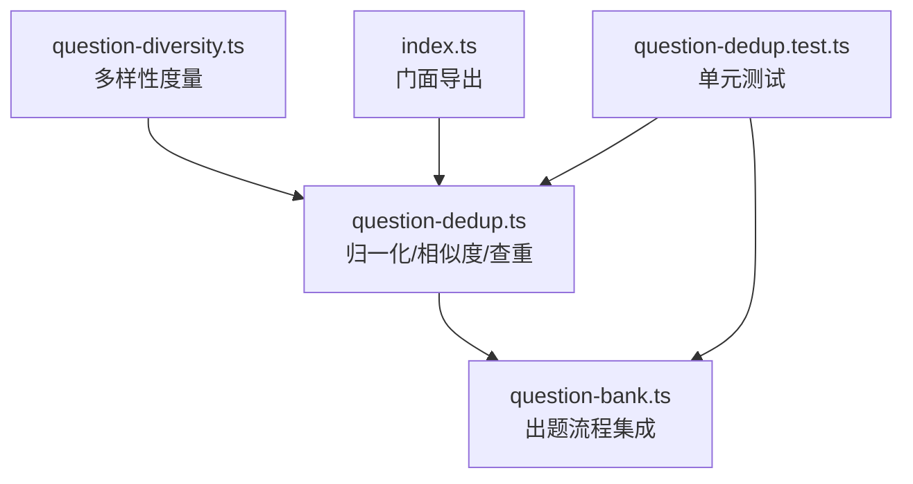
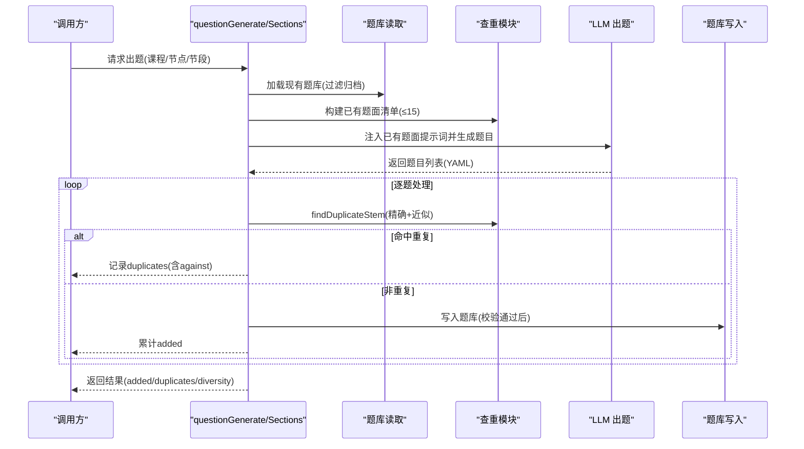
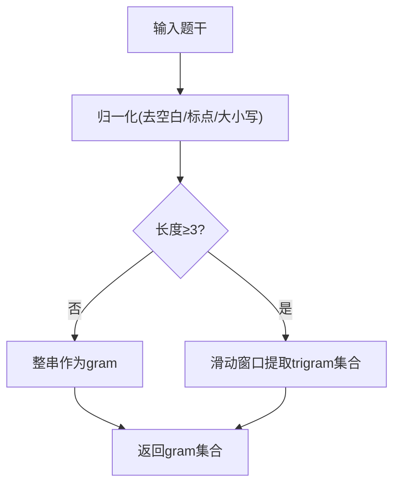
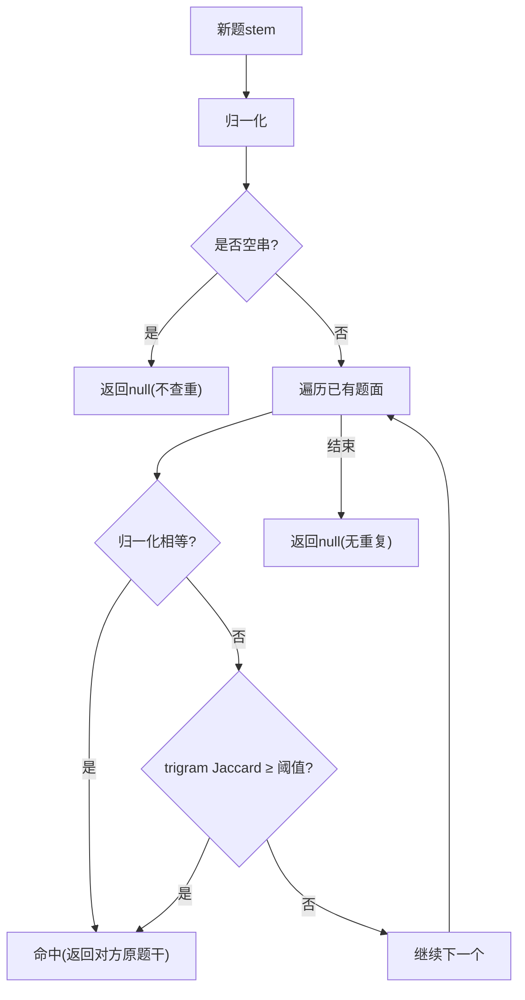
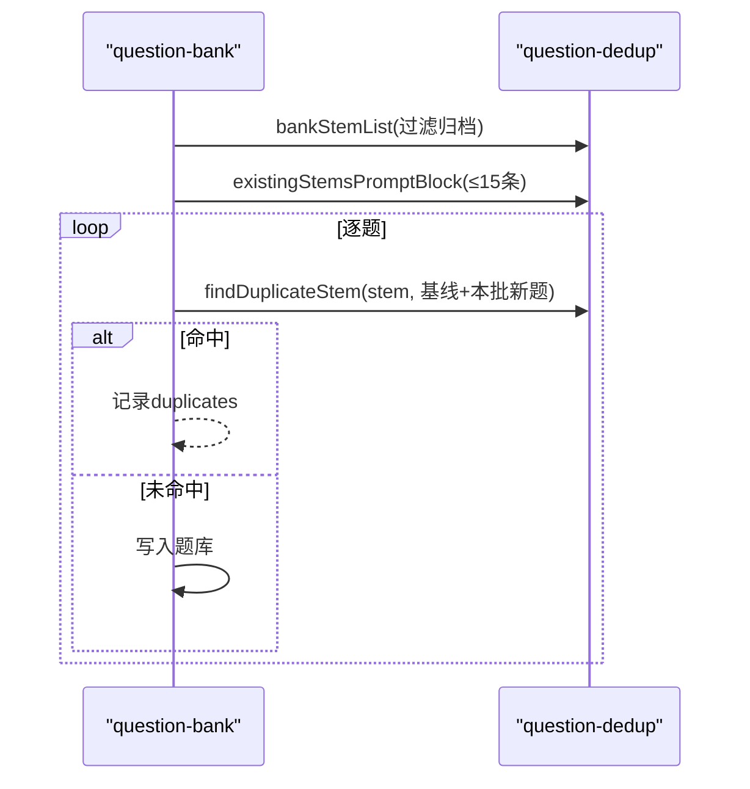
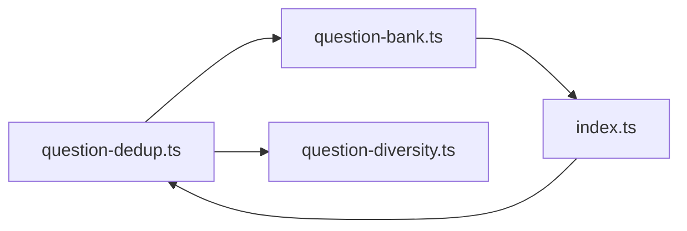

# 题目去重机制

<cite>
**本文引用的文件**
- [question-dedup.ts](file://src/engine/question-dedup.ts)
- [question-bank.ts](file://src/engine/question-bank.ts)
- [question-diversity.ts](file://src/engine/question-diversity.ts)
- [index.ts](file://src/engine/index.ts)
- [question-dedup.test.ts](file://tests/question-dedup.test.ts)
</cite>

## 目录
1. [简介](#简介)
2. [项目结构](#项目结构)
3. [核心组件](#核心组件)
4. [架构总览](#架构总览)
5. [详细组件分析](#详细组件分析)
6. [依赖关系分析](#依赖关系分析)
7. [性能考量](#性能考量)
8. [故障排查指南](#故障排查指南)
9. [结论](#结论)
10. [附录：使用示例与参数说明](#附录使用示例与参数说明)

## 简介
本文件系统化阐述题库“题目去重”机制，覆盖语义相似性检测、重复识别策略、阈值配置、题库扫描与增量去重、效果评估与性能优化、冲突解决与数据一致性保证，并给出具体调用路径与代码片段位置。该机制在出题生成后拦截完全重复与近似重复的题目，避免题库膨胀与同质化，同时为多样性度量提供基础。

## 项目结构
围绕去重的关键文件与职责如下：
- 相似度与查重核心：question-dedup.ts（归一化、trigram 相似度、查重入口）
- 出题流程集成：question-bank.ts（注入已有题面、逐题查重、入库与报告）
- 多样性度量：question-diversity.ts（复用 normalizeStem，提供 trigram 重叠与 self-BLEU 等指标）
- 门面导出：index.ts（对外暴露 normalizeStem 等能力）
- 测试用例：question-dedup.test.ts（覆盖归一化、相似度、查重与集成场景）

图表来源
- [question-dedup.ts:1-89](file://src/engine/question-dedup.ts#L1-L89)
- [question-bank.ts:1320-1468](file://src/engine/question-bank.ts#L1320-L1468)
- [question-diversity.ts:1-246](file://src/engine/question-diversity.ts#L1-L246)
- [index.ts:80-100](file://src/engine/index.ts#L80-L100)
- [question-dedup.test.ts:1-177](file://tests/question-dedup.test.ts#L1-L177)

章节来源
- [question-dedup.ts:1-89](file://src/engine/question-dedup.ts#L1-L89)
- [question-bank.ts:1320-1468](file://src/engine/question-bank.ts#L1320-L1468)
- [question-diversity.ts:1-246](file://src/engine/question-diversity.ts#L1-L246)
- [index.ts:80-100](file://src/engine/index.ts#L80-L100)
- [question-dedup.test.ts:1-177](file://tests/question-dedup.test.ts#L1-L177)

## 核心组件
- 题干文本归一化：去除空白与中英文标点、统一大小写，仅保留内容字符，用于消除格式差异带来的误判。
- 关键词提取：采用字符级 trigram（三元组）集合表示题干特征，兼顾中文无分词场景下的局部匹配。
- 相似度计算：基于 trigram 集合的 Jaccard 相似度；空串或极短串特殊处理，避免误报。
- 重复识别策略：两层判定
  - 精确重复：归一化后字符串相等即命中。
  - 近似重复：trigram Jaccard 相似度超过阈值即命中。
- 题库扫描与增量去重：
  - 扫描：从题库中过滤归档题，提取题面、题型、难度作为查重基线。
  - 增量：将本批新收题也加入基线，实现批内互查，防止同批次重复。
- 提示词注入：将已有题面清单（≤15 条）注入到出题提示词，辅助模型减少重复产出。
- 结果报告：命中返回对方原题面，供上层记录 duplicates 报告。

章节来源
- [question-dedup.ts:14-41](file://src/engine/question-dedup.ts#L14-L41)
- [question-dedup.ts:48-74](file://src/engine/question-dedup.ts#L48-L74)
- [question-bank.ts:1386-1390](file://src/engine/question-bank.ts#L1386-L1390)
- [question-bank.ts:1320-1342](file://src/engine/question-bank.ts#L1320-L1342)

## 架构总览
去重机制贯穿“生成—查重—入库”全流程，形成闭环：
- 生成阶段：按节点/节段调用 LLM 产出题目 YAML。
- 查重阶段：对每道题进行精确与近似重复检查；命中则丢弃并记录。
- 入库阶段：通过校验门后写入题库；未入库题目不计入多样性统计。
- 提示词增强：将已有题面清单注入提示词，降低重复概率。
- 多样性度量：入库后的题目进入多样性仪表，补充“换皮不换结构”的检测维度。

图表来源
- [question-bank.ts:1320-1468](file://src/engine/question-bank.ts#L1320-L1468)
- [question-dedup.ts:61-74](file://src/engine/question-dedup.ts#L61-L74)

## 详细组件分析

### 题干文本分析与关键词提取
- 归一化：统一小写、移除空白与标点符号，确保比较聚焦于内容本身。
- Trigram 提取：将归一化后的字符串切分为字符三元组集合；长度不足 3 时整体作为一个 gram，保证短串也能参与相似度计算。
- 复杂度：trigram 集合构建 O(n)，Jaccard 相似度 O(|A|+|B|)，适合批量比对。

图表来源
- [question-dedup.ts:17-31](file://src/engine/question-dedup.ts#L17-L31)
- [question-diversity.ts:131-154](file://src/engine/question-diversity.ts#L131-L154)

章节来源
- [question-dedup.ts:17-31](file://src/engine/question-dedup.ts#L17-L31)
- [question-diversity.ts:131-154](file://src/engine/question-diversity.ts#L131-L154)

### 相似度计算与重复识别策略
- 精确重复：归一化后字符串相等即命中。
- 近似重复：trigram Jaccard 相似度 ≥ 阈值（默认 0.8）。
- 边界处理：任一为空集时相似度为 0，避免纯标点或空串误判。
- 批内互查：新增题纳入基线，防止同批次重复。

图表来源
- [question-dedup.ts:61-74](file://src/engine/question-dedup.ts#L61-L74)

章节来源
- [question-dedup.ts:14-41](file://src/engine/question-dedup.ts#L14-L41)
- [question-dedup.ts:61-74](file://src/engine/question-dedup.ts#L61-L74)

### 去重阈值配置与可调参数
- 默认阈值：DUPLICATE_SIMILARITY_THRESHOLD = 0.8
- 可调方式：findDuplicateStem 支持传入自定义 threshold；可在上层调用处调整以平衡召回与误杀。
- 影响范围：阈值越高，越严格（更少近似重复被拦），反之更宽松。

章节来源
- [question-dedup.ts:14-15](file://src/engine/question-dedup.ts#L14-L15)
- [question-dedup.ts:61-74](file://src/engine/question-dedup.ts#L61-L74)

### 题库扫描与增量去重处理
- 题库扫描：bankStemList 过滤归档题，提取 {q, kind, difficulty} 作为查重基线。
- 提示词注入：existingStemsPromptBlock 将 ≤15 条已有题面清单注入提示词，帮助模型避免重复。
- 增量去重：questionGenerate/Sections 在批内将新收题加入基线，实现批内互查。

图表来源
- [question-bank.ts:1386-1390](file://src/engine/question-bank.ts#L1386-L1390)
- [question-bank.ts:1320-1468](file://src/engine/question-bank.ts#L1320-L1468)
- [question-dedup.ts:48-88](file://src/engine/question-dedup.ts#L48-L88)

章节来源
- [question-dedup.ts:48-88](file://src/engine/question-dedup.ts#L48-L88)
- [question-bank.ts:1386-1390](file://src/engine/question-bank.ts#L1386-L1390)
- [question-bank.ts:1320-1468](file://src/engine/question-bank.ts#L1320-L1468)

### 去重效果评估方法
- 直接指标：duplicates 数量与命中率（对比新增题量）。
- 间接指标：多样性仪表（self-BLEU、平均对相似度、干扰项编辑距离）反映“换皮不换结构”的问题。
- 回归验证：单元测试覆盖归一化、相似度、查重与集成场景，确保口径稳定。

章节来源
- [question-dedup.test.ts:16-55](file://tests/question-dedup.test.ts#L16-L55)
- [question-diversity.ts:1-30](file://src/engine/question-diversity.ts#L1-L30)
- [question-diversity.ts:214-242](file://src/engine/question-diversity.ts#L214-L242)

### 性能优化策略
- 时间复杂度：trigram 集合构建 O(n)，Jaccard 相似度 O(|A|+|B|)；批量比对可接受。
- 内存优化：trigram 使用 Set 存储，避免重复 gram；行滚动 DP 在多样性模块中用于编辑距离。
- 提示词限制：已有题面清单限制 ≤15 条，控制上下文长度与成本。
- 批内互查：减少重复入库导致的后续重复比对成本。

章节来源
- [question-dedup.ts:24-41](file://src/engine/question-dedup.ts#L24-L41)
- [question-diversity.ts:112-129](file://src/engine/question-diversity.ts#L112-L129)
- [question-dedup.ts:76-88](file://src/engine/question-dedup.ts#L76-L88)

### 冲突解决策略与数据一致性保证
- 冲突解决：重复题直接丢弃，不入库；非重复题经 schema 校验后写入；非法题跳过不影响整批。
- 数据一致性：写入前执行 validateBank 门禁；原子写入 atomicWrite 保障落盘一致性；归档题不参与查重与复习。
- 事务性：生成失败或校验失败不写盘；批内错误隔离（单题非法不毁整批）。

章节来源
- [question-bank.ts:309-318](file://src/engine/question-bank.ts#L309-L318)
- [question-bank.ts:337-352](file://src/engine/question-bank.ts#L337-L352)
- [question-bank.ts:1320-1342](file://src/engine/question-bank.ts#L1320-L1342)

## 依赖关系分析
- question-dedup.ts 被 question-bank.ts 与 question-diversity.ts 引用，提供归一化与相似度能力。
- index.ts 将 normalizeStem 暴露给宿主侧实验工具，统一接入门面。
- question-bank.ts 整合查重、提示词注入、入库与多样性报告，形成端到端流程。

图表来源
- [question-dedup.ts:1-89](file://src/engine/question-dedup.ts#L1-L89)
- [question-bank.ts:62-68](file://src/engine/question-bank.ts#L62-L68)
- [index.ts:80-100](file://src/engine/index.ts#L80-L100)

章节来源
- [question-dedup.ts:1-89](file://src/engine/question-dedup.ts#L1-L89)
- [question-bank.ts:62-68](file://src/engine/question-bank.ts#L62-L68)
- [index.ts:80-100](file://src/engine/index.ts#L80-L100)

## 性能考量
- 相似度计算开销可控：trigram 集合较小，Jaccard 计算高效。
- 提示词注入上限：≤15 条已有题面，避免上下文过长。
- 批内互查：减少重复入库后的二次查重成本。
- 多样性指标：self-BLEU 与平均对相似度作为第二读数，辅助评估去重效果。

[本节为通用指导，无需特定文件引用]

## 故障排查指南
- 归一化异常：确认输入是否为字符串；空串或纯标点将被忽略。
- 相似度误判：检查阈值设置；过低的阈值可能导致误杀，过高可能漏拦。
- 题库加载失败：检查 YAML 解析与 schema 校验；Broken 题库会抛错而非静默。
- 生成失败：LLM 输出非法 YAML 或校验失败时，跳过该题不阻塞整批。

章节来源
- [question-dedup.test.ts:16-30](file://tests/question-dedup.test.ts#L16-L30)
- [question-bank.ts:275-318](file://src/engine/question-bank.ts#L275-L318)
- [question-bank.ts:1320-1342](file://src/engine/question-bank.ts#L1320-L1342)

## 结论
该去重机制通过“精确重复 + 近似重复”的双层判定，结合 trigram Jaccard 相似度与阈值配置，有效拦截重复与高度相似的题目；题库扫描与批内增量去重确保新旧题一致；多样性仪表提供互补视角，防止“换皮不换结构”的同构题渗透。整体设计简洁、可配置、可扩展，并通过测试与门禁保障稳定性与一致性。

[本节为总结，无需特定文件引用]

## 附录：使用示例与参数说明
- 归一化函数：normalizeStem
  - 用途：题干预处理，去除空白与标点、统一大小写。
  - 参考路径：[question-dedup.ts:17-22](file://src/engine/question-dedup.ts#L17-L22)
- 相似度函数：trigramSimilarity
  - 用途：计算两题面的 trigram Jaccard 相似度。
  - 参考路径：[question-dedup.ts:33-41](file://src/engine/question-dedup.ts#L33-L41)
- 查重函数：findDuplicateStem
  - 用途：在已有题面中查找重复或高度相似题；返回对方原题面或 null。
  - 参数：stem, existing[], threshold(默认 0.8)。
  - 参考路径：[question-dedup.ts:61-74](file://src/engine/question-dedup.ts#L61-L74)
- 提示词注入：existingStemsPromptBlock
  - 用途：将 ≤15 条已有题面清单注入提示词，辅助模型减少重复。
  - 参考路径：[question-dedup.ts:76-88](file://src/engine/question-dedup.ts#L76-L88)
- 题库扫描：bankStemList
  - 用途：过滤归档题，提取 {q, kind, difficulty} 作为查重基线。
  - 参考路径：[question-dedup.ts:48-55](file://src/engine/question-dedup.ts#L48-L55)
- 集成调用：questionGenerate / questionGenerateSections
  - 用途：出题流程中逐题查重、入库与报告。
  - 参考路径：[question-bank.ts:1320-1468](file://src/engine/question-bank.ts#L1320-L1468)
- 门面导出：normalizeStem
  - 用途：宿主侧实验工具可直接消费。
  - 参考路径：[index.ts:80-100](file://src/engine/index.ts#L80-L100)
- 测试用例：question-dedup.test.ts
  - 用途：覆盖归一化、相似度、查重与集成场景。
  - 参考路径：[question-dedup.test.ts:1-177](file://tests/question-dedup.test.ts#L1-L177)

章节来源
- [question-dedup.ts:17-88](file://src/engine/question-dedup.ts#L17-L88)
- [question-bank.ts:1320-1468](file://src/engine/question-bank.ts#L1320-L1468)
- [index.ts:80-100](file://src/engine/index.ts#L80-L100)
- [question-dedup.test.ts:1-177](file://tests/question-dedup.test.ts#L1-L177)