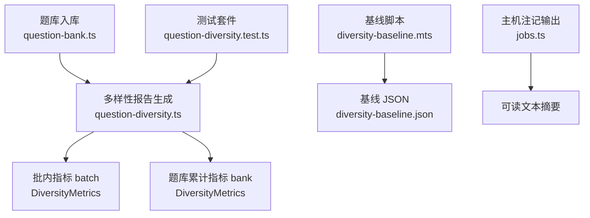
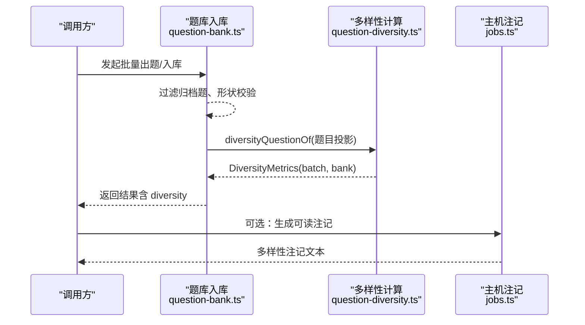
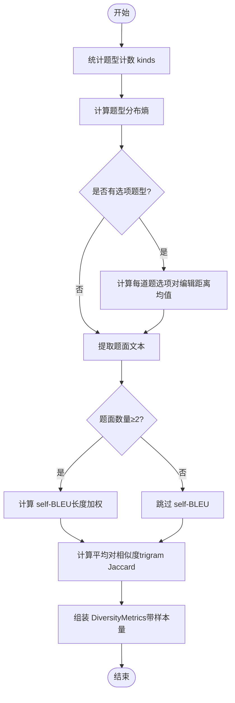
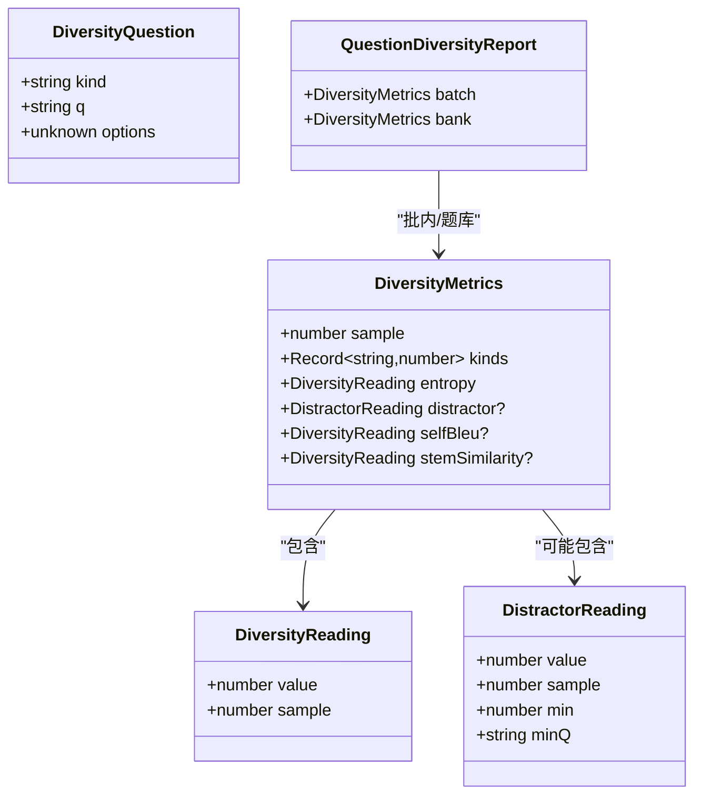
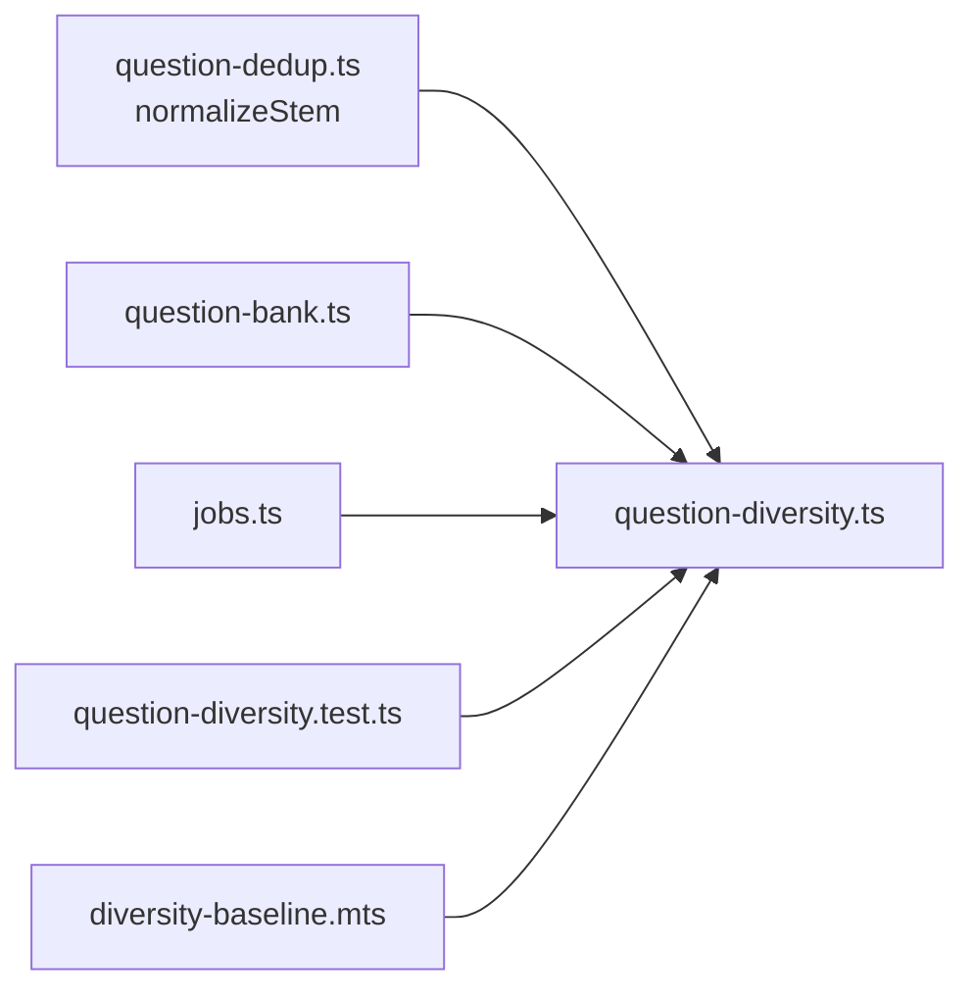

# 题目多样性保证

<cite>
**本文引用的文件**
- [question-diversity.ts](file://src/engine/question-diversity.ts)
- [diversity-baseline.mts](file://scripts/diversity-baseline.mts)
- [question-diversity.test.ts](file://tests/question-diversity.test.ts)
- [diversity-baseline.json](file://tests/fixtures/diversity-baseline.json)
- [jobs.ts](file://src/host/jobs.ts)
- [question-bank.ts](file://src/engine/question-bank.ts)
- [quality-rubrics.ts](file://src/engine/quality-rubrics.ts)
- [params.ts](file://src/engine/params.ts)
</cite>

## 目录
1. [简介](#简介)
2. [项目结构](#项目结构)
3. [核心组件](#核心组件)
4. [架构总览](#架构总览)
5. [详细组件分析](#详细组件分析)
6. [依赖关系分析](#依赖关系分析)
7. [性能考量](#性能考量)
8. [故障排查指南](#故障排查指南)
9. [结论](#结论)
10. [附录：API 调用示例与结果解读](#附录api-调用示例与结果解读)

## 简介
本文件系统性阐述“题目多样性保证”的算法原理、指标体系、报告生成机制以及与学习目标的动态联动方式。该能力通过纯读侧测量，在不改变出题门禁的前提下，对批内新增题与题库累计题分别计算题型分布熵、干扰项编辑距离、题面 self-BLEU 与平均对相似度等指标，形成可追踪、可回放、可基线化的多样性报告，辅助评估并指导后续优化。

## 项目结构
围绕多样性保证的核心代码主要分布在引擎层与脚本/测试层：
- 引擎层：提供多样性指标计算函数、报告聚合、与题库入库流程的集成点。
- 脚本层：用于对固定语料快照复算基线，确保口径一致性与回归保护。
- 测试层：覆盖纯函数单测、全链回归与基线回放，保障实现稳定可靠。

图表来源
- [question-bank.ts:60-68](file://src/engine/question-bank.ts#L60-L68)
- [question-diversity.ts:249-302](file://src/engine/question-diversity.ts#L249-L302)
- [diversity-baseline.mts:20-75](file://scripts/diversity-baseline.mts#L20-L75)
- [question-diversity.test.ts:173-253](file://tests/question-diversity.test.ts#L173-L253)
- [jobs.ts:104-114](file://src/host/jobs.ts#L104-L114)

章节来源
- [question-bank.ts:60-68](file://src/engine/question-bank.ts#L60-L68)
- [question-diversity.ts:249-302](file://src/engine/question-diversity.ts#L249-L302)
- [diversity-baseline.mts:20-75](file://scripts/diversity-baseline.mts#L20-L75)
- [question-diversity.test.ts:173-253](file://tests/question-diversity.test.ts#L173-L253)
- [jobs.ts:104-114](file://src/host/jobs.ts#L104-L114)

## 核心组件
- 多样性指标计算模块：提供题型分布熵、干扰项对编辑距离、题面 self-BLEU、平均对相似度等指标的纯函数实现，以及按范围（批内/题库）聚合的报告生成。
- 基线与回放：通过脚本读取固定语料快照，使用同一函数复算三指标，输出基线 JSON；测试用例逐值比对，防止口径漂移。
- 主机注记：将多样性读数以人类可读形式附加到作业/任务注记中，便于审阅与趋势观察。

章节来源
- [question-diversity.ts:1-302](file://src/engine/question-diversity.ts#L1-L302)
- [diversity-baseline.mts:1-75](file://scripts/diversity-baseline.mts#L1-L75)
- [question-diversity.test.ts:1-315](file://tests/question-diversity.test.ts#L1-L315)
- [jobs.ts:104-114](file://src/host/jobs.ts#L104-L114)

## 架构总览
多样性保证在题库入库流程中被调用一次，返回包含“批内”和“题库累计”两个范围的多样性报告。报告中的每个指标都附带样本量，避免小样本误判。主机层将“题库累计”范围的读数转换为可读注记，便于人工审阅。

图表来源
- [question-bank.ts:60-68](file://src/engine/question-bank.ts#L60-L68)
- [question-diversity.ts:249-302](file://src/engine/question-diversity.ts#L249-L302)
- [jobs.ts:104-114](file://src/host/jobs.ts#L104-L114)

## 详细组件分析

### 题型分布控制：题型分布熵
- 原理：统计批内或题库范围内各题型出现次数，计算香农熵（以 2 为底，单位 bit）。定义域仅包含实际出现的题型，未出现的不占概率质量；单一题型熵恒为 0，题型 ≥2 时 > 0。
- 复杂度：O(n)，n 为题目数；空间 O(k)，k 为不同题型数。
- 用途：衡量题型均匀度，越高表示分布越分散；上界为 log2(不同题型数)。

章节来源
- [question-diversity.ts:99-110](file://src/engine/question-diversity.ts#L99-L110)
- [question-diversity.ts:249-280](file://src/engine/question-diversity.ts#L249-L280)

### 难度梯度设计：与质量规约联动
- 系统通过质量规约要求“难度递进”，并以系统注入的难度锚定作为约束，低复杂度节点不出高难度题。
- 多样性模块本身不直接计算难度标准差，但可与质量规约结合，在生成与评审阶段共同保证难度梯度合理。

章节来源
- [quality-rubrics.ts:251-263](file://src/engine/quality-rubrics.ts#L251-L263)

### 知识点覆盖策略：概念引用与先验
- 题目可通过 invokes 字段声明概念引用，配合概念登记与图谱结构，确保只考正文已讲内容，避免超纲。
- 多样性报告虽不直接度量概念覆盖率，但可与图谱健康、节点掌握度等信号联合评估覆盖是否充分。

章节来源
- [question-bank.ts:94-99](file://src/engine/question-bank.ts#L94-L99)
- [content-subsystem.ts:669-693](file://src/engine/content-subsystem.ts#L669-L693)

### 多样性指标计算方法
- 题型分布熵：见上文。
- 干扰项对编辑距离：针对单选/多选题，对每道题的选项两两进行归一化后的 Levenshtein 距离计算，取题内均值，再按题量平均；同时记录最差一题的题内均值及题面片段，便于定位问题。
- 题面 self-BLEU：对每道题相对其余题面计算 BLEU（1–4 阶，加一平滑，标准 brevity penalty），按题面长度加权平均；参考集越大命中越容易，因此跨批比较更推荐平均对相似度。
- 平均对相似度：字符 trigram Jaccard 相似度，按题面长度加权；对题量不敏感，适合作为同轴第二读数。

图表来源
- [question-diversity.ts:112-182](file://src/engine/question-diversity.ts#L112-L182)
- [question-diversity.ts:184-242](file://src/engine/question-diversity.ts#L184-L242)
- [question-diversity.ts:249-293](file://src/engine/question-diversity.ts#L249-L293)

章节来源
- [question-diversity.ts:112-242](file://src/engine/question-diversity.ts#L112-L242)
- [question-diversity.ts:249-293](file://src/engine/question-diversity.ts#L249-L293)

### 多样性报告生成机制
- 输入：题目子集（已按范围筛选：批内新增 vs 题库累计非归档题）。
- 处理：逐项计算熵、干扰项距离、self-BLEU、平均对相似度；缺失样本的指标键缺席（不是 0）。
- 输出：DiversityMetrics（含 sample、kinds、entropy、可选 distractor/selfBleu/stemSimilarity），以及 QuestionDiversityReport（batch + bank）。

图表来源
- [question-diversity.ts:39-97](file://src/engine/question-diversity.ts#L39-L97)
- [question-diversity.ts:249-302](file://src/engine/question-diversity.ts#L249-L302)

章节来源
- [question-diversity.ts:39-97](file://src/engine/question-diversity.ts#L39-L97)
- [question-diversity.ts:249-302](file://src/engine/question-diversity.ts#L249-L302)

### 可视化输出与可读注记
- 主机层将多样性读数转换为人类可读的注记文本，展示各指标值与样本量；当无样本时显示“无样本”，避免误导。
- 建议在前端或报表系统中将熵、干扰项距离、self-BLEU、平均对相似度绘制为时间序列或直方图，便于观察趋势与异常。

章节来源
- [jobs.ts:104-114](file://src/host/jobs.ts#L104-L114)

### 学习目标动态调整多样性参数
- 当前多样性模块为纯读侧测量，不直接接收学习目标参数来动态调整指标阈值或权重。
- 可在上层编排中根据学习目标（如“强化题型多样”“控制趋同”）读取多样性报告，并结合质量规约与调度策略进行决策（例如调整生成提示、抽样策略或评审重点）。
- 相关可调参数集中在 params.ts，可用于影响整体学习与复习行为，但不直接绑定多样性指标。

章节来源
- [question-diversity.ts:1-302](file://src/engine/question-diversity.ts#L1-L302)
- [params.ts:1-20](file://src/engine/params.ts#L1-L20)

### 最佳实践与调优建议
- 关注“缺席 ≠ 0”：样本不足时指标键缺席，不要将其视为零值；解读时需结合 sample。
- 跨批比较优先看平均对相似度：self-BLEU 随参考集题量单调偏高，不适合直接跨批比较。
- 定位最差项：利用干扰项距离的 min 与 minQ 快速定位选项趋同的题目。
- 基线回放：任何口径变更必须重测基线并通过测试用例逐值比对，确保回归安全。
- 与质量规约协同：将多样性读数与“难度递进”“不趋同”等规约结合，形成多维评价。

章节来源
- [question-diversity.ts:73-91](file://src/engine/question-diversity.ts#L73-L91)
- [question-diversity.ts:214-242](file://src/engine/question-diversity.ts#L214-L242)
- [question-diversity.test.ts:153-171](file://tests/question-diversity.test.ts#L153-L171)
- [quality-rubrics.ts:251-263](file://src/engine/quality-rubrics.ts#L251-L263)

## 依赖关系分析
- question-diversity.ts 依赖 question-dedup.ts 的 normalizeStem 进行题面归一化。
- question-bank.ts 在入库流程中调用多样性模块，返回结果携带 diversity 报告。
- jobs.ts 消费多样性报告生成可读注记。
- 测试与脚本复用同一函数，确保口径一致。

图表来源
- [question-diversity.ts:31](file://src/engine/question-diversity.ts#L31)
- [question-bank.ts:60-68](file://src/engine/question-bank.ts#L60-L68)
- [jobs.ts:104-114](file://src/host/jobs.ts#L104-L114)
- [question-diversity.test.ts:173-253](file://tests/question-diversity.test.ts#L173-L253)
- [diversity-baseline.mts:20-75](file://scripts/diversity-baseline.mts#L20-L75)

章节来源
- [question-diversity.ts:31](file://src/engine/question-diversity.ts#L31)
- [question-bank.ts:60-68](file://src/engine/question-bank.ts#L60-L68)
- [jobs.ts:104-114](file://src/host/jobs.ts#L104-L114)
- [question-diversity.test.ts:173-253](file://tests/question-diversity.test.ts#L173-L253)
- [diversity-baseline.mts:20-75](file://scripts/diversity-baseline.mts#L20-L75)

## 性能考量
- 熵计算：O(n)，内存 O(k)。
- 干扰项编辑距离：每道题选项两两比较，最坏 O(m^2·L)，m 为选项数，L 为选项长度；采用滚动 DP 降低内存占用。
- self-BLEU：n-gram 计数与匹配，复杂度与 n-gram 阶数与文本长度相关；加一平滑避免短文本零匹配。
- 平均对相似度：trigram 集合交集运算，复杂度与题面长度与题量相关。
- 总体建议在大批量场景下分批计算并缓存中间结果（如 n-gram 计数），以减少重复计算。

[本节为通用性能讨论，不直接分析具体文件]

## 故障排查指南
- 指标缺席：检查样本量与题型覆盖；单题无法自比、无选项题型不进干扰项轴。
- 基线不一致：确认脚本与测试使用同一函数；若修改口径，需重测基线并通过测试用例逐值比对。
- 趋同报警：查看干扰项距离的 min 与 minQ，定位选项趋同题目；检查题干句式与考点是否过于相似。
- 全批被查重丢弃：多样性仪表不影响失败语义；若全部未入库，仍会抛出既有错误。

章节来源
- [question-diversity.ts:73-91](file://src/engine/question-diversity.ts#L73-L91)
- [question-diversity.test.ts:197-208](file://tests/question-diversity.test.ts#L197-L208)
- [question-diversity.test.ts:232-253](file://tests/question-diversity.test.ts#L232-L253)

## 结论
多样性保证通过纯读侧测量，提供了题型分布熵、干扰项编辑距离、self-BLEU 与平均对相似度等多维指标，形成批内与题库累计双范围的可回溯报告。结合质量规约与学习目标，可在生成与评审环节有效识别趋同与分布失衡问题，提升题库质量与学习效果。基线与回放机制确保口径稳定，便于长期演进与回归保护。

[本节为总结性内容，不直接分析具体文件]

## 附录：API 调用示例与结果解读
- 调用入口：题库入库流程（questionGenerate / questionGenerateSections）返回结果中包含 diversity 字段，包含 batch 与 bank 两个范围的 DiversityMetrics。
- 关键指标解读：
  - entropy：题型分布熵，越高表示分布越分散；单一题型为 0。
  - distractor：干扰项对编辑距离，越小表示选项越趋同；min/minQ 帮助定位最差题。
  - selfBleu：题面相似度，值越高越趋同；注意随参考集题量偏高，跨批比较谨慎。
  - stemSimilarity：平均对相似度，对题量不敏感，适合趋势对比。
- 基线回放：使用 scripts/diversity-baseline.mts 对 tests/fixtures/bank-corpus/*.yaml 复算，输出 tests/fixtures/diversity-baseline.json；测试用例逐值比对，确保口径不变。
- 可读注记：主机层将多样性读数转换为文本注记，便于审阅。

章节来源
- [question-bank.ts:60-68](file://src/engine/question-bank.ts#L60-L68)
- [question-diversity.test.ts:173-253](file://tests/question-diversity.test.ts#L173-L253)
- [diversity-baseline.mts:20-75](file://scripts/diversity-baseline.mts#L20-L75)
- [jobs.ts:104-114](file://src/host/jobs.ts#L104-L114)