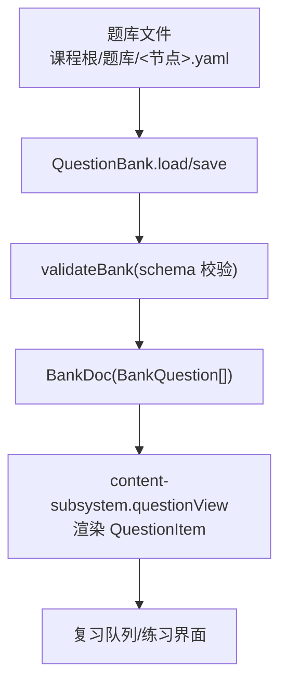
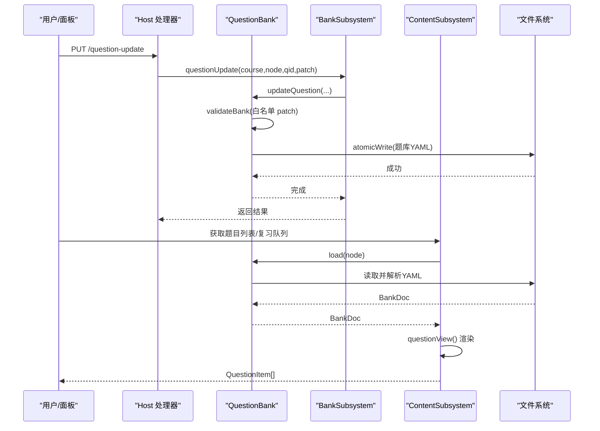
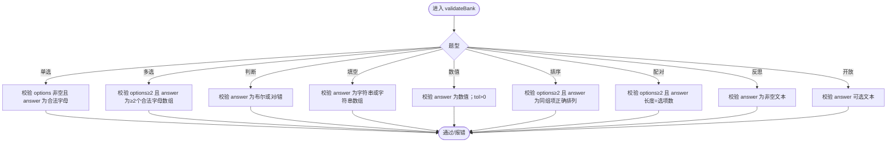
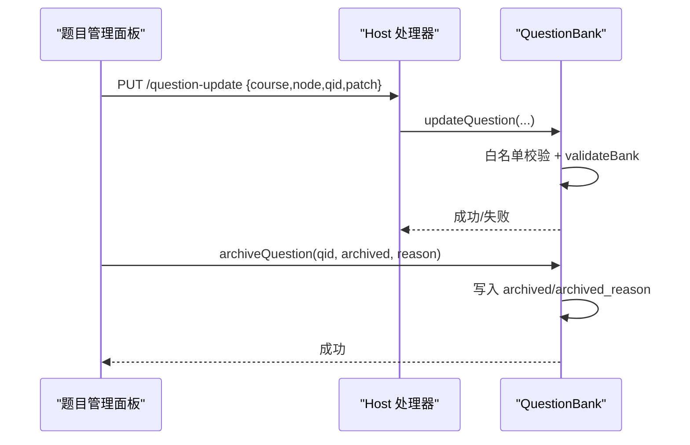
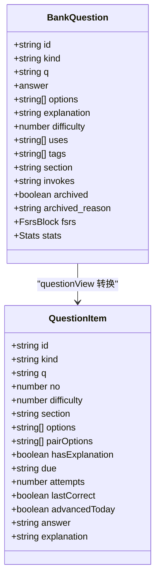
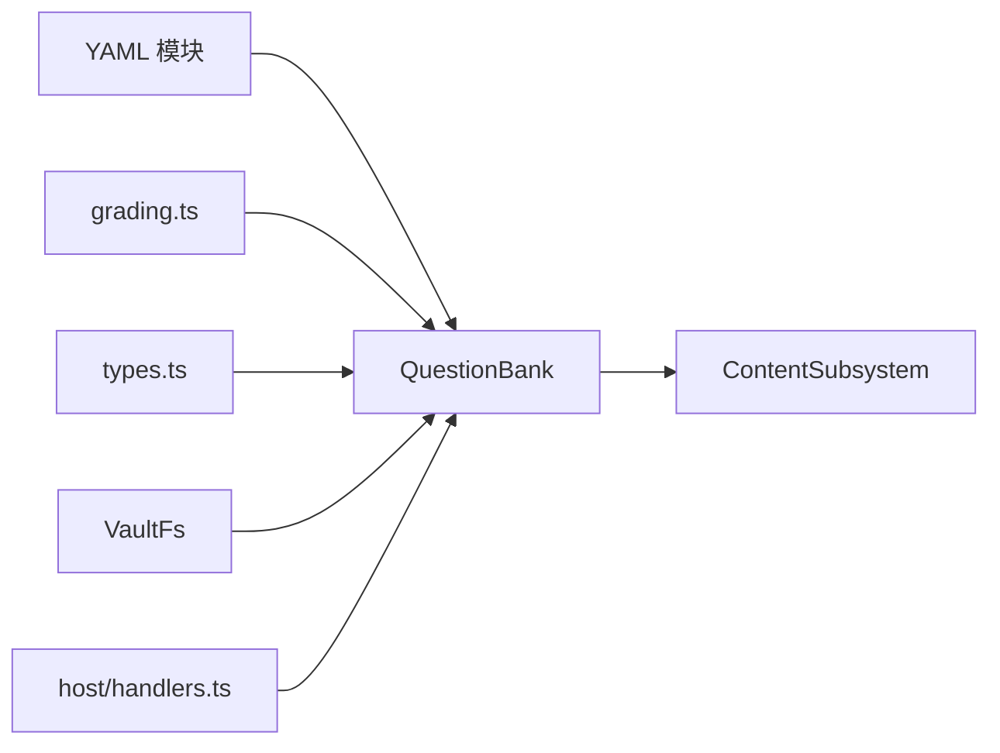

# 题目存储结构

<cite>
**本文引用的文件**
- [question-bank.ts](file://src/engine/question-bank.ts)
- [grading.ts](file://src/engine/grading.ts)
- [content-subsystem.ts](file://src/engine/content-subsystem.ts)
- [types.ts](file://src/engine/types.ts)
- [handlers.ts](file://src/host/handlers.ts)
- [判断命题真假并用与或非组合命题.yaml](file://tests/fixtures/bank-corpus/判断命题真假并用与或非组合命题.yaml)
- [提取公因式进行因式分解.yaml](file://tests/fixtures/bank-corpus/提取公因式进行因式分解.yaml)
- [用等式性质移项合并解一元一次方程.yaml](file://tests/fixtures/bank-corpus/用等式性质移项合并解一元一次方程.yaml)
</cite>

## 目录
1. [简介](#简介)
2. [项目结构](#项目结构)
3. [核心组件](#核心组件)
4. [架构总览](#架构总览)
5. [详细组件分析](#详细组件分析)
6. [依赖关系分析](#依赖关系分析)
7. [性能考虑](#性能考虑)
8. [故障排查指南](#故障排查指南)
9. [结论](#结论)
10. [附录：YAML 示例与字段规范](#附录yaml-示例与字段规范)

## 简介
本文件系统性说明题库（Bank）的存储结构与生命周期管理，覆盖以下要点：
- BankQuestion 接口定义与九种题型及其答案格式约束
- 题目元数据字段（难度、前置技能、标签、章节归属、概念引用、归档状态、FSRS 调度、作答统计）
- YAML 文件格式规范与 schema 校验规则
- 题目生命周期：创建、更新、归档与恢复
- 题目 ID 生成策略与唯一性保证
- 判卷与视图渲染的关键行为（含匹配题右列打乱防泄题）

## 项目结构
题库以“课程根/题库/<节点>.yaml”为落盘位置，单文件一节点。引擎通过 QuestionBank 类完成读取、解析、校验与写入；BankSubsystem 聚合题库域能力（归档、批量操作、错误对比卡等）。内容子系统负责将 BankQuestion 转换为前端可渲染的 QuestionItem。

**图表来源**
- [question-bank.ts:271-318](file://src/engine/question-bank.ts#L271-L318)
- [content-subsystem.ts:462-484](file://src/engine/content-subsystem.ts#L462-L484)

**章节来源**
- [question-bank.ts:271-318](file://src/engine/question-bank.ts#L271-L318)
- [content-subsystem.ts:462-484](file://src/engine/content-subsystem.ts#L462-L484)

## 核心组件
- BankQuestion：题库中一道题的完整数据结构，包含题型、题干、答案、选项、解析、难度、前置技能、标签、章节归属、概念引用、归档标记、FSRS 调度块、作答统计等。
- validateBank：对 YAML 文档进行强类型与业务规则校验，确保题型与答案形态一致、必填字段存在、数值容差合法等。
- QuestionBank：提供 load/save/add/update/archive 等操作，所有写前均过 schema 校验，保证持久化一致性。
- content-subsystem.questionView：将 BankQuestion 转为 QuestionItem，处理 matching 右列打乱、已推进披露答案/解析等。

**章节来源**
- [question-bank.ts:82-116](file://src/engine/question-bank.ts#L82-L116)
- [question-bank.ts:139-262](file://src/engine/question-bank.ts#L139-L262)
- [question-bank.ts:271-453](file://src/engine/question-bank.ts#L271-L453)
- [content-subsystem.ts:462-484](file://src/engine/content-subsystem.ts#L462-L484)

## 架构总览
下图展示从 YAML 到前端展示的端到端流程，以及判卷与调度侧的交互点。

**图表来源**
- [handlers.ts:277-280](file://src/host/handlers.ts#L277-L280)
- [question-bank.ts:354-376](file://src/engine/question-bank.ts#L354-L376)
- [content-subsystem.ts:462-484](file://src/engine/content-subsystem.ts#L462-L484)

## 详细组件分析

### BankQuestion 与题型答案契约
- 支持题型：single_choice、true_false、fill_in_blank、reflection、multi_choice、numeric、ordering、matching、open_question。
- 答案格式要求（由 validateBank 与 grading 共同保障）：
  - single_choice：options 非空，answer 为合法选项字母（A-Z），系统自动编号。
  - multi_choice：options ≥2，answer 为至少两个合法选项字母数组。
  - true_false：answer 为布尔或中文对/错等价值。
  - fill_in_blank：answer 为字符串或字符串数组（可接受写法集合）。
  - numeric：answer 为数值（支持小数/分数/百分数），tol 为正数时按容差判卷。
  - ordering：options 为乱序步骤/事件项（≥2），answer 为同一组项的正确顺序文本数组。
  - matching：options 为左列项（≥2），answer 为与左列一一对应的右列文本数组。
  - reflection/open_question：answer 为评分要点/参考要点文本（开放题走 AI 判卷）。
- 判卷语义：客观题规则判卷；reflection/open_question 必须经 AI 判卷通道，失败则事务回滚。

**图表来源**
- [question-bank.ts:139-262](file://src/engine/question-bank.ts#L139-L262)
- [grading.ts:113-200](file://src/engine/grading.ts#L113-L200)

**章节来源**
- [question-bank.ts:82-116](file://src/engine/question-bank.ts#L82-L116)
- [question-bank.ts:139-262](file://src/engine/question-bank.ts#L139-L262)
- [grading.ts:113-200](file://src/engine/grading.ts#L113-L200)

### 题目元数据字段
- 基础：id、kind、q、answer、options、explanation
- 教学属性：difficulty（1-3）、uses（前置技能）、tags（标签）、section（章节归属）、invokes（一枚概念引用）
- 数值题：tol（容差）
- 状态与调度：archived、archived_reason、fsrs（稳定性/难度/到期日/复习次数/遗忘次数）、stats（尝试次数/正确数/最近作答时间/最近对错/待自评标记）
- 注意：fsrs/stats 由作答侧整体替换，不通过作者字段白名单修改。

**章节来源**
- [question-bank.ts:82-109](file://src/engine/question-bank.ts#L82-L109)
- [question-bank.ts:118-121](file://src/engine/question-bank.ts#L118-L121)
- [question-bank.ts:378-403](file://src/engine/question-bank.ts#L378-L403)

### YAML 文件格式规范与 schema 验证
- 文件组织：课程根/题库/<节点>.yaml，顶层 node 与 questions 数组。
- 每道题必填：kind、q；答案形态依题型而定；选项仅在需要时出现。
- 校验规则：
  - 顶层 node/questions 存在性与类型
  - 题型枚举限制
  - 各题型答案形态与数量约束
  - numeric 的 tol 必须为正
  - invokes 若存在须为字符串（登记在册概念名）
  - section/uses/tags/difficulty 等可选字段类型与范围检查
- 写入路径：save/loadDoc/writeDoc 统一经过 validateBank，Broken 即抛错，绝不静默降级。

**章节来源**
- [question-bank.ts:271-318](file://src/engine/question-bank.ts#L271-L318)
- [question-bank.ts:139-262](file://src/engine/question-bank.ts#L139-L262)

### 题目生命周期管理
- 创建：addQuestion 追加新题，未提供 id 时自动生成 qN（N 为当前题数+1），并做 id 唯一性检查。
- 更新：updateQuestion 仅允许作者字段白名单（q/answer/options/explanation/difficulty/uses/tags/section/tol），id/kind/fsrs/stats/archived 不可改。
- 归档/恢复：archiveQuestion/archiveQuestions 设置 archived 与 archived_reason；恢复时一并清除归档标记与原因。
- 证据更新：updateQuestionEvidence 仅允许整体替换 fsrs/stats，用于作答侧写回。
- 外部入口：PUT /question-update 暴露给宿主层调用。

**图表来源**
- [handlers.ts:277-280](file://src/host/handlers.ts#L277-L280)
- [question-bank.ts:337-453](file://src/engine/question-bank.ts#L337-L453)

**章节来源**
- [question-bank.ts:337-453](file://src/engine/question-bank.ts#L337-L453)
- [handlers.ts:277-280](file://src/host/handlers.ts#L277-L280)

### 题目 ID 生成策略与唯一性保证
- 自动生成：当未提供 id 时，使用 qN（N = 现有题数 + 1）。
- 唯一性：在 addQuestion 时对已有 id 集合查重，冲突直接报错。
- 更新保护：updateQuestion 不允许修改 id，避免身份漂移。

**章节来源**
- [question-bank.ts:337-352](file://src/engine/question-bank.ts#L337-L352)
- [question-bank.ts:354-376](file://src/engine/question-bank.ts#L354-L376)

### 判卷与视图渲染
- 判卷：evaluateAllo 实现九种题型的规则判卷；reflection/open_question 强制 AI 判卷，失败则抛出异常中断事务。
- 视图渲染：questionView 将 BankQuestion 转为 QuestionItem，针对 matching 题型对右列答案打乱以防泄题；当日已推进的题目会附带答案与解析。

**图表来源**
- [question-bank.ts:82-109](file://src/engine/question-bank.ts#L82-L109)
- [content-subsystem.ts:462-484](file://src/engine/content-subsystem.ts#L462-L484)
- [grading.ts:113-200](file://src/engine/grading.ts#L113-L200)

**章节来源**
- [grading.ts:113-200](file://src/engine/grading.ts#L113-L200)
- [content-subsystem.ts:462-484](file://src/engine/content-subsystem.ts#L462-L484)

## 依赖关系分析
- QuestionBank 依赖：
  - YAML 解析与序列化（yaml.ts）
  - 判卷工具（grading.ts）
  - 文件系统抽象（VaultFs）
  - 类型定义（types.ts 中的 FsrsBlock 等）
- ContentSubsystem 依赖 QuestionBank 提供的 BankDoc，并输出 QuestionItem。
- Host handlers 暴露 REST 接口，委托 Engine 的 bank2.questionUpdate。

**图表来源**
- [question-bank.ts:23-58](file://src/engine/question-bank.ts#L23-L58)
- [content-subsystem.ts:462-484](file://src/engine/content-subsystem.ts#L462-L484)
- [handlers.ts:277-280](file://src/host/handlers.ts#L277-L280)

**章节来源**
- [question-bank.ts:23-58](file://src/engine/question-bank.ts#L23-L58)
- [content-subsystem.ts:462-484](file://src/engine/content-subsystem.ts#L462-L484)
- [handlers.ts:277-280](file://src/host/handlers.ts#L277-L280)

## 性能考虑
- 批量归档/恢复采用一次 load-validate-write 落盘，减少 I/O 与重复校验开销。
- 匹配题右列答案在渲染时打乱，避免泄露固定顺序，计算量小。
- 数值判卷使用归一化与容差比较，避免浮点毛刺导致的误判。

[本节为通用指导，无需具体文件来源]

## 故障排查指南
- YAML 解析失败：检查顶层是否为映射、node/questions 是否存在、questions 是否为数组。
- 题型答案不匹配：确认 answer 形态与题型一致（如多选至少两个正确项、数值题 tol 为正）。
- 更新被拒：确认 patch 仅包含白名单字段；id/kind/fsrs/stats/archived 需通过专用接口修改。
- 归档/恢复失败：确认 qid 存在且题库文件可读；恢复时会清除 archived 与 archived_reason。
- 判卷失败：reflection/open_question 必须经 AI 判卷通道；客观题答案需满足归一化与容差规则。

**章节来源**
- [question-bank.ts:139-262](file://src/engine/question-bank.ts#L139-L262)
- [question-bank.ts:337-453](file://src/engine/question-bank.ts#L337-L453)
- [grading.ts:113-200](file://src/engine/grading.ts#L113-L200)

## 结论
题库以严格的 schema 校验与清晰的题型契约保障数据质量；通过 QuestionBank 提供安全的 CRUD 与归档能力；ContentSubsystem 负责面向学习端的视图渲染与防泄题处理。配合判卷与调度模块，形成从出题、入库、作答到复习的完整闭环。

[本节为总结性内容，无需具体文件来源]

## 附录：YAML 示例与字段规范
以下为仓库中真实题库样例的路径，可用于对照题型与字段用法：
- 单选/多选/判断/数值/开放题等综合示例：[判断命题真假并用与或非组合命题.yaml](file://tests/fixtures/bank-corpus/判断命题真假并用与或非组合命题.yaml)
- 多种题型混合（含排序、配对、开放题等）：[提取公因式进行因式分解.yaml](file://tests/fixtures/bank-corpus/提取公因式进行因式分解.yaml)
- 简单示例（单选/判断/数值）：[用等式性质移项合并解一元一次方程.yaml](file://tests/fixtures/bank-corpus/用等式性质移项合并解一元一次方程.yaml)

字段速查（节选）：
- 必填：node、questions[].kind、questions[].q
- 答案：按题型约束（见上文“题型答案契约”）
- 选项：单选/多选/排序/配对按需提供
- 解析：explanation（可选）
- 教学属性：difficulty、uses、tags、section、invokes（可选）
- 数值题：tol（可选，正数）
- 调度与统计：fsrs、stats（由作答侧写入）
- 归档：archived、archived_reason（由归档操作写入）

**章节来源**
- [判断命题真假并用与或非组合命题.yaml:1-112](file://tests/fixtures/bank-corpus/判断命题真假并用与或非组合命题.yaml#L1-L112)
- [提取公因式进行因式分解.yaml:1-800](file://tests/fixtures/bank-corpus/提取公因式进行因式分解.yaml#L1-L800)
- [用等式性质移项合并解一元一次方程.yaml:1-55](file://tests/fixtures/bank-corpus/用等式性质移项合并解一元一次方程.yaml#L1-L55)