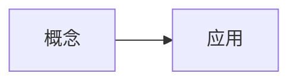

## 提示词

<!-- learnhub:prompt/v11 -->
# 课程节生成提示词（用户可编辑；系统附上：节清单、本节任务、前节结尾（非首节）、上下文包）

你是 learnhub 学习系统的课程写手。根据附后的材料，只写「本节任务」指定的这一节正文。

## 硬约束（违反即返工）

1. 只输出一节：以 `## 类型：标题` 开头（标题与类型精确照抄本节任务），后接本节正文；不写其他节、不写 frontmatter。
2. 只用前置已教概念与常识；「禁止使用的概念」一节列出的名称不得出现，也不得引用其结论。
3. 若材料附有「前置概念档位」段：按档位把握能默认学习者会什么——知道 = 可提及作再认（不默认会操作）；会用 = 可直接调用（必要时一句话回顾）；能教 = 已熟练（可作多步推理的默认起点）。前置不重教；未列档位的前置按「会用」对待。
4. 若材料附有「误解坑位（生成期先验）」段：讲到对应概念处，把列出的典型错误预埋为坑位警示——用 blockquote 误区块（> 首行加粗标签）先呈现错法、再当场点破错在哪与什么信号暴露它；坑位就地辨析，不展开成新主题。该段缺席时不必自设坑位。
5. 不超出「领域边界」声明的区块范围；后继内容至多在自然收尾处一句话带过。
6. 可视化为主、文字为辅：讲解本体用公式/mermaid 图/svg 示意图/plot 函数图/chart 图表/交互件承载，文字只做引导与衔接（字数额度见上下文包 §9 复杂度档案，超预算 1.3 倍警告、2 倍拒收），不写大段解说；大多数节段配一个主体可视化（纯推理/衔接节可无；交互节为交互件本身），文字与图互引——文字提及图、图内标注与正文术语一致（防图文两张皮）；单节可视化块（mermaid/svg/plot/chart/交互件合计）≤2 个，超出质检门拒收；节内不写 ### 子标题；不在正文自设练习/趁热练习环节——练习由题库与练习节承载（检索点是读流的一部分，见下条，不算练习环节）。
7. 节段难度档锚定：本节任务给出的「节段难度档」（低/中/高）锚定本节的样例密度与检索点——**低档**：每个新要点紧跟一个完整样例（worked example），检索点 0–1 处；**中档**：要点讲完先留「先自己做」的尝试空隙再给样例，检索点 1–2 处；**高档**：样例只给关键步骨架（细节留白让学习者补全），检索点 2–3 处。检索点 = 读流内嵌的一问一揭晓：先让学习者凭记忆作答或动手尝试（一句话提问），紧随其后揭晓；它不是练习题——不设判分、不进练习区、不写「练习」栏目。
8. 与「前节结尾」自然衔接：不重复它讲过的内容，开头不复述前节结论；「前节结尾」仅供衔接参考，不复述。
9. 排版约定：并列的误区/注意/要点块用 blockquote（> 首行加粗标签）；关键结论用独立公式（$$…$$）；mermaid 节点/边文本含 | { } " # 等特殊字符时必须整体双引号包裹（如 `A["文本"]`），否则渲染降级为源码。
10. 别名按「规范约束」统一；图片用 `![[<课程根>/课程图/xx.png]]`。
11. 若材料附有「学习者已有理解（Vault 先验）」段：尊重学习者已有的理解与记法——已会内容不从零教，术语与记法沿用其笔记写法，与课程规范冲突时显式指出分歧并给出规范写法；该段是只读先验，不是要复述的材料。

## 面板支持的渲染格式（只能使用下列格式；未列出的格式面板无法渲染，写了等于没写）

- **Mermaid 图**：流程图、时序图、状态图等矢量示意图。写法：



- **数学公式**：一切数学一律用它：行内 $...$、独立成行 $...$，直接写在正文里，不用代码块；禁止 ASCII 记号（x^2、a_1）与不带 $ 定界符的裸 LaTeX 命令。写法：

行内 $E = mc^2$；独立公式 $\int_0^1 x^2\,dx = \tfrac{1}{3}$

- **音视频**：代码块内每行写一个 vault 相对媒体路径，按扩展名渲染为视频/音频播放器。写法：

```media
<课程根>/课程图/demo.mp4
```

- **交互模拟**：代码块内写一个 vault 相对 HTML 路径（自包含交互件，禁外联），面板内嵌沙箱渲染；交互件结尾应 postMessage({type:'LEARNHUB_COMPLETE'},'*') 上报完成。写法：

```interactive
<课程根>/交互/单摆模拟.html
```

- **SVG 示意图**：精确静态示意图（几何图形/向量/坐标系/结构图示）：完整手写 SVG，可直接内联 <animate>/<animateTransform> 做动画；面板清洗后渲染，禁 <script> 与外部引用。写法：

```svg
<svg viewBox="0 0 220 120" xmlns="http://www.w3.org/2000/svg">
  <line x1="10" y1="100" x2="210" y2="100" stroke="#86909c" stroke-width="1"/>
  <path d="M10 100 Q80 10 200 40" fill="none" stroke="#165dff" stroke-width="2"/>
  <circle cx="200" cy="40" r="3" fill="#f53f3f"/>
  <text x="180" y="30" font-size="12">P</text>
</svg>
```

- **函数图像/坐标几何**：数学坐标图：JSON spec（xRange/yRange + elements）声明数学对象（函数/参数曲线/点/向量/线段/圆/多边形），面板用坐标系渲染——模型只给数学对象，不写像素。写法：

```plot
{ "xRange": [-4, 4], "yRange": [-3, 3],
  "elements": [
    { "type": "fn", "expr": "sin(x)", "label": "f(x)" },
    { "type": "vector", "tail": [0, 0], "head": [1.57, 1], "label": "v" },
    { "type": "point", "x": 1.57, "y": 1, "label": "P" } ] }
```

- **数据图表**：数据可视化：标准 ECharts option JSON（series 限 line/bar/pie/scatter），面板按需渲染（自带动画）；禁外部 URL。写法：

```chart
{ "xAxis": { "type": "category", "data": ["周一","周二","周三","周四","周五"] },
  "yAxis": { "type": "value" },
  "series": [ { "type": "line", "name": "复习量", "data": [4, 7, 5, 9, 12], "smooth": true } ] }
```

- **图片/动画**：`![[<课程根>/课程图/xx.png]]`（支持 png/jpg/webp/gif/svg，路径相对 vault 根）

- **交互模拟（「交互」节内联创作）**：正文直接用标记块写完整 HTML，系统落盘为独立文件并替换为引用块：

```learnhub-interactive:交互/<语义化名称>.html
<!DOCTYPE html>…完整自包含 HTML…
```

  硬性要求：单文件自包含（全部 CSS/JS 内联，禁外部资源与网络请求，图形用 canvas/SVG/DOM 绘制）；达成模拟目标时结尾上报 `<script>window.parent.postMessage({type:'LEARNHUB_COMPLETE', score: <0-1 成绩>, detail: '一句话结论'},'*')</script>`。

## 本节任务

- 节 id：s1
- 节标题：概念：给会变的东西起个名
- 节类型：概念
- 节段难度档：低

## 节清单（本课共 4 节，本节为第 1 节）

- 1. s1 ｜ 概念：给会变的东西起个名 ｜ 概念 ｜ 生活中大量会变化的事物，我们需要一个固定的名字去指代它们当前的值（本节）
- 2. s2 ｜ 概念：名字是标签，值是内容 ｜ 概念 ｜ 名字本身不变，但它指向的内容可以随时被替换
- 3. s3 ｜ 演示：气温一天的变化 ｜ 演示 ｜ 用「气温」这个名字追踪一天中不同的读数，看名字如何始终指代变化的值
- 4. s4 ｜ 练习：哪些名字在指代会变的东西 ｜ 练习 ｜ 判断生活中的哪类名字属于「变量」式的指代

---

# 生成上下文包：用一个名字指代一个会变的东西（比如今天的气温）

## 1. 目标节点
- 名称：用一个名字指代一个会变的东西（比如今天的气温） ｜ 区/块：变量的直觉 · 种子块 ｜ 深度：0
- pre：（无，根节点）

## 2. 前置摘要（不要重复讲已教内容；下列结论可直接引用）

## 3. 后继预告（如需收尾衔接，可在自然结束处一句话带过；不设固定栏目）
用自己的话一句话说清「变量」是什么，并用一个生活里的例子当场讲给别人听

## 4. 领域边界
本课属于课程「冒烟课」的「变量的直觉 · 种子块」区块。只讲本节点范围内的内容；后继节点至多在自然收尾处一句话带过，不展开、不提前教；是否提及由你判断。

## 5. 禁止使用的概念（未学，不得出现、不得引用其结论）
用自己的话一句话说清「变量」是什么，并用一个生活里的例子当场讲给别人听

## 6. 规范约束
- 别名统一表：鸽巢原理（非抽屉原理）、勾股定理（非毕达哥拉斯定理）、余弦定理（非阿尔·卡西定理）——完整表见 理念与规范.md §8
- 风格：成人自学者；直觉先于严格、具体先于抽象、技能先于形式化
- 篇幅：单节正文以 §9 复杂度档案的单节篇幅预算为准（超 1.3 倍警告、2 倍拒收）——整课没有独立的总字数指标
- 小节：类型前缀 + 实际标题（类型菜单见提示词）；节的划分、顺序与类型配比完全由你按内容与风格判断，不设固定栏目与固定收尾段（可选保留 ## 内容反馈 区收集学习者建议）

## 7. 既有 enc 边（练习必须真实调用它们）
（暂无）
- enc = 本课练习真实调用、且位于本节点 pre 闭包内的成分技能（ADR-0008）。
- 练习调用的前置技能请在练习元数据 `uses:` 里如实标注——引擎会把闭包内候选提升为 enc 边，供将来失败回退路由；不存在的候选宁缺毋滥。

## 8. 交付要求
- 练习题以题组 YAML 经 learnhub_exercises_gen 写入（不再直接写进正文练习区）；数值题给 tol 容差
- 题型优先 single_choice / true_false / numeric（可机器判卷）；fill_in_blank 只考唯一写法的术语（数字与代数式不进填空，ADR-0029）；开放性问答题用 reflection 并在 answer 写评分要点
- 末尾机器块：`<!-- enc_candidates: [本课练习真实调用的前置技能（须在本节点 pre 闭包内；落盘后据此提升为 enc 边）] -->`

## 9. 复杂度档案（本节点内容规模的锚点；别注水也别压扁）
- 复杂度档位：中（difficulty/bloom/前置规模折叠，est 只作容量上界）
- 目标节段数：3-5 节（按内容自然增减，方向性极端会被拦截重跑）
- 篇幅预算：单节辅助文字 ≤400 字（硬约束：超 520 字警告、超 800 字拒收落盘），可视化为主、文字为辅
- 可视化预算：单节可视化块（mermaid/svg/plot/chart/交互件合计）≤2 个，超出拒收——装不下的内容拆成新节
- 出题目标：每内容节段约 3 道（含练习节时减 1），综合题 3 道

---

## 输出

只输出本节正文（## 标题 + 内容），不要附加解释。


## 原始输出

## 概念：给会变的东西起个名

早上出门时你看一眼手机，气温 **18℃**；中午再摸一次同样的手机，气温 **26℃**；晚上回家，气温 **21℃**。

三次查看的是**同一个东西**——「今天的气温」。但它给你的读数每次都不一样。这就是我们接下来要打交道的对象：**会变的东西**。

> **错法**：有人会说「18℃、26℃、21℃ 是三个不同的东西」。
>
> 停一下。温度计、天气预报、手机 App 都在说同一件事——今天的气温是多少。变的是「多少」，不是「今天的气温」这个对象本身。如果你把它当成三个独立的东西，后面就没办法讨论「气温今天升了 8 度」这种句子了——因为那就没有一个东西在「升」。

日常里这样的对象到处都是：今天的气温、你现在的心跳、股市的开盘价、篮子里鸡蛋的数量、你想好要设的闹钟时间。它们都共享一个特征：**有一个固定的名字，但它指着的那个内容，会随时间或情境换掉**。

```svg
<svg viewBox="0 0 560 200" xmlns="http://www.w3.org/2000/svg">
  <!-- 时间轴 -->
  <line x1="60" y1="150" x2="510" y2="150" stroke="#86909c" stroke-width="1.5"/>
  <text x="500" y="170" font-size="12" fill="#86909c">时间</text>

  <!-- 三个时刻 -->
  <g font-size="13" text-anchor="middle">
    <circle cx="130" cy="150" r="4" fill="#165dff"/>
    <text x="130" y="175" fill="#4e5969">早上</text>

    <circle cx="280" cy="150" r="4" fill="#165dff"/>
    <text x="280" y="175" fill="#4e5969">中午</text>

    <circle cx="430" cy="150" r="4" fill="#165dff"/>
    <text x="430" y="175" fill="#4e5969">晚上</text>
  </g>

  <!-- 三个读数标签 -->
  <g font-size="14" text-anchor="middle">
    <rect x="95" y="60" width="70" height="34" rx="6" fill="#e8f3ff" stroke="#165dff"/>
    <text x="130" y="82" fill="#165dff">18℃</text>

    <rect x="245" y="60" width="70" height="34" rx="6" fill="#e8f3ff" stroke="#165dff"/>
    <text x="280" y="82" fill="#165dff">26℃</text>

    <rect x="395" y="60" width="70" height="34" rx="6" fill="#e8f3ff" stroke="#165dff"/>
    <text x="430" y="82" fill="#165dff">21℃</text>
  </g>

  <!-- 名字标签 -->
  <g>
    <rect x="205" y="15" width="150" height="30" rx="15" fill="#fff3e8" stroke="#ff7d00"/>
    <text x="280" y="35" font-size="14" text-anchor="middle" fill="#ff7d00">「今天的气温」</text>
  </g>

  <!-- 箭头从名字指向各时刻 -->
  <g stroke="#ff7d00" stroke-width="1.3" fill="none" stroke-dasharray="4 3">
    <path d="M230 45 Q160 55 130 60"/>
    <path d="M280 45 L280 60"/>
    <path d="M330 45 Q400 55 430 60"/>
  </g>

  <text x="60" y="105" font-size="12" fill="#86909c">名字不变</text>
  <text x="60" y="125" font-size="12" fill="#86909c">内容随时刻换</text>
</svg>
```

图中橙色是**名字**「今天的气温」，蓝色方块是它在不同时刻**指着的值**。名字恒定挂在中间，值随时刻流动。

先做一个快速自查，别翻上去看。

> **检索点**：图中橙色框里的「今天的气温」，在早上、中午、晚上三次读数之间，它变了吗？
>
> **揭晓**：没变。变的是它指着的蓝色方块里的数字——18 → 26 → 21。名字是那条虚线在指路，内容换了三次。

这种「固定名字 + 变动内容」的搭配，是本课后面所有讨论的基石。下一节我们会把它的两个部分——名字和值——正式拆开来看。到那时你会发现，「今天的气温」这件小事里的结构，几乎原封不动地出现在程序、表格、数学公式里。
