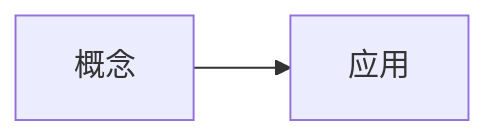
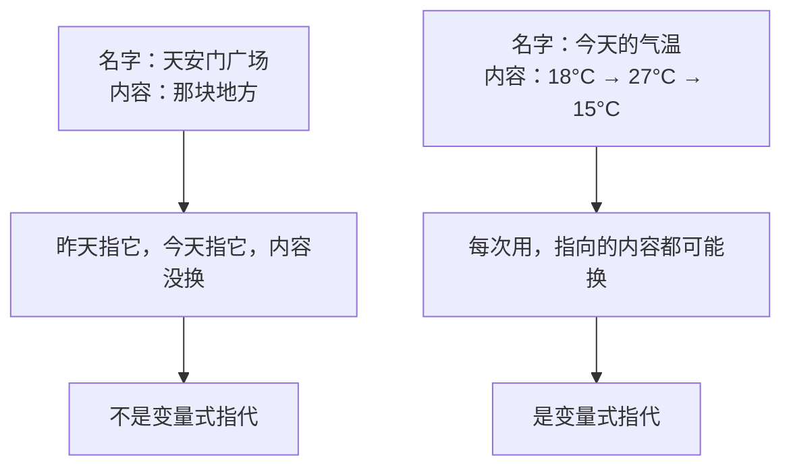
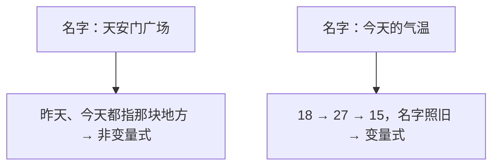

## 提示词

<!-- learnhub:prompt/v11 -->
# 课程节生成提示词（用户可编辑；系统附上：节清单、本节任务、前节结尾（非首节）、上下文包）

你是 learnhub 学习系统的课程写手。根据附后的材料，只写「本节任务」指定的这一节正文。

## 硬约束（违反即返工）

1. 只输出一节：以 `## 类型：标题` 开头（标题与类型精确照抄本节任务），后接本节正文；不写其他节、不写 frontmatter。
2. 只用前置已教概念与常识；「禁止使用的概念」一节列出的名称不得出现，也不得引用其结论。
3. 若材料附有「前置概念档位」段：按档位把握能默认学习者会什么——知道 = 可提及作再认（不默认会操作）；会用 = 可直接调用（必要时一句话回顾）；能教 = 已熟练（可作多步推理的默认起点）。前置不重教；未列档位的前置按「会用」对待。
4. 若材料附有「误解坑位（生成期先验）」段：讲到对应概念处，把列出的典型错误预埋为坑位警示——用 blockquote 误区块（> 首行加粗标签）先呈现错法、再当场点破错在哪与什么信号暴露它；坑位就地辨析，不展开成新主题。该段缺席时不必自设坑位。
5. 不超出「领域边界」声明的区块范围；后继内容至多在自然收尾处一句话带过。
6. 可视化为主、文字为辅：讲解本体用公式/mermaid 图/svg 示意图/plot 函数图/chart 图表/交互件承载，文字只做引导与衔接（字数额度见上下文包 §9 复杂度档案，超预算 1.3 倍警告、2 倍拒收），不写大段解说；大多数节段配一个主体可视化（纯推理/衔接节可无；交互节为交互件本身），文字与图互引——文字提及图、图内标注与正文术语一致（防图文两张皮）；单节可视化块（mermaid/svg/plot/chart/交互件合计）≤2 个，超出质检门拒收；节内不写 ### 子标题；不在正文自设练习/趁热练习环节——练习由题库与练习节承载（检索点是读流的一部分，见下条，不算练习环节）。
7. 节段难度档锚定：本节任务给出的「节段难度档」（低/中/高）锚定本节的样例密度与检索点——**低档**：每个新要点紧跟一个完整样例（worked example），检索点 0–1 处；**中档**：要点讲完先留「先自己做」的尝试空隙再给样例，检索点 1–2 处；**高档**：样例只给关键步骨架（细节留白让学习者补全），检索点 2–3 处。检索点 = 读流内嵌的一问一揭晓：先让学习者凭记忆作答或动手尝试（一句话提问），紧随其后揭晓；它不是练习题——不设判分、不进练习区、不写「练习」栏目。
8. 与「前节结尾」自然衔接：不重复它讲过的内容，开头不复述前节结论；「前节结尾」仅供衔接参考，不复述。
9. 排版约定：并列的误区/注意/要点块用 blockquote（> 首行加粗标签）；关键结论用独立公式（$$…$$）；mermaid 节点/边文本含 | { } " # 等特殊字符时必须整体双引号包裹（如 `A["文本"]`），否则渲染降级为源码。
10. 别名按「规范约束」统一；图片用 `![[<课程根>/课程图/xx.png]]`。
11. 若材料附有「学习者已有理解（Vault 先验）」段：尊重学习者已有的理解与记法——已会内容不从零教，术语与记法沿用其笔记写法，与课程规范冲突时显式指出分歧并给出规范写法；该段是只读先验，不是要复述的材料。

## 面板支持的渲染格式（只能使用下列格式；未列出的格式面板无法渲染，写了等于没写）

- **Mermaid 图**：流程图、时序图、状态图等矢量示意图。写法：



- **数学公式**：一切数学一律用它：行内 $...$、独立成行 $...$，直接写在正文里，不用代码块；禁止 ASCII 记号（x^2、a_1）与不带 $ 定界符的裸 LaTeX 命令。写法：

行内 $E = mc^2$；独立公式 $\int_0^1 x^2\,dx = \tfrac{1}{3}$

- **音视频**：代码块内每行写一个 vault 相对媒体路径，按扩展名渲染为视频/音频播放器。写法：

```media
<课程根>/课程图/demo.mp4
```

- **交互模拟**：代码块内写一个 vault 相对 HTML 路径（自包含交互件，禁外联），面板内嵌沙箱渲染；交互件结尾应 postMessage({type:'LEARNHUB_COMPLETE'},'*') 上报完成。写法：

```interactive
<课程根>/交互/单摆模拟.html
```

- **SVG 示意图**：精确静态示意图（几何图形/向量/坐标系/结构图示）：完整手写 SVG，可直接内联 <animate>/<animateTransform> 做动画；面板清洗后渲染，禁 <script> 与外部引用。写法：

```svg
<svg viewBox="0 0 220 120" xmlns="http://www.w3.org/2000/svg">
  <line x1="10" y1="100" x2="210" y2="100" stroke="#86909c" stroke-width="1"/>
  <path d="M10 100 Q80 10 200 40" fill="none" stroke="#165dff" stroke-width="2"/>
  <circle cx="200" cy="40" r="3" fill="#f53f3f"/>
  <text x="180" y="30" font-size="12">P</text>
</svg>
```

- **函数图像/坐标几何**：数学坐标图：JSON spec（xRange/yRange + elements）声明数学对象（函数/参数曲线/点/向量/线段/圆/多边形），面板用坐标系渲染——模型只给数学对象，不写像素。写法：

```plot
{ "xRange": [-4, 4], "yRange": [-3, 3],
  "elements": [
    { "type": "fn", "expr": "sin(x)", "label": "f(x)" },
    { "type": "vector", "tail": [0, 0], "head": [1.57, 1], "label": "v" },
    { "type": "point", "x": 1.57, "y": 1, "label": "P" } ] }
```

- **数据图表**：数据可视化：标准 ECharts option JSON（series 限 line/bar/pie/scatter），面板按需渲染（自带动画）；禁外部 URL。写法：

```chart
{ "xAxis": { "type": "category", "data": ["周一","周二","周三","周四","周五"] },
  "yAxis": { "type": "value" },
  "series": [ { "type": "line", "name": "复习量", "data": [4, 7, 5, 9, 12], "smooth": true } ] }
```

- **图片/动画**：`![[<课程根>/课程图/xx.png]]`（支持 png/jpg/webp/gif/svg，路径相对 vault 根）

- **交互模拟（「交互」节内联创作）**：正文直接用标记块写完整 HTML，系统落盘为独立文件并替换为引用块：

```learnhub-interactive:交互/<语义化名称>.html
<!DOCTYPE html>…完整自包含 HTML…
```

  硬性要求：单文件自包含（全部 CSS/JS 内联，禁外部资源与网络请求，图形用 canvas/SVG/DOM 绘制）；达成模拟目标时结尾上报 `<script>window.parent.postMessage({type:'LEARNHUB_COMPLETE', score: <0-1 成绩>, detail: '一句话结论'},'*')</script>`。

## 本节任务

- 节 id：s4
- 节标题：练习：哪些名字在指代会变的东西
- 节类型：练习
- 节段难度档：高

## 节清单（本课共 4 节，本节为第 4 节）

- 1. s1 ｜ 概念：给会变的东西起个名 ｜ 概念 ｜ 生活中大量会变化的事物，我们需要一个固定的名字去指代它们当前的值
- 2. s2 ｜ 概念：名字是标签，值是内容 ｜ 概念 ｜ 名字本身不变，但它指向的内容可以随时被替换
- 3. s3 ｜ 演示：气温一天的变化 ｜ 演示 ｜ 用「气温」这个名字追踪一天中不同的读数，看名字如何始终指代变化的值
- 4. s4 ｜ 练习：哪些名字在指代会变的东西 ｜ 练习 ｜ 判断生活中的哪类名字属于「变量」式的指代（本节）

## 前节结尾（仅供衔接参考，不复述前节内容）

> **常见误解**：看到曲线就说「气温在变，所以这个名字也在变」。
> 错在哪：名字从头到尾没换过，换的只是箭头右端。一旦把名字和值打包成一回事，就会说出「同一个名字既是 18 又是 27」这种自相矛盾的话——分开看，毫无矛盾。

> **常见误解**：以为换了内容，名字就成了新名字。
> 错在哪：换的是内容，不是名字。信号：若有人说「现在这个气温已经不是刚才那个气温了」，反问「那它现在叫什么」——答不上来，说明没改名。

$$\text{名字（不变）} \longrightarrow \text{内容（随时可换）}$$

下一节用这个结构判断：生活里哪些名字在指代会变的东西。

---

# 生成上下文包：用一个名字指代一个会变的东西（比如今天的气温）

## 1. 目标节点
- 名称：用一个名字指代一个会变的东西（比如今天的气温） ｜ 区/块：变量的直觉 · 种子块 ｜ 深度：0
- pre：（无，根节点）

## 2. 前置摘要（不要重复讲已教内容；下列结论可直接引用）

## 3. 后继预告（如需收尾衔接，可在自然结束处一句话带过；不设固定栏目）
用自己的话一句话说清「变量」是什么，并用一个生活里的例子当场讲给别人听

## 4. 领域边界
本课属于课程「冒烟课」的「变量的直觉 · 种子块」区块。只讲本节点范围内的内容；后继节点至多在自然收尾处一句话带过，不展开、不提前教；是否提及由你判断。

## 5. 禁止使用的概念（未学，不得出现、不得引用其结论）
用自己的话一句话说清「变量」是什么，并用一个生活里的例子当场讲给别人听

## 6. 规范约束
- 别名统一表：鸽巢原理（非抽屉原理）、勾股定理（非毕达哥拉斯定理）、余弦定理（非阿尔·卡西定理）——完整表见 理念与规范.md §8
- 风格：成人自学者；直觉先于严格、具体先于抽象、技能先于形式化
- 篇幅：单节正文以 §9 复杂度档案的单节篇幅预算为准（超 1.3 倍警告、2 倍拒收）——整课没有独立的总字数指标
- 小节：类型前缀 + 实际标题（类型菜单见提示词）；节的划分、顺序与类型配比完全由你按内容与风格判断，不设固定栏目与固定收尾段（可选保留 ## 内容反馈 区收集学习者建议）

## 7. 既有 enc 边（练习必须真实调用它们）
（暂无）
- enc = 本课练习真实调用、且位于本节点 pre 闭包内的成分技能（ADR-0008）。
- 练习调用的前置技能请在练习元数据 `uses:` 里如实标注——引擎会把闭包内候选提升为 enc 边，供将来失败回退路由；不存在的候选宁缺毋滥。

## 8. 交付要求
- 练习题以题组 YAML 经 learnhub_exercises_gen 写入（不再直接写进正文练习区）；数值题给 tol 容差
- 题型优先 single_choice / true_false / numeric（可机器判卷）；fill_in_blank 只考唯一写法的术语（数字与代数式不进填空，ADR-0029）；开放性问答题用 reflection 并在 answer 写评分要点
- 末尾机器块：`<!-- enc_candidates: [本课练习真实调用的前置技能（须在本节点 pre 闭包内；落盘后据此提升为 enc 边）] -->`

## 9. 复杂度档案（本节点内容规模的锚点；别注水也别压扁）
- 复杂度档位：中（difficulty/bloom/前置规模折叠，est 只作容量上界）
- 目标节段数：3-5 节（按内容自然增减，方向性极端会被拦截重跑）
- 篇幅预算：单节辅助文字 ≤400 字（硬约束：超 520 字警告、超 800 字拒收落盘），可视化为主、文字为辅
- 可视化预算：单节可视化块（mermaid/svg/plot/chart/交互件合计）≤2 个，超出拒收——装不下的内容拆成新节
- 出题目标：每内容节段约 3 道（含练习节时减 1），综合题 3 道

## 上一次输出未过质检门（✗ 项必须全部修复；正文过长的修复 = 压缩文字，不是删结构）

上次输出：

## 练习：哪些名字在指代会变的东西

这一节不教新东西，只做一件事：把「名字—内容」这副眼镜戴上，去生活里辨认。判断标准始终只有一条——

> **线索**：如果同一个名字，昨天和今天指向的内容不一样、而且以后还会再不一样，那它就是在指代会变的东西。

先看一组对照，体会这条线索怎么用。



> **先自己做**：下面五个名字，先凭直觉各判一次，写在旁边，再往下看揭晓。
> ① 你的手机电量　② 你的身份证号　③ 本节课的当前页数　④ 你家的门牌号　⑤ 你现在的心率

揭晓：

| 名字 | 会变吗 | 判断依据 |
|---|---|---|
| 手机电量 | 是 | 名字没换，读数从 80% 掉到 20% |
| 身份证号 | 否 | 一辈子的内容都是那一串数字 |
| 当前页数 | 是 | 「第几页」这个位置说明它随翻页替换 |
| 门牌号 | 否 | 房子不变，号就不会换 |
| 心率 | 是 | 静止 60，跑完 140，名字仍是「心率」 |

注意到没有：**判断的对象不是「这个词听起来像不像数字」，而是「它有没有被反复替换内容」**。身份证号是一串数字，却不是变量式指代；心率一个词都没提数字，却是。

> **坑位**：「电量在变，所以『电量』这个词也在变。」
> 错在哪：词没变——你打出来、说出来的还是那两个字。变的是它右端挂着的内容。信号：说这句话的人往往同时会承认「电量」明天还叫「电量」，这就自相矛盾了。
> 正确读法：名字恒定，内容流动。

再看一个更容易踩的例子，仔细分辨中间的区别：

```svg
<svg viewBox="0 0 460 150" xmlns="http://www.w3.org/2000/svg">
  <rect x="10" y="20" width="200" height="110" rx="8" fill="none" stroke="#165dff" stroke-width="2"/>
  <text x="110" y="45" font-size="13" text-anchor="middle" fill="#165dff">「今天的天气」</text>
  <text x="110" y="70" font-size="12" text-anchor="middle">周一：晴</text>
  <text x="110" y="90" font-size="12" text-anchor="middle">周二：雨</text>
  <text x="110" y="110" font-size="12" text-anchor="middle">周三：阴</text>
  <text x="110" y="140" font-size="11" text-anchor="middle" fill="#86909c">同一名字，内容每天替换 → 变量式</text>

  <rect x="250" y="20" width="200" height="110" rx="8" fill="none" stroke="#f53f3f" stroke-width="2"/>
  <text x="350" y="45" font-size="13" text-anchor="middle" fill="#f53f3f">「本周的冠军」</text>
  <text x="350" y="70" font-size="12" text-anchor="middle">周一：甲队</text>
  <text x="350" y="90" font-size="12" text-anchor="middle">周二：乙队</text>
  <text x="350" y="110" font-size="12" text-anchor="middle">周三：甲队</text>
  <text x="350" y="140" font-size="11" text-anchor="middle" fill="#86909c">同一名字，内容每天替换 → 变量式</text>
</svg>
```

两个看起来毫不相干的例子——天气和冠军——结构完全一样：**固定名字 + 可换内容**。这就是本节要你反复辨认的模式。

> **先自己做**：把下面这些名字分成两栏，一栏是变量式指代，一栏不是。
> 「当前登录的用户」「圆周率」「冰箱里剩下的鸡蛋数」「你的出生日期」「今年的第几天」「教科书的书名」

揭晓：

- 变量式：当前登录的用户、冰箱里剩下的鸡蛋数、今年的第几天
- 非变量式：圆周率、你的出生日期、教科书的书名

分完后请自己说一句为什么——不是「它带数字所以是变量」，而是「它被反复替换内容」。

> **坑位**：把「圆周率」判成变量，理由是「它写出来也是 3.14 这种数字」。
> 错在哪：判据是内容会不会被换，不是外形像不像数字。圆周率从古到今始终是同一个值，从没被替换过——所以它的名字只是钉死在一个不变内容上。
> 信号：如果有人说「圆周率今天是 3.14，明天可能是 3.15」，你自己都笑了——这就是判据用对了。

最后一组更难一点的，练「同一句话里两半各是什么」：

> **先自己做**：「今天的最高气温比昨天高 3 度」——这句话里，哪些名字在指代会变的东西？哪些指向固定值？

揭晓：**「今天的最高气温」和「昨天的最高气温」都在指代会变的东西**（明天气温又换了，名字照旧）；**数字 3** 指向一个固定的量，它没有可换的内容。一句日常话里，变量式名字与固定值常混着出现——能揪出来、能分开看，本节的目的就达到了。

到这里你已经能做的判断是：给一个名字，说出它在指代会变的东西还是固定内容，并讲清依据。下一步，试着用同样的例句，当场把「名字不变、内容可换」这套说法讲给身边的人听。

质检清单：

[section] 「练习：哪些名字在指代会变的东西」质检门未过：
  ✗ 节「练习：哪些名字在指代会变的东西」正文过长（约 1236 字 > 拒收线 800 字 = 单节预算 400×2；字数按去空白、去公式与可视化/交互块后的正文字数计——公式与图不占预算）：一节 = 学习页 1–2 屏，把内容拆成多个节（管线可自动拆）或压缩文字


## 压缩目标

- 把超长节的正文压缩到 ≤ 400 字（安全余量：目标 520 字以内必过）。字数按去空白、去公式与可视化/交互块后的**纯文字数**计——公式、mermaid/svg/plot/chart 图、交互件不占预算，先删冗余解说与重复示例，可视化方案保留。
- 拆成多个节由生成管线自动处理，本调用不需要也不会接受拆节——只输出压缩后的一节。

---

## 输出

只输出本节正文（## 标题 + 内容），不要附加解释。


## 原始输出

## 练习：哪些名字在指代会变的东西

本节只做一件事：戴上「名字—内容」这副眼镜，去生活里辨认。

> **线索**：同一个名字，昨天和今天指向的内容不同、以后还会再不同，它就是变量式指代。



> **先自己做**：① 手机电量 ② 身份证号 ③ 当前页数 ④ 门牌号 ⑤ 心率——各判一次，再往下看。

揭晓：变量式是①③⑤，非变量式是②④。依据不是「像不像数字」：身份证号是数字却钉死不变，心率不带数字却反复被替换。

```svg
<svg viewBox="0 0 470 120" xmlns="http://www.w3.org/2000/svg">
  <rect x="10" y="15" width="215" height="95" rx="8" fill="none" stroke="#165dff" stroke-width="2"/>
  <text x="117" y="38" font-size="13" text-anchor="middle" fill="#165dff">「今天的天气」</text>
  <text x="117" y="60" font-size="12" text-anchor="middle">周一晴 · 周二雨 · 周三阴</text>
  <text x="117" y="88" font-size="11" text-anchor="middle" fill="#86909c">名字固定，内容天天换</text>
  <rect x="245" y="15" width="215" height="95" rx="8" fill="none" stroke="#165dff" stroke-width="2"/>
  <text x="352" y="38" font-size="13" text-anchor="middle" fill="#165dff">「本周的冠军」</text>
  <text x="352" y="60" font-size="12" text-anchor="middle">周一甲队 · 周二乙队</text>
  <text x="352" y="88" font-size="11" text-anchor="middle" fill="#86909c">结构完全相同</text>
</svg>
```

> **先自己做**：「当前登录的用户」「圆周率」「冰箱里剩下的鸡蛋数」「你的出生日期」「今年的第几天」，分两栏。

揭晓：变量式——当前登录的用户、剩下的鸡蛋数、今年的第几天；非变量式——圆周率、出生日期。

> **坑位**：把圆周率判成变量，理由是「写出来也是 3.14 这种数字」。
> 错在哪：判据是内容会不会被换。圆周率自古至今是同一个值，从未被替换——名字只是钉死在一个不变内容上。

> **先自己做**：「今天的最高气温比昨天高 3 度」里，哪些名字在指代会变的东西？

揭晓：两个「最高气温」都是——明天气温再换，名字照旧；数字 3 指向固定的量，没有可换的内容。一句日常话里两类混着出现，能揪出来并分开看，本节目的就达到了。

下一步：用同样的例句，把这套说法讲给身边的人听。
