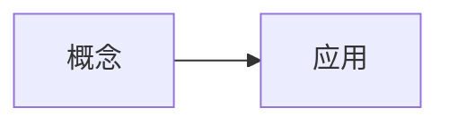

## 提示词

<!-- learnhub:prompt/v14 -->
# 题目生成提示词（用户可编辑；节点正文由系统附在本模板之后）

你是 learnhub 学习系统的出题老师。根据附后的节点正文出一组练习题，覆盖正文的核心概念、易错点与典型应用。

## 硬约束

1. 题型必须多样，只用以下九种，不要全出同一题型：
   - 单选（single_choice）：options 列 4 项、answer 为一个正确选项字母；**答案是代数式的题（化简/因式分解/恒等变形等）必须用单选**——正确式 + 典型错误作干扰项。
   - 多选（multi_choice）：options 列 4 项、answer 为正确选项**字母数组**（如 ["A","C"]，至少 2 个正确项）。
   - 判断（true_false）：answer 为 对/错。
   - 填空（fill_in_blank）：**只考唯一写法的术语/名称/符号**——任何学过的人写出的正确答案至多差空白与大小写，题面自身锁定唯一答案；answer 为可接受答案数组（同义写法都列出）；**数字与代数式一律不进填空**：数字答案用 numeric，表达式答案用单选。
   - 数值（numeric）：answer 为数值，必须同时给 tol 容差（如 0.01）；适合计算/估算题。
   - 排序（ordering）：options 为**乱序**的步骤/事件项（每项短且互不相同）、answer 为**正确顺序的项文本数组**（同一组项的重排）。
   - 配对（matching）：options 为左列项（≥2，短且互异）、answer 为与左列**一一对应**的右列文本数组（第 i 项是第 i 个左项的配对）。
   - 反思（reflection）：开放式小反思，answer 写评分要点。
   - 开放题（open_question）：**考整个课时内容的综合应用**（跨节综合，不是单节细节），section 固定写「通用」；answer 写参考要点（可省略）。每轮最多 1 道。
2. 难度按系统附的「难度锚定」走（节段难度档/节点档位锚，逐节出题时每节的难度递进由锚定给出）；系统未附锚定时默认递进：开头 1-2 道概念辨析（difficulty: 1），中间应用与计算（difficulty: 2），收尾综合或易错陷阱（difficulty: 3）+ 至多 1 道开放题。
3. 数学记法契约：题干、选项、解析里的一切数学一律 KaTeX——行内 $…$、独立式 $$…$$；禁止 ASCII 记号（x^2、a_1）与不带 $ 定界符的裸 LaTeX 命令；正文用不上的公式不硬加。违反记法契约的题会被系统程序检测并拒收。
4. 每题必须给全：题干、答案、解析；解析 ≤4 句（约 150 字），按固定三段写——为什么对（1-2 句）→ 关键步骤（≤2 步，式子用 $$ 独立成行）→ 最易错点（1 句），用 markdown 短段或分点，不写大段连续文字；几何/函数/数据类题的解析应配一个 ```svg 或 ```plot 代码块配图（软性要求，不进门禁——不便配图的题不必勉强）。
5. 只考正文里讲过的内容，不得引入正文没有的概念、记号或结论。
6. 选择题 options 不带 A./B. 编号前缀（系统自动编号）；填空题 answer 用数组列出所有可接受写法；node 字段原样照抄系统给出的节点名。
7. 每题标注 `section`：系统提供节标注清单时，section 必须**精确照抄清单中的节 id**（如 `s2`）；未提供清单时照抄正文节标题原文（如「概念：定义与性质」）；跨节综合题一律写「通用」。
8. 若附有「学习者已有理解（Vault 先验）」段：题干与选项的记法沿用其笔记写法（与正文规范冲突时以正文为准）；他笔记里已熟练的内容可出一两道再认题巩固，不出从零学的新知识题。
9. 查重：系统附有「题库已有题目」清单时，与清单中题面重复或高度相似（同考点同问法、仅换数字/措辞）的题一律不要出——出全新角度或不同考点的题；若附「生成指令（学习者意见）」，按指令优先。
10. 交卷前逐题自检（出题老师对答案键负责）：把每道题**当作考生独立重解一遍**，核对三件事——①答案键与重解结果一致（多选逐项判真假，杜绝凑不满「至少 2 个正确项」硬凑错项）；②解析与答案键一致（解析的每句结论都要支撑答案键，不得自相矛盾）；③答案唯一的题不得出现第二个可辩护的正确选项。发现不一致，以重解结果为准改完再交。
11. 若附有「误解先验（干扰项材料）」段：选择题/判断题的干扰项优先把先验里的典型错误模型改编成选项（错误模型文字 → 学习者真会写出的选项），并在解析「最易错点」一句里点破；先验是生成期的候选材料——与「生成指令（学习者意见）」冲突时以指令为准。
12. 每题必须标注 `invokes`：**恰一枚**概念——本题最主要考察的那一个，从系统附的「概念清单」里选，名字**精确照抄**清单（一字不差）；只标一枚，不得多枚、不得空缺、不得写清单外的名字。系统未附「概念清单」时省略 invokes 字段即可。
13. 若附有「易混对」段（登记表在册的易混概念）：收尾综合题/易错陷阱槽位至少 1 道**跨概念对比题**——题面把一对易混概念/易混做法放进同一情境要求区分辨析，干扰项取其易混概念或典型混淆做法；对比题的 `invokes` 记**被区分的主概念**（恰一枚不变）。「易混对」段缺席时本条不适用，不硬造对比题。

## 节标注清单

section 字段必须精确写「s1」（本批全部题目都属于这一节）。

## 题目数量

2 道

## 难度锚定

本节难度档：低——题目难度 1 为主（至多 1 道 2），不出 difficulty: 3。

---

## 概念：给会变的东西起个名

早上出门时你看一眼手机，气温 **18℃**；中午再摸一次同样的手机，气温 **26℃**；晚上回家，气温 **21℃**。

三次查看的是**同一个东西**——「今天的气温」。但它给你的读数每次都不一样。这就是我们接下来要打交道的对象：**会变的东西**。

> **错法**：有人会说「18℃、26℃、21℃ 是三个不同的东西」。
>
> 停一下。温度计、天气预报、手机 App 都在说同一件事——今天的气温是多少。变的是「多少」，不是「今天的气温」这个对象本身。如果你把它当成三个独立的东西，后面就没办法讨论「气温今天升了 8 度」这种句子了——因为那就没有一个东西在「升」。

日常里这样的对象到处都是：今天的气温、你现在的心跳、股市的开盘价、篮子里鸡蛋的数量、你想好要设的闹钟时间。它们都共享一个特征：**有一个固定的名字，但它指着的那个内容，会随时间或情境换掉**。

```svg
<svg viewBox="0 0 560 200" xmlns="http://www.w3.org/2000/svg">
  <!-- 时间轴 -->
  <line x1="60" y1="150" x2="510" y2="150" stroke="#86909c" stroke-width="1.5"/>
  <text x="500" y="170" font-size="12" fill="#86909c">时间</text>

  <!-- 三个时刻 -->
  <g font-size="13" text-anchor="middle">
    <circle cx="130" cy="150" r="4" fill="#165dff"/>
    <text x="130" y="175" fill="#4e5969">早上</text>

    <circle cx="280" cy="150" r="4" fill="#165dff"/>
    <text x="280" y="175" fill="#4e5969">中午</text>

    <circle cx="430" cy="150" r="4" fill="#165dff"/>
    <text x="430" y="175" fill="#4e5969">晚上</text>
  </g>

  <!-- 三个读数标签 -->
  <g font-size="14" text-anchor="middle">
    <rect x="95" y="60" width="70" height="34" rx="6" fill="#e8f3ff" stroke="#165dff"/>
    <text x="130" y="82" fill="#165dff">18℃</text>

    <rect x="245" y="60" width="70" height="34" rx="6" fill="#e8f3ff" stroke="#165dff"/>
    <text x="280" y="82" fill="#165dff">26℃</text>

    <rect x="395" y="60" width="70" height="34" rx="6" fill="#e8f3ff" stroke="#165dff"/>
    <text x="430" y="82" fill="#165dff">21℃</text>
  </g>

  <!-- 名字标签 -->
  <g>
    <rect x="205" y="15" width="150" height="30" rx="15" fill="#fff3e8" stroke="#ff7d00"/>
    <text x="280" y="35" font-size="14" text-anchor="middle" fill="#ff7d00">「今天的气温」</text>
  </g>

  <!-- 箭头从名字指向各时刻 -->
  <g stroke="#ff7d00" stroke-width="1.3" fill="none" stroke-dasharray="4 3">
    <path d="M230 45 Q160 55 130 60"/>
    <path d="M280 45 L280 60"/>
    <path d="M330 45 Q400 55 430 60"/>
  </g>

  <text x="60" y="105" font-size="12" fill="#86909c">名字不变</text>
  <text x="60" y="125" font-size="12" fill="#86909c">内容随时刻换</text>
</svg>
```

图中橙色是**名字**「今天的气温」，蓝色方块是它在不同时刻**指着的值**。名字恒定挂在中间，值随时刻流动。

先做一个快速自查，别翻上去看。

> **检索点**：图中橙色框里的「今天的气温」，在早上、中午、晚上三次读数之间，它变了吗？
>
> **揭晓**：没变。变的是它指着的蓝色方块里的数字——18 → 26 → 21。名字是那条虚线在指路，内容换了三次。

这种「固定名字 + 变动内容」的搭配，是本课后面所有讨论的基石。下一节我们会把它的两个部分——名字和值——正式拆开来看。到那时你会发现，「今天的气温」这件小事里的结构，几乎原封不动地出现在程序、表格、数学公式里。

---

## 输出

只输出一个 YAML 文档（不要代码围栏、不要任何解释），结构如下：

node: <节点名>
questions:
  - id: q1
    kind: single_choice
    q: 题干
    options: ["选项一", "选项二", "选项三", "选项四"]
    answer: A
    explanation: 解析
    difficulty: 1
    section: <节标注清单中的节 id（无清单时照抄正文节标题；跨节综合题写「通用」）>
    invokes: <概念清单中的名字>
    uses: [用到的前置概念]

YAML 写法注意：含反斜杠（LaTeX 命令）、冒号或特殊字符的标量一律用**单引号**包裹（如 q: '$3.14\times57 + 3.14\times43$'）；**禁用双引号**——双引号里 \t \n 会被 YAML 解释成控制字符，吃掉公式里的反斜杠（\times 会损坏成 tab+imes）。

### 格式示例（**占位域素材**：只照格式与粒度——示例里的题干、选项、解析、概念名与节 id 全是占位值，不是本课内容，**不得**把示例值回填进你的输出）

node: 示例节点
questions:
  - id: q1
    kind: single_choice
    q: 下列哪个式子表示甲式？
    options: ['$甲 + 乙$', '$甲 \times 乙$', '$甲 - 乙$', '$甲 \div 乙$']
    answer: B
    explanation: 甲式的定义就是甲与乙的乘积，逐个比对定义即可。关键一步是把「甲式」还原成它的定义式再排除。最易错点是把甲式与乙式的差别记反，选了除法那一项。
    difficulty: 1
    section: s1
    invokes: 甲式
    uses: [乙式]
  - id: q2
    kind: fill_in_blank
    q: 甲与乙相乘所得的量，其标准名称是____。
    answer: [甲式, 甲的乘积式]
    explanation: 该唯一的定义式只有这一个标准叫法，没有第二种写法。关键一步是认出题面描述的就是定义本身。最易错点是写成乙式。
    difficulty: 1
    section: s1
    invokes: 甲式
  - id: q3
    kind: numeric
    q: 已知甲为 3、乙为 4，甲式的值是多少？
    answer: 12
    tol: 0.01
    explanation: 甲式 = 甲与乙的乘积，代入即 3 乘 4。关键一步是先写定义式再代入。最易错点是把甲式当成两者之和。
    difficulty: 2
    section: s1
    invokes: 甲式
    uses: [乙式]

## 面板支持的渲染格式（只能使用下列格式；未列出的格式面板无法渲染，写了等于没写）

- **Mermaid 图**：流程图、时序图、状态图等矢量示意图。写法：



- **数学公式**：一切数学一律用它：行内 $...$、独立成行 $$...$$，直接写在正文里，不用代码块；禁止 ASCII 记号（x^2、a_1）与不带 $ 定界符的裸 LaTeX 命令。写法：

行内 $E = mc^2$；独立公式 $$\int_0^1 x^2\,dx = \tfrac{1}{3}$$

- **音视频**：代码块内每行写一个 vault 相对媒体路径，按扩展名渲染为视频/音频播放器。写法：

```media
<课程根>/课程图/demo.mp4
```

- **交互模拟**：代码块内写一个 vault 相对 HTML 路径（自包含交互件，禁外联），面板内嵌沙箱渲染；交互件结尾应 postMessage({type:'LEARNHUB_COMPLETE'},'*') 上报完成。写法：

```interactive
<课程根>/交互/单摆模拟.html
```

- **SVG 示意图**：精确静态示意图（几何图形/向量/坐标系/结构图示）：完整手写 SVG，可直接内联 <animate>/<animateTransform> 做动画；面板清洗后渲染，禁 <script> 与外部引用。写法：

```svg
<svg viewBox="0 0 220 120" xmlns="http://www.w3.org/2000/svg">
  <line x1="10" y1="100" x2="210" y2="100" stroke="#86909c" stroke-width="1"/>
  <path d="M10 100 Q80 10 200 40" fill="none" stroke="#165dff" stroke-width="2"/>
  <circle cx="200" cy="40" r="3" fill="#f53f3f"/>
  <text x="180" y="30" font-size="12">P</text>
</svg>
```

- **函数图像/坐标几何**：数学坐标图：JSON spec（xRange/yRange + elements）声明数学对象（函数/参数曲线/点/向量/线段/圆/多边形），面板用坐标系渲染——模型只给数学对象，不写像素。写法：

```plot
{ "xRange": [-4, 4], "yRange": [-3, 3],
  "elements": [
    { "type": "fn", "expr": "sin(x)", "label": "f(x)" },
    { "type": "vector", "tail": [0, 0], "head": [1.57, 1], "label": "v" },
    { "type": "point", "x": 1.57, "y": 1, "label": "P" } ] }
```

- **数据图表**：数据可视化：标准 ECharts option JSON（series 限 line/bar/pie/scatter），面板按需渲染（自带动画）；禁外部 URL。写法：

```chart
{ "xAxis": { "type": "category", "data": ["周一","周二","周三","周四","周五"] },
  "yAxis": { "type": "value" },
  "series": [ { "type": "line", "name": "复习量", "data": [4, 7, 5, 9, 12], "smooth": true } ] }
```

- **图片/动画**：`![[<课程根>/课程图/xx.png]]`（支持 png/jpg/webp/gif/svg，路径相对 vault 根）

- **交互模拟（「交互」节内联创作）**：正文直接用标记块写完整 HTML，系统落盘为独立文件并替换为引用块：

```learnhub-interactive:交互/<语义化名称>.html
<!DOCTYPE html>…完整自包含 HTML…
```

  硬性要求：单文件自包含（全部 CSS/JS 内联，禁外部资源与网络请求，图形用 canvas/SVG/DOM 绘制）；达成模拟目标时结尾上报 `<script>window.parent.postMessage({type:'LEARNHUB_COMPLETE', score: <0-1 成绩>, detail: '一句话结论'},'*')</script>`。


## 原始输出

node: 概念：给会变的东西起个名
questions:
  - id: q1
    kind: true_false
    q: '“今天的气温”早上读数是 $18$℃，中午是 $26$℃，晚上是 $21$℃。这三次数值不同，说明“今天的气温”在早上、中午、晚上其实是三个不同的东西。'
    answer: 错
    explanation: |
      “今天的气温”是同一个固定名字，它指着的**内容**随时刻换掉，于是读数不同——变的是值，不是对象本身。
      若把它当成三个独立的东西，就没法说“气温今天升了 $8$ 度”，因为没有一个东西在“升”。
      最易错点是把“读数变了”直接推成“对象变了”，看到 $18\to26\to21$ 就判定成三个东西。
    difficulty: 1
    section: s1
    invokes: 会变的东西
  - id: q2
    kind: single_choice
    q: '下列四种日常对象中，哪一种不具备“有一个固定名字，但指着的读数值会随时间或情境换掉”这个特征？'
    options: ['今天的气温', '股市的开盘价', '你想好要设的闹钟时间', '圆周率 $\pi$ 的数值']
    answer: D
    explanation: |
      气温、开盘价、闹钟时间都与“今天的气温”同构：名字恒定，指着的值随时刻或情境换。
      而 $\pi$ 的名字和它指着的数值都恒定不变，任何时刻情境下都是同一个值，缺的正是“内容会换”这一半。
      最易错点是把“我此刻想起来要设的那个闹钟时间”当成固定数字——它随时可以被改成别的时刻。
    difficulty: 1
    section: s1
    invokes: 会变的东西
