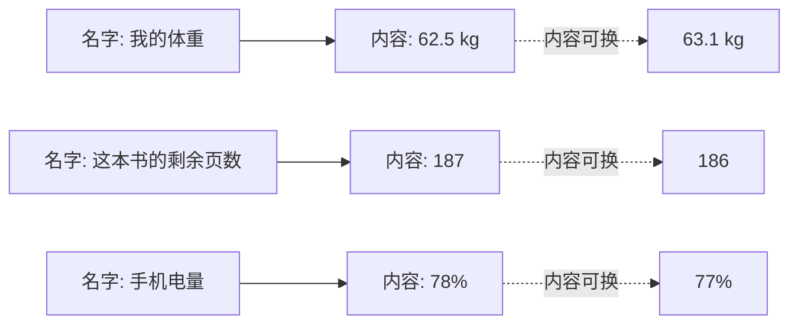
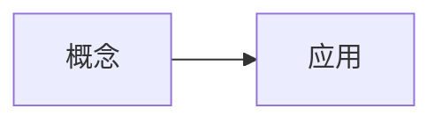

## 提示词

<!-- learnhub:prompt/v14 -->
# 题目生成提示词（用户可编辑；节点正文由系统附在本模板之后）

你是 learnhub 学习系统的出题老师。根据附后的节点正文出一组练习题，覆盖正文的核心概念、易错点与典型应用。

## 硬约束

1. 题型必须多样，只用以下九种，不要全出同一题型：
   - 单选（single_choice）：options 列 4 项、answer 为一个正确选项字母；**答案是代数式的题（化简/因式分解/恒等变形等）必须用单选**——正确式 + 典型错误作干扰项。
   - 多选（multi_choice）：options 列 4 项、answer 为正确选项**字母数组**（如 ["A","C"]，至少 2 个正确项）。
   - 判断（true_false）：answer 为 对/错。
   - 填空（fill_in_blank）：**只考唯一写法的术语/名称/符号**——任何学过的人写出的正确答案至多差空白与大小写，题面自身锁定唯一答案；answer 为可接受答案数组（同义写法都列出）；**数字与代数式一律不进填空**：数字答案用 numeric，表达式答案用单选。
   - 数值（numeric）：answer 为数值，必须同时给 tol 容差（如 0.01）；适合计算/估算题。
   - 排序（ordering）：options 为**乱序**的步骤/事件项（每项短且互不相同）、answer 为**正确顺序的项文本数组**（同一组项的重排）。
   - 配对（matching）：options 为左列项（≥2，短且互异）、answer 为与左列**一一对应**的右列文本数组（第 i 项是第 i 个左项的配对）。
   - 反思（reflection）：开放式小反思，answer 写评分要点。
   - 开放题（open_question）：**考整个课时内容的综合应用**（跨节综合，不是单节细节），section 固定写「通用」；answer 写参考要点（可省略）。每轮最多 1 道。
2. 难度按系统附的「难度锚定」走（节段难度档/节点档位锚，逐节出题时每节的难度递进由锚定给出）；系统未附锚定时默认递进：开头 1-2 道概念辨析（difficulty: 1），中间应用与计算（difficulty: 2），收尾综合或易错陷阱（difficulty: 3）+ 至多 1 道开放题。
3. 数学记法契约：题干、选项、解析里的一切数学一律 KaTeX——行内 $…$、独立式 $$…$$；禁止 ASCII 记号（x^2、a_1）与不带 $ 定界符的裸 LaTeX 命令；正文用不上的公式不硬加。违反记法契约的题会被系统程序检测并拒收。
4. 每题必须给全：题干、答案、解析；解析 ≤4 句（约 150 字），按固定三段写——为什么对（1-2 句）→ 关键步骤（≤2 步，式子用 $$ 独立成行）→ 最易错点（1 句），用 markdown 短段或分点，不写大段连续文字；几何/函数/数据类题的解析应配一个 ```svg 或 ```plot 代码块配图（软性要求，不进门禁——不便配图的题不必勉强）。
5. 只考正文里讲过的内容，不得引入正文没有的概念、记号或结论。
6. 选择题 options 不带 A./B. 编号前缀（系统自动编号）；填空题 answer 用数组列出所有可接受写法；node 字段原样照抄系统给出的节点名。
7. 每题标注 `section`：系统提供节标注清单时，section 必须**精确照抄清单中的节 id**（如 `s2`）；未提供清单时照抄正文节标题原文（如「概念：定义与性质」）；跨节综合题一律写「通用」。
8. 若附有「学习者已有理解（Vault 先验）」段：题干与选项的记法沿用其笔记写法（与正文规范冲突时以正文为准）；他笔记里已熟练的内容可出一两道再认题巩固，不出从零学的新知识题。
9. 查重：系统附有「题库已有题目」清单时，与清单中题面重复或高度相似（同考点同问法、仅换数字/措辞）的题一律不要出——出全新角度或不同考点的题；若附「生成指令（学习者意见）」，按指令优先。
10. 交卷前逐题自检（出题老师对答案键负责）：把每道题**当作考生独立重解一遍**，核对三件事——①答案键与重解结果一致（多选逐项判真假，杜绝凑不满「至少 2 个正确项」硬凑错项）；②解析与答案键一致（解析的每句结论都要支撑答案键，不得自相矛盾）；③答案唯一的题不得出现第二个可辩护的正确选项。发现不一致，以重解结果为准改完再交。
11. 若附有「误解先验（干扰项材料）」段：选择题/判断题的干扰项优先把先验里的典型错误模型改编成选项（错误模型文字 → 学习者真会写出的选项），并在解析「最易错点」一句里点破；先验是生成期的候选材料——与「生成指令（学习者意见）」冲突时以指令为准。
12. 每题必须标注 `invokes`：**恰一枚**概念——本题最主要考察的那一个，从系统附的「概念清单」里选，名字**精确照抄**清单（一字不差）；只标一枚，不得多枚、不得空缺、不得写清单外的名字。系统未附「概念清单」时省略 invokes 字段即可。
13. 若附有「易混对」段（登记表在册的易混概念）：收尾综合题/易错陷阱槽位至少 1 道**跨概念对比题**——题面把一对易混概念/易混做法放进同一情境要求区分辨析，干扰项取其易混概念或典型混淆做法；对比题的 `invokes` 记**被区分的主概念**（恰一枚不变）。「易混对」段缺席时本条不适用，不硬造对比题。

## 节标注清单

section 字段必须精确写「s2」（本批全部题目都属于这一节）。

## 题目数量

2 道

## 难度锚定

本节难度档：中——难度递进到 2 即可（收尾至多 1 道 difficulty: 3）。

---

## 概念：名字是标签，值是内容

上一节的图里，橙色框恒定，蓝色方块流动。现在把这两个部分正式拆开：橙色框是**标签**，蓝色方块是**内容**。标签贴在哪里，就被读作哪里当前的内容。

```svg
<svg viewBox="0 0 380 150" xmlns="http://www.w3.org/2000/svg">
  <rect x="20" y="20" width="150" height="46" rx="8" fill="none" stroke="#ff7d00" stroke-width="2"/>
  <text x="95" y="48" font-size="14" text-anchor="middle" fill="#ff7d00">今天的气温</text>
  <line x1="170" y1="43" x2="230" y2="43" stroke="#ff7d00" stroke-width="2" stroke-dasharray="5,4"/>
  <rect x="230" y="20" width="120" height="46" rx="8" fill="#e8f3ff" stroke="#165dff" stroke-width="2"/>
  <text x="290" y="48" font-size="14" text-anchor="middle" fill="#165dff">18</text>

  <rect x="20" y="86" width="150" height="46" rx="8" fill="none" stroke="#ff7d00" stroke-width="2" stroke-dasharray="2,3" opacity="0.4"/>
  <text x="95" y="114" font-size="13" text-anchor="middle" fill="#ff7d00" opacity="0.6">（同一个标签）</text>
  <line x1="170" y1="109" x2="230" y2="109" stroke="#ff7d00" stroke-width="2" stroke-dasharray="5,4"/>
  <rect x="230" y="86" width="120" height="46" rx="8" fill="#e8f3ff" stroke="#165dff" stroke-width="2"/>
  <text x="290" y="114" font-size="14" text-anchor="middle" fill="#165dff">26</text>
  <text x="360" y="60" font-size="12" fill="#86909c">标签不变</text>
</svg>
```

标签「今天的气温」在两行里写法完全一样，指针却指向了两个不同的内容框。**名字是标签，值是内容——标签不变，内容可换。**

> **坑位警示**：容易想成「名字会变」。比如看到气温从 18 变到 26，就说「今天的气温变了」——这句话在口语里没问题，但拆结构时必须分清：变的是**标签挂着的内容**，标签本身从头到尾是同一个。判断信号：只要问「这个名字的**写法**改了吗？」——没改，就是内容在变。

顺着这个拆分读两个日常场景。



三个名字的写法都不会变，但它们各自指的内容随时可以被替换。名字负责**指路**，内容负责**装东西**。

先自己做一步：下面这两个名字——「北京」和「今天的日期」——哪一个在「名字不变、内容可变」这一模式下成立？

> **揭晓**：「今天的日期」。它在一年中会被替换成不同的年月日，而「北京」不管哪一天都指同一座城市——它的内容不会换。区别不在名字长短，而在**它指的东西会不会被替换**。

再进一步：同一份内容，能不能被两个不同的名字同时指着？

> **揭晓**：能。比如「今天的气温」和「此刻的户外读数」是两个写法不同的标签，但它们可以指向同一个内容 26。这说明名字和内容不是一对一绑死的——**标签可以有多个，内容只有一个**。

一句话总结这节的结构：$ \text{名字} \to \text{值} $，箭头左端是固定的标签，右端是可换的内容。下一节把这种结构放进一天的气温里跑一遍，看它在真实数据上怎么工作。

---

## 输出

只输出一个 YAML 文档（不要代码围栏、不要任何解释），结构如下：

node: <节点名>
questions:
  - id: q1
    kind: single_choice
    q: 题干
    options: ["选项一", "选项二", "选项三", "选项四"]
    answer: A
    explanation: 解析
    difficulty: 1
    section: <节标注清单中的节 id（无清单时照抄正文节标题；跨节综合题写「通用」）>
    invokes: <概念清单中的名字>
    uses: [用到的前置概念]

YAML 写法注意：含反斜杠（LaTeX 命令）、冒号或特殊字符的标量一律用**单引号**包裹（如 q: '$3.14\times57 + 3.14\times43$'）；**禁用双引号**——双引号里 \t \n 会被 YAML 解释成控制字符，吃掉公式里的反斜杠（\times 会损坏成 tab+imes）。

### 格式示例（**占位域素材**：只照格式与粒度——示例里的题干、选项、解析、概念名与节 id 全是占位值，不是本课内容，**不得**把示例值回填进你的输出）

node: 示例节点
questions:
  - id: q1
    kind: single_choice
    q: 下列哪个式子表示甲式？
    options: ['$甲 + 乙$', '$甲 \times 乙$', '$甲 - 乙$', '$甲 \div 乙$']
    answer: B
    explanation: 甲式的定义就是甲与乙的乘积，逐个比对定义即可。关键一步是把「甲式」还原成它的定义式再排除。最易错点是把甲式与乙式的差别记反，选了除法那一项。
    difficulty: 1
    section: s1
    invokes: 甲式
    uses: [乙式]
  - id: q2
    kind: fill_in_blank
    q: 甲与乙相乘所得的量，其标准名称是____。
    answer: [甲式, 甲的乘积式]
    explanation: 该唯一的定义式只有这一个标准叫法，没有第二种写法。关键一步是认出题面描述的就是定义本身。最易错点是写成乙式。
    difficulty: 1
    section: s1
    invokes: 甲式
  - id: q3
    kind: numeric
    q: 已知甲为 3、乙为 4，甲式的值是多少？
    answer: 12
    tol: 0.01
    explanation: 甲式 = 甲与乙的乘积，代入即 3 乘 4。关键一步是先写定义式再代入。最易错点是把甲式当成两者之和。
    difficulty: 2
    section: s1
    invokes: 甲式
    uses: [乙式]

## 面板支持的渲染格式（只能使用下列格式；未列出的格式面板无法渲染，写了等于没写）

- **Mermaid 图**：流程图、时序图、状态图等矢量示意图。写法：



- **数学公式**：一切数学一律用它：行内 $...$、独立成行 $$...$$，直接写在正文里，不用代码块；禁止 ASCII 记号（x^2、a_1）与不带 $ 定界符的裸 LaTeX 命令。写法：

行内 $E = mc^2$；独立公式 $$\int_0^1 x^2\,dx = \tfrac{1}{3}$$

- **音视频**：代码块内每行写一个 vault 相对媒体路径，按扩展名渲染为视频/音频播放器。写法：

```media
<课程根>/课程图/demo.mp4
```

- **交互模拟**：代码块内写一个 vault 相对 HTML 路径（自包含交互件，禁外联），面板内嵌沙箱渲染；交互件结尾应 postMessage({type:'LEARNHUB_COMPLETE'},'*') 上报完成。写法：

```interactive
<课程根>/交互/单摆模拟.html
```

- **SVG 示意图**：精确静态示意图（几何图形/向量/坐标系/结构图示）：完整手写 SVG，可直接内联 <animate>/<animateTransform> 做动画；面板清洗后渲染，禁 <script> 与外部引用。写法：

```svg
<svg viewBox="0 0 220 120" xmlns="http://www.w3.org/2000/svg">
  <line x1="10" y1="100" x2="210" y2="100" stroke="#86909c" stroke-width="1"/>
  <path d="M10 100 Q80 10 200 40" fill="none" stroke="#165dff" stroke-width="2"/>
  <circle cx="200" cy="40" r="3" fill="#f53f3f"/>
  <text x="180" y="30" font-size="12">P</text>
</svg>
```

- **函数图像/坐标几何**：数学坐标图：JSON spec（xRange/yRange + elements）声明数学对象（函数/参数曲线/点/向量/线段/圆/多边形），面板用坐标系渲染——模型只给数学对象，不写像素。写法：

```plot
{ "xRange": [-4, 4], "yRange": [-3, 3],
  "elements": [
    { "type": "fn", "expr": "sin(x)", "label": "f(x)" },
    { "type": "vector", "tail": [0, 0], "head": [1.57, 1], "label": "v" },
    { "type": "point", "x": 1.57, "y": 1, "label": "P" } ] }
```

- **数据图表**：数据可视化：标准 ECharts option JSON（series 限 line/bar/pie/scatter），面板按需渲染（自带动画）；禁外部 URL。写法：

```chart
{ "xAxis": { "type": "category", "data": ["周一","周二","周三","周四","周五"] },
  "yAxis": { "type": "value" },
  "series": [ { "type": "line", "name": "复习量", "data": [4, 7, 5, 9, 12], "smooth": true } ] }
```

- **图片/动画**：`![[<课程根>/课程图/xx.png]]`（支持 png/jpg/webp/gif/svg，路径相对 vault 根）

- **交互模拟（「交互」节内联创作）**：正文直接用标记块写完整 HTML，系统落盘为独立文件并替换为引用块：

```learnhub-interactive:交互/<语义化名称>.html
<!DOCTYPE html>…完整自包含 HTML…
```

  硬性要求：单文件自包含（全部 CSS/JS 内联，禁外部资源与网络请求，图形用 canvas/SVG/DOM 绘制）；达成模拟目标时结尾上报 `<script>window.parent.postMessage({type:'LEARNHUB_COMPLETE', score: <0-1 成绩>, detail: '一句话结论'},'*')</script>`。


## 原始输出

node: 概念：名字是标签，值是内容
questions:
  - id: q1
    kind: single_choice
    q: '把「名字 $\to$ 值」这一结构拆开看，下列哪一项说法正确？'
    options: ['名字是内容，值是标签', '名字是标签，值是内容；标签固定，内容可换', '名字和内容必须一一对应，一个内容只能有一个名字', '内容变化时，名字的写法必然跟着改变']
    answer: B
    explanation: 把这节的结构拆开，左端是固定的标签，右端是可换的内容，标签不变而内容可换。关键判断方法是问「这个名字的写法改了吗」：没改，就是内容在换。最易错点是把口语里「气温变了」直接当成名字在变——变的是标签挂着的内容。
    difficulty: 2
    section: s2
    invokes: 名字是标签，值是内容
  - id: q2
    kind: true_false
    q: '「今天的气温」和「此刻的户外读数」是两个写法不同的名字，它们可以指向同一个内容 26。'
    answer: 对
    explanation: 名字和内容不是一对一绑死的，两个不同的标签可以指向同一个内容，这正是「标签可以有多个，内容只有一个」。关键一步是把两个名字的写法对照，再确认它们所指的内容是否相同。最易错点是默认名字与内容必须一一对应，从而判成错。
    difficulty: 2
    section: s2
    invokes: 名字是标签，值是内容
    uses: [名字是标签，值是内容]
